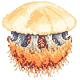
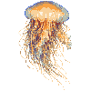
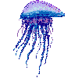
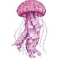
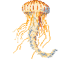

---
[
	{
		"image": "./media/1.png",
		"title": "Выйдите на берег",
		"description": "При укусе медузы немедленно выйдите из воды."
	},
	{
		"image": "./media/2.png",
		"title": "Промывание морской водой",
		"description": "Остатки щупалец на поражённом участке следует быстро удалить с помощью морской воды или физиологического раствора и тщательно промыть. Не используйте пресную воду, так как это может усилить поражение."
	},
	{
		"image": "./media/3.png",
		"title": "Обратитесь за медицинской помощью",
		"description": "При появлении тяжёлых симптомов, таких как затруднённое дыхание, потеря сознания или сильная боль по всему телу, немедленно обратитесь за медицинской помощью и обеспечьте транспортировку в больницу для экстренного лечения."
	}
]
---

# Если вас ужалила медуза - порядок действий

1. Немедленно выйдите из воды.
2. Смойте остатки щупалец морской водой или физраствором. Промывайте как следует.
3. Если боль не проходит, приложите тепло около 45 °C.
4. При затруднённом дыхании, потере сознания или боли по всему телу сразу звоните 119 и доставьте человека в больницу. При необходимости проводите реанимацию.

> Не промывайте водопроводной водой.
> Пресная вода меняет осмотическое равновесие, и оставшиеся нематоцисты выстреливают ещё порцию яда, отчего поражение усиливается. Только морская вода или физраствор.

> Не хватайте и не растирайте щупальца голыми руками. От растирания лопаются новые стрекательные капсулы.

---

# Симптомы

| Когда | Что появляется |
| --- | --- |
| Сразу | Полосы, как от удара плетью, боль, зуд |
| Спустя время | Тошнота, рвота, понос, боль в животе |
| В тяжёлых случаях | Падение давления, затруднённое дыхание, потеря сознания - возможен смертельный исход |

---

# Профилактика

- Входя в воду, закрывайте кожу. Помогает гидрофутболка или купальник с длинным рукавом.
- Заметив медуз, сообщите об этом через мобильный сервис оповещения.
- В период массового появления выполняйте указания и запреты на пляже.

---

# Основные медузы у берегов Кореи

## 1. Номура (*Nemopilema nomurai*)

- Сезон: с июня у Чеджу, с середины августа до начала декабря - по всей стране
- Размер: гигантский вид - свыше 150 см в диаметре и больше 100 кг
- Вид: мощная мускулатура внутри купола, ротовые лопасти по бокам в форме буквы J, на концах много щупалец
- При ожоге: рубцы, как от плети, с болью и покраснением

## 2. Львиная грива (*Cyanea capillata*)

- Сезон: с июля по ноябрь у южного побережья
- Размер: 30–50 см
- Вид: белые щупальца, покрытые слизью и стрекательными капсулами, свисают пучками по нескольку сотен из-под развитых мышц купола
- При ожоге: красные пятна и слабая боль

## 3. Португальский кораблик (*Physalia physalis*)

- Сезон: с июня по август у Чеджу
- Размер: 5–15 см
- Вид: целиком синий, под треугольным поплавком длинные ядовитые щупальца, похожие на бусины
- При ожоге: сильная боль и красные полосы, как от плети, с воспалением

## 4. Пелагия ночесветка (*Pelagia noctiluca*)

- Сезон: с мая по июль у Чеджу и южного побережья
- Размер: около 8 см
- Вид: розовая, жёлтая или бледно-розовая; по краю купола восемь щупалец, внутри четыре ротовые лопасти, спадающие занавесом. Верна своему имени: светится, если потревожить её ночью
- При ожоге: боль и затруднённое дыхание

## 5. Морская нетль (*Dactylometra quinquecirrha*)

- Сезон: в основном летом у Чеджу и южного побережья, иногда встречается с весны до осени
- Размер: 10–20 см
- Вид: светло-коричневый купол с коричневыми радиальными полосами, между ними от края тянутся коричневые щупальца
- При ожоге: сильная боль, красная сыпь и отёк

---

## Источники
- [Safe Korea 24](https://www.safekorea.go.kr/safekorea-kor/main/main.do): [Бытовая безопасность - медузы](https://safekorea.go.kr/safekorea-kor/acts/nacts/nationalActionTips.do?menuSn=4#tab3) - действия при массовом появлении, порядок первой помощи, тепло около 45 °C, запрет промывания водопроводной водой
- [Кафедра токсикологии ветеринарного факультета Университета Кёнсан](https://www.gnu.ac.kr/vet/cm/cntnts/cntntsView.do?mi=2116&cntntsId=1646) - сезоны, размеры и внешний вид каждого вида и симптомы их ожогов
