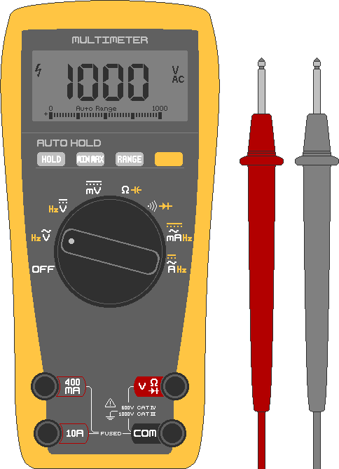

## 2. Измерения и безопасность
&nbsp;&nbsp;&nbsp;Большинство аварий при создании солнечных систем происходит из-за того, что: ① приступают к работе, не проверив напряжение, ② допускают короткое замыкание аккумулятора, ③ используют слишком тонкие провода. Это самая важная часть документа, поэтому, даже если вы спешите с установкой, обязательно изучите эту главу перед началом работ.

---
### 2-1. Мультиметр
#### 2-1-1. Как пользоваться мультиметром (тестером)
&nbsp;&nbsp;&nbsp;Электричество невидимо. Мультиметр (тестер) — это незаменимый инструмент при работе с солнечными панелями, который отображает напряжение, ток и состояние соединений в виде цифр. Бюджетной цифровой модели будет вполне достаточно.

  

- Поворотный переключатель (регулятор): служит для выбора измеряемой величины (напряжение V, сопротивление Ω, ток A и т. д.). Прямая линия (⎓) на шкале означает постоянный ток (DC), а волнистая линия (∿) — переменный ток (AC). При работе с солнечными панелями и аккумуляторами переключатель необходимо устанавливать в режим DC (⎓).
- Черный щуп: отрицательный (−) щуп, который всегда подключается к разъему с маркировкой **COM**.
- Красный щуп: положительный (+) щуп, который обычно вставляется в разъем **VΩmA** и переключается в разъем **10A** только для измерения больших токов.

#### 2-1-2. Измерение напряжения
1. Включите питание проверяемого устройства.
2. Установите переключатель в режим V⎓ (напряжение постоянного тока). (На приборах с ручным выбором диапазона выберите значение, превышающее ожидаемое. Например, для 12V установите диапазон 20V).
3. Приложите красный щуп к положительному (+) полюсу измеряемого устройства, а черный — к отрицательному (−).
4. Считайте показания с экрана мультиметра.

```
    ┌────────[ Нагрузка/АКБ ]────────┐
 [+]┤                                ├[−]
    └─● Красный щуп     Черный щуп ○─┘
    Мультиметр (подключается к концам)
```

&nbsp;&nbsp;&nbsp;В солнечной энергетике это используется для проверки уровня заряда аккумулятора, напряжения панелей и определения полярности (+/−).  

- Проверка уровня заряда аккумулятора: по мере разряда АКБ ее напряжение падает. Свинцово-кислотный аккумулятор на 12V во время зарядки может достигать около 14.4V, а после отключения зарядного устройства в состоянии покоя при полном заряде показывает около 12.7V. Аккумуляторная сборка на 24V при полном заряде показывает около 25.4V.
- Проверка напряжения солнечной панели: если измерить контакты +/− панели под солнечными лучами, прибор покажет напряжение разомкнутой цепи (Voc). Его следует сравнить с паспортными данными от производителя.
- Определение полярности (+/−): если перед числом на экране появляется знак «−», это означает, что щупы подключены наоборот (красный к минусу, черный к плюсу). Это позволяет точно определить полярность.

#### 2-1-3. Проверка целостности цепи (прозвонка)
1. Отключите питание проверяемого устройства. (Измерение под напряжением может повредить проверяемое устройство).
2. Установите переключатель в режим звукового сигнала •)) (прозвонка).
3. Приложите красный щуп к первой точке измерения, а черный — ко второй.
4. Если между точками есть электрический контакт, раздастся звуковой сигнал («пип»).

&nbsp;&nbsp;&nbsp;В солнечных системах этот режим применяется для поиска коротких замыканий (КЗ).  

- Проверка исправности предохранителя: приложите щупы к обоим концам предохранителя. Если раздается звук — предохранитель цел, если звука нет — он перегорел.
- Проверка провода на обрыв: приложите щупы к концам провода. Звуковой сигнал означает целостность цепи, его отсутствие указывает на обрыв.
- Проверка на короткое замыкание: приложите щупы к концам плюсового (+) и минусового (−) проводов, которые должны быть изолированы друг от друга. Если раздается звук — провода где-то соприкасаются (КЗ), если звука нет — они изолированы.

#### 2-1-4. Измерение сопротивления (Ω)
1. Отключите питание проверяемого устройства. (Измерение под напряжением может повредить мультиметр).
2. Установите переключатель в режим измерения сопротивления (Ω).
3. Приложите красный щуп к положительному (+) контакту устройства, а черный — к отрицательному (−).
4. Считайте показания с экрана мультиметра.

#### 2-1-5. Измерение тока (A)
&nbsp;&nbsp;&nbsp;Измерение тока кардинально отличается от трех предыдущих методов, поэтому здесь требуется максимальная осторожность. Чтобы измерить ток, необходимо разорвать цепь и подключить мультиметр последовательно в этот разрыв, чтобы весь ток проходил через сам прибор. Категорически запрещено просто прикладывать щупы к противоположным полюсам (как при измерении напряжения) — это приведет к прямому короткому замыканию аккумулятора, мощной вспышке дуги и сильным ожогам. Измерение должно выполняться строго при наличии нагрузки (сопротивления) в цепи.  

&nbsp;&nbsp;&nbsp;Разъем 10A на обычном мультиметре представляет собой практически чистый проводник с внутренним сопротивлением, близким к 0 Ом. Если подключить его напрямую к высокоемкому аккумулятору (например, на 100Ah), через прибор мгновенно хлынет ток в сотни ампер, что вызовет взрыв мультиметра и тяжелые ожоги. Поскольку измерение тока требует разрыва цепи и последовательного подключения, любая ошибка новичка легко приводит к короткому замыканию, пожару или взрыву АКБ. При сборке солнечных электросистем начинающим пользователям практически никогда не требуется измерять ток вручную. Токи заряда и разряда можно безопасно отслеживать по экрану контроллера заряда (CC) или инвертора. **В самостоятельном ручном измерении тока нет абсолютно никакой необходимости.** 1. Отключите питание проверяемого устройства. (Выполнение этого действия под напряжением может привести к поломке мультиметра, КЗ или возникновению искр).
2. Установите переключатель в режим измерения постоянного тока A⎓.
3. Переставьте красный щуп в разъем `10A`, чтобы снизить риск перегорания внутреннего предохранителя.
4. Подключите красный щуп к положительному (+) полюсу источника, а черный — к отрицательному (−) полюсу, соединенному с нагрузкой.
5. Считайте показания с экрана мультиметра.
6. Проводите измерение как можно быстрее и сразу же размыкайте контакты.

```
[+]──● Красный  Мультиметр  Черный ●──[ Нагрузка ]──[−]
        (вставляется в разрыв цепи)
```

---
### 2-2. Сечение и калибр проводов
&nbsp;&nbsp;&nbsp;Максимальный ток, который может пропустить провод, определяется площадью поперечного сечения его медной жилы. Обычно сечение измеряется в квадратных миллиметрах (мм² / SQ), а в американской системе используется калибр AWG (чем меньше число, тем толще провод).

| Сечение провода | Близкий AWG | Допустимый ток |
|---|---|---|
| 1.5 мм² | 16 AWG | Около 15 A |
| 2.5 мм² | 14 AWG | Около 20 A |
| 4 мм² | 12 AWG | Около 28 A |
| 6 мм² | 10 AWG | Около 36 A |
| 10 мм² | 8 AWG | Около 50 A |

&nbsp;&nbsp;&nbsp;Эти значения являются ориентировочными. Реальный допустимый ток зависит от типа изоляции, температуры окружающей среды и способа прокладки (например, в пучке). Всегда выбирайте провод с запасом (толще), а так как с увеличением длины провода растут потери напряжения, на длинных дистанциях следует использовать еще более толстый кабель. Если вы сомневаетесь, для безопасности выберите сечение на один шаг больше требуемого. Если пропустить большой ток через слишком тонкий провод, он сам станет оказывать высокое сопротивление (R) и начнет сильно нагреваться (P=I²×R). Выделяемое тепло расплавит изоляцию, что приведет к короткому замыканию и пожару.

---
### 2-3. Предохранители и автоматические выключатели
&nbsp;&nbsp;&nbsp;Предохранители и автоматы (автоматические выключатели) — это намеренно созданные «слабые звенья» в цепи. Когда ток превышает допустимый уровень, они размыкают цепь, прекращая подачу питания. Предохранитель «жертвует собой», перегорая до того, как пострадают провода и оборудование от перегрузки или КЗ. Автомат выполняет ту же функцию, но его можно включить заново (сбросить) после срабатывания.

&nbsp;&nbsp;&nbsp;При выборе предохранителя или автомата их номинал устанавливают чуть выше рабочего тока системы, но ниже максимально допустимого тока провода. (Например, если рабочий ток составляет 20A, а провод выдерживает до 28A, оптимален предохранитель на 25A). Для инверторов из-за высоких пусковых токов подбирают номинал примерно в 1.5 раза выше номинального рабочего тока. Стоит помнить, что разорвать постоянный ток (DC) гораздо сложнее, чем переменный, поэтому при монтаже солнечных систем необходимо обязательно использовать специализированные защитные устройства, рассчитанные на работу с DC.

&nbsp;&nbsp;&nbsp;Предохранители и автоматы устанавливают на плюсовом (+) проводе аккумулятора как можно ближе к клемме АКБ, чтобы защитить весь последующий участок цепи.

```
[АКБ +]──[Предохранитель]────────[Контроллер/Нагрузка]
                ↑ Ближе к аккумулятору, на плюсовом проводе
```

---
### 2-4. Электрический удар, короткое замыкание и пожары
&nbsp;&nbsp;&nbsp;Возгорания происходят из-за **использования слишком тонких проводов, плохой затяжки (люфта) клемм, повреждения изоляции кабелей или прямого соприкосновения полюсов «+» и «−»**. Главная защита от этого — правильный подбор сечения проводов, установка предохранителей/автоматов и надежная, плотная фиксация всех соединений.

#### 2-4-1. 감전 (Поражение током)
&nbsp;&nbsp;&nbsp;Тяжесть поражения током зависит не от самого напряжения (Вольт), а от силы тока (миллиампер, мА), проходящего через тело человека. При одном и том же напряжении влажная кожа резко снижает сопротивление тела (по закону Ома), из-за чего через него протекает гораздо более мощный и опасный ток.

&nbsp;&nbsp;&nbsp;Сопротивление сухой кожи достаточно велико, поэтому низкое постоянное напряжение (12–24V), как правило, не способно вызвать опасный для жизни ток в теле. Однако при контакте с влажными руками, ранами, языком или глазами опасность резко возрастает. Во время любых работ необходимо полностью исключить присутствие влаги.  

| Ток, проходящий через тело (для AC) | Ощущения / Последствия |
|---|---|
| Около 1 мА | Легкое покалывание |
| Около 5~10 мА | Сильная боль, мышечные судороги |
| Около 10~20 мА | Мышцы парализует, невозможно оторвать руку (крайне опасно) |
| Более 50 мА | Затрудненное дыхание, удушье |
| Более 100 мА | Высокий риск остановки сердца (смертельно опасно) |

#### 2-4-2. Короткое замыкание и ожоги
&nbsp;&nbsp;&nbsp;В системах на 24V гораздо более частой и реальной угрозой, чем удар током, являются короткие замыкания, ожоги и пожары. Даже при низком напряжении аккумулятор способен мгновенно выдать ток в сотни ампер. Если металлический инструмент, кольцо или цепочка случайно замкнут контакты «+» и «−», металл мгновенно раскалится докрасна. Это приведет к тяжелейшим ожогам, возникновению сварочной дуги со снопом искр, разрушению или взрыву аккумулятора. Поэтому перед началом работы обязательно снимите кольца, часы и металлические браслеты, используйте инструменты с изолированными ручками и будьте предельно аккуратны, чтобы не уронить металл на клеммы АКБ.

&nbsp;&nbsp;&nbsp;Также, как только вы подключаете инвертор для получения 220V AC, на его выходе возникает точно такая же смертельная опасность поражения током, как и в обычной домашней розетке. Это же относится и к случаям, когда несколько солнечных панелей соединены последовательно и суммарное напряжение становится высоким (например, более 100V).

#### 2-4-3. Опасность электрической дуги (арки)
&nbsp;&nbsp;&nbsp;В цепях переменного тока (AC) величина тока меняет полярность и проходит через ноль десятки раз в секунду, благодаря чему возникающая при размыкании контактов искра (электрическая дуга) быстро гаснет сама. Однако постоянный ток (DC) непрерывно течет в одном направлении, из-за чего возникшая дуга горит стабильно и ее очень трудно погасить. По этой причине все выключатели, предохранители и автоматы должны иметь строго номинал DC (включая класс напряжения). Использование компонентов AC в цепях постоянного тока приведет к тому, что дуга не погаснет, расплавив детали и вызвав пожар.

#### 2-4-4. Правила техники безопасности при работе
- Работайте только при полностью отключенном питании (автоматы в положении OFF, клеммы отсоединены).
- Перед началом манипуляций всегда лично проверяйте мультиметром, что напряжение на участке равно 0.
- Работайте исключительно в сухой среде и сухими руками (категорически запрещено монтировать систему во время дождя или стоя на влажном полу).
- Снимите все металлические украшения, используйте диэлектрические перчатки и инструменты с изолированными рукоятками.
- Приучите себя работать одной рукой (если держать вторую руку в кармане, это исключит путь протекания тока через грудную клетку и сердце в случае аварии).
- Возьмите за правило дважды проверять полярность (+/−) перед каждым подключением.
- Тщательно и плотно затягивайте все клеммы и контакты, не допускайте люфта.

#### 2-4-5. Действия при несчастном случае
1. Отключите источник питания. Категорически запрещено прикасаться к пострадавшему до обесточивания цепи.
2. Если отключить питание невозможно, отделите пострадавшего от токоведущих частей с помощью диэлектрика (сухой деревянной палки, резиновых перчаток и т. д.).
3. При отсутствии дыхания или пульса немедленно начните сердечно-легочную реанимацию (СЛР) и используйте автоматический наружный дефибриллятор (АНД) при его наличии.
4. В случае возгорания электропроводки категорически запрещено тушить пожар водой. По возможности обесточьте систему и используйте углекислотный (CO₂) или порошковый (ABC) огнетушитель. Если справиться с огнем не удается, немедленно эвакуируйтесь и вызовите пожарную службу.

---
### 2-5. Безопасность при обращении с аккумуляторами
&nbsp;&nbsp;&nbsp;Аккумулятор является главным узлом концентрации энергии в системе и представляет собой наибольший источник опасности. Поскольку риски зависят от типа АКБ, важно четко знать особенности используемых вами батарей.

#### 2-5-1. Риски в зависимости от типа аккумулятора
&nbsp;&nbsp;&nbsp;Популярные сегодня в солнечной энергетике литий-железо-фосфатные аккумуляторы (LiFePO₄) относительно безопаснее других разновидностей литиевых батарей. Большинство из них оснащены встроенной платой защиты (BMS), которая предотвращает перезаряд, переразряд и КЗ, однако терять бдительность все равно нельзя.  

- Свинцово-кислотные / AGM (автомобильного типа)
  - В процессе зарядки выделяют взрывоопасный водород, поэтому заряжать их можно только в хорошо вентилируемых помещениях.
  - Содержат агрессивный раствор серной кислоты; вблизи них строго запрещены источники открытого огня и курение. При утечке защищайте кожу и глаза, нейтрализуйте пролитую кислоту пищевой содой перед уборкой.
  - Обладают большим весом, будьте осторожны во избежание травм спины и ног при переноске.
- Литий-железо-фосфатные (LiFePO₄)
  - Должны заряжаться исключительно с использованием специализированных зарядных устройств и системы управления батареей — BMS (Battery Management System).
  - При перезаряде, проколе или воздействии высоких температур существует риск сильного нагрева и возгорания (теплового разгона). Защищайте их от ударов и нагрева.
  - Если аккумулятор вздулся, стал сильно горячим или появился специфический запах, немедленно прекратите его эксплуатацию и переместите подальше от горючих материалов.

#### 2-5-2. Общие правила
- Никогда не соединяйте клеммы «+» и «−» металлическими предметами.
- Перед работой с клеммами снимите кольца, часы, металлические украшения и используйте изолированный инструмент.
- Всегда устанавливайте предохранитель или автомат на плюсовом проводе рядом с АКБ для защиты от КЗ и сверхтоков.
- Не храните аккумуляторы под прямыми солнечными лучами, в местах с высокой температурой (например, в закрытом автомобиле) или рядом с горючими материалами.
- Не допускайте падений или деформации корпусов (особенно важно для литиевых АКБ).
- Запрещено объединять в одну систему аккумуляторы разных типов или с разным номинальным напряжением.

#### 2-5-3. Действия при возгорании аккумулятора
&nbsp;&nbsp;&nbsp;Пожар аккумулятора относится к категории сложных и опасных техногенных возгораний. Зачастую немедленная эвакуация и вызов спасателей гораздо важнее попыток самостоятельного тушения.  

1. Если это возможно и безопасно, обесточьте систему, отсоедините провода и отдалите АКБ от горючих веществ.
2. При возгорании литиевого аккумулятора обычные огнетушители или небольшое количество воды не помогут. Попытка залить пламя малым объемом воды может спровоцировать взрыв, поэтому следует засыпать огонь сухим песком или использовать специальный огнетушитель класса D. Если их нет под рукой, не пытайтесь тушить пламя самостоятельно — немедленно покиньте помещение и вызовите пожарных.

&nbsp;&nbsp;&nbsp;Большинство инцидентов с аккумуляторами можно предотвратить, соблюдая базовые правила: **исключить КЗ, не допускать перезаряда (использовать подходящий контроллер), беречь от ударов/нагрева и хранить вдали от горючих материалов**.

---
### Итоги Главы 2

| Параметр | Описание |
|---|---|
| Измерение напряжения | Переключатель на V⎓, щупы прижимают к двум точкам (питание включено) |
| Целостность / Сопротивление | Только при отключенном питании. Проверка предохранителей, обрывов, КЗ |
| Измерение тока | Цепь размыкают, прибор подключают последовательно, используя разъем 10A |
| Напряжение полного заряда | Для системы 12V — около 12.7V, для 24V — около 25.4V |
| Сечение провода | Чем толще, тем безопаснее. Всегда берите с запасом, увеличивайте толщину при большой длине |
| Защитные устройства | Ставятся на плюсовой провод, как можно ближе к АКБ, обязательно класса DC |
| Поражение током | Главная опасность — сила протекающего через тело тока. Работа во влажной среде запрещена |
| Особенности 24V | Короткие замыкания, ожоги и пожары опаснее удара током. Снимайте металлические украшения |
| Особенности DC | Электрическая дуга плохо гаснет → выключатели и предохранители должны быть рассчитаны на DC |
| Профилактика аварий АКБ | ① Запрет КЗ ② Запрет перезаряда ③ Защита от ударов и нагрева ④ Удаление от горючих веществ |