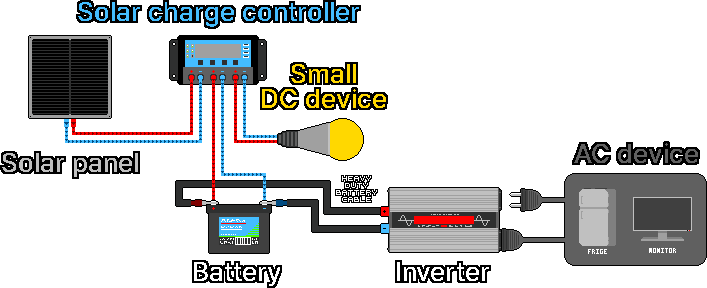
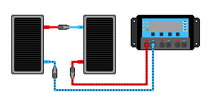
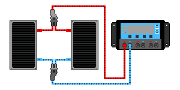
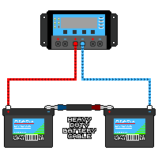
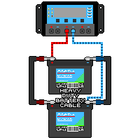

## 3. Солнечные системы

  

1. Солнечные панели улавливают солнечный свет и вырабатывают постоянный ток (DC).
2. Выработанная электроэнергия поступает в контроллер заряда солнечных батарей.
3. Контроллер заряда регулирует поступающий ток и подает его в соответствии с параметрами аккумулятора и небольших DC-устройств (светодиодное освещение, USB и др.).
4. Постоянный ток (DC) поступает в аккумулятор, и происходит его зарядка.
5. Аккумулятор и инвертор соединяются между собой по полюсам (+) и (−) с помощью толстых соединительных перемычек (под болтовое крепление с кольцевыми наконечниками) или специализированных разъемов.
6. Накопленный в аккумуляторе постоянный ток (DC) подается по кабелям в инвертор.
7. Инвертор преобразует полученный постоянный ток (DC) в переменный ток (AC).
8. Преобразованный переменный ток (AC) подается на подключенные к инвертору приборы, использующие данный тип тока (холодильники, мониторы и др.).

---

### 3-1. Солнечные панели
#### 3-1-1. Принцип работы
&nbsp;&nbsp;&nbsp;Солнечная панель — это устройство, преобразующее световую энергию в электрическую посредством фотоэлектрического эффекта, возникающего при попадании света на кремниевый полупроводник. Панель состоит из множества «солнечных элементов» (Solar Cells), каждый из которых сформирован путем соединения двух полупроводниковых слоев с различными электрическими свойствами. Место соединения этих двух слоев называется P-N переходом, и на его границе образуется электрическое поле.  

- Полупроводник N-типа: слой полупроводника с избытком электронов (отрицательный (−) заряд).
- Полупроводник P-типа: слой полупроводника с дефицитом электронов, где преобладают «дырки» (положительный (+) заряд).

1. Когда фотоны (частицы света) попадают на солнечную панель, электроны в атомах кремния внутри полупроводника получают энергию, высвобождаются и начинают свободно перемещаться.
2. Высвобожденные электроны (−) устремляются к полупроводнику N-типа, а дырки (+) собираются на стороне полупроводника P-типа.
3. За счет разделения электронов и дырок возникает разность потенциалов (напряжение). Если подключить провода к электродам на передней и задней поверхностях элемента, электроны потекут по цепи, образуя электрический ток.

| Тип панели | Особенности |
|---|---|
| Монокристаллические (Моно) | Изготавливаются путем нарезания тонких пластин из одного крупного выращенного кристалла кремния. Однородная структура и упорядоченное расположение атомов обеспечивают высокий КПД. Имеют равномерный темно-черный цвет. |
| Поликристаллические (Поли) | Изготавливаются путем плавления и заливки нескольких кристаллов кремния в квадратные формы. Кристаллы ориентированы хаотично, поэтому их КПД ниже монокристаллических, но они дешевле в производстве. Поверхность состоит из множества сросшихся кристаллических осколков, которые переливаются на свету синим цветом, напоминая грани драгоценных камней. В условиях летней жары их эффективность падает чуть сильнее, чем у монокристаллических аналогов. |
| Тонкопленочные | При производстве не используются кремниевые пластины; вместо этого на стеклянную, пластиковую или металлическую подложку тончайшим слоем напыляется светочувствительный фотоэлектрический материал. Их толщина измеряется в микрометрах (мкм). За счет использования соединений, отличных от чистого кремния, поверхность имеет очень гладкую, однородную темно-черную или черно-бурую текстуру. По сравнению с кристаллическими панелями имеют меньший срок службы, более низкий КПД и подвержены ускоренной деградации (падению эффективности). |

#### 3-1-2. Чтение паспортной таблички (маркировки) панели
&nbsp;&nbsp;&nbsp;На тыльной стороне каждой панели наклеена этикетка с ее техническими характеристиками. Чтобы успешно смонтировать солнечную систему, достаточно понимать значение всего пяти основных параметров.  

| Маркировка | Название | Значение |
|---|---|---|
| Pmax (Wp) | Номинальная максимальная мощность | Максимальная мощность (W), вырабатываемая в идеальных условиях |
| Vmp | Напряжение при максимальной мощности | Фактическое рабочее напряжение панели |
| Imp | Ток при максимальной мощности | Фактический рабочий ток панели |
| Voc | Напряжение разомкнутой цепи | Наивысшее напряжение при отсутствии подключенной нагрузки |
| Isc | Ток короткого замыкания | Максимальный ток при прямом соединении полюсов «+» и «−» |

Пример маркировки:
```
   Номинальная максимальная мощность (Pmax): 200 W  
   Напряжение при максимальной мощности (Vmp): 18.0 V  
   Ток при максимальной мощности (Imp): 11.1 A  
   Напряжение разомкнутой цепи (Voc): 22.0 V  
   Ток короткого замыкания (Isc): 11.8 A  
```

&nbsp;&nbsp;&nbsp;Здесь выполняется соотношение Pmax ≈ Vmp × Imp. (18.0 × 11.1 ≈ 200W). Параметры Voc и Isc отражают предельные критические значения. Они обязательно учитываются при выборе контроллера заряда, чтобы «не превысить его лимиты», поэтому сверяться с показателями Voc и Isc на маркировке строго необходимо.  

#### 3-1-3. Панели 12V / Панели 24V
&nbsp;&nbsp;&nbsp;Как видно из приведенного выше примера, у так называемой «12-вольтовой панели» фактическое рабочее напряжение (Vmp) составляет около 18V, а напряжение разомкнутой цепи (Voc) — около 22V. Почему же панель с напряжением 18V называют «панелью 12V»? Это означает, что «данная панель разработана для зарядки аккумулятора на 12V». Чтобы зарядить 12-вольтовый аккумулятор, требуется напряжение около 14V, поэтому панели проектируются с запасом — в районе 18V. Соответственно, «панель 24V» предназначена для совместной работы с 24-вольтовыми компонентами (контроллером и аккумуляторами на 24V).  

| Наименование | Примерное Vmp | Примерное Voc | Объект зарядки |
|---|---|---|---|
| Панель 12V | Около 18V | Около 22V | Аккумулятор 12V |
| Панель 24V | Около 30~36V | Около 37~44V | Аккумулятор 24V |

#### 3-1-4. Фактическая выработка (мощность)
&nbsp;&nbsp;&nbsp;Параметры на маркировке измеряются в идеальных лабораторных условиях (STC: интенсивность солнечного излучения 1000 Вт/м², температура 25°C). В реальной жизни выходные показатели обычно оказываются ниже.  

Факторы, влияющие на выработку:
- Интенсивность солнечного света: в пасмурные дни, а также утром и вечером выработка резко снижается.
- Угол наклона: максимальная мощность достигается, когда солнечные лучи падают строго перпендикулярно поверхности панели.
- Затенение: элементы внутри панели соединены последовательно, поэтому даже частичная тень на одном участке может обрушить выработка всей панели (остерегайтесь падения листьев, теней от столбов и т.д.).
- Температура: при сильном нагревании панелей их напряжение падает, что снижает общую мощность. При низких температурах напряжение, напротив, возрастает. В ясные и морозные зимние дни напряжение последовательно соединенных панелей может превысить допустимый предел контроллера, поэтому при выборе контроллера необходимо закладывать запас по максимальному входному напряжению.
- Пыль и снег: загрязнение поверхности панели препятствует прохождению света и снижает эффективность.

#### 3-1-5. Последовательное и параллельное соединение солнечных панелей
&nbsp;&nbsp;&nbsp;Солнечные панели должны быть скоммутированы в соответствии с рабочим напряжением контроллера заряда и аккумулятора (12V / 24V / 48V). Для регулирования рабочих характеристик используют базовые правила: при последовательном соединении складываются напряжения (V), а при параллельном — токи (A).  

&nbsp;&nbsp;&nbsp;Для минимизации рисков аварий соединяемые панели должны быть строго одного типа и идентичных характеристик. Перед началом любых работ в целях безопасности обязательно отключите линию связи между панелями и контроллером.

  

- Последовательное соединение: используется, когда у вас есть панели на 12V, но система (контроллер и аккумуляторы) рассчитана на 24V. Последовательное соединение двух панелей 12V позволяет получить одну виртуальную панель на 24V.  
- Важно: если суммарное напряжение Voc последовательной цепи превысит «Максимальное входное напряжение PV» контроллера, произойдет авария и выход оборудования из строя. Помните, что в холодные ясные дни Voc возрастает еще сильнее. Всегда оставляйте запас по напряжению относительно лимитов контроллера. В системах на 24V обычно используют параллельное или последовательно-параллельное (смешанное) соединение, чтобы удерживать напряжение в безопасных пределах.
1. Полностью отключите все соединяемые панели от контроллера заряда.
2. Соедините положительный (+) разъем панели А с отрицательным (−) разъемом панели Б.
3. Соедините оставшийся отрицательный (−) разъем панели А с минусовой (−) клеммой контроллера.
4. Соедините оставшийся положительный (+) разъем панели Б с плюсовой (+) клеммой контроллера.

  

- Параллельное соединение: применяется, когда рабочие напряжения панелей, контроллера и аккумулятора совпадают, а запас по току и входному напряжению контроллера позволяет добавить еще одну панель для увеличения суммарного тока и общего объема выработки электроэнергии.  
- Примечание: в крупных системах при параллельном соединении ветвей возникает риск протекания обратных токов, поэтому для обеспечения безопасности на каждую линию необходимо устанавливать плавкие предохранители или DC-автоматы.  
1. Полностью отключите все соединяемые панели от контроллера заряда.
2. Соедините между собой положительные (+) разъемы панели А и панели Б.
3. Соедините между собой отрицательные (−) разъемы панели А и панели Б.
4. Подключите объединенный положительный (+) кабель к плюсовой (+) клемме контроллера, а объединенный отрицательный (−) кабель — к минусовой (−) клемме контроллера.

---
### 3-2. Контроллер заряда солнечных батарей
#### 3-2-1. Роль контроллера заряда
&nbsp;&nbsp;&nbsp;Напряжение и ток, поступающие от солнечных панелей, постоянно колеблются в зависимости от интенсивности света, однако аккумулятор требует строго определенных и стабильных алгоритмов зарядки. Контроллер заряда выступает связующим звеном: он предотвращает избыточный перезаряд, защищая аккумулятор от вздутия, выделения газов, возгорания или взрыва, и управляет стадиями зарядки, значительно продлевая срок службы батареи. Категорически запрещено подключать солнечные панели напрямую к аккумулятору — зарядка должна осуществляться исключительно через контроллер.  

&nbsp;&nbsp;&nbsp;Чтобы избежать аварийных ситуаций, при сборке системы сначала всегда подключают аккумулятор к контроллеру, и только после этого подключают солнечные панели. При демонтаже системы соблюдают строго обратный порядок: сначала отключают солнечные панели, а затем — аккумулятор.  

#### 3-2-2. Типы контроллеров
&nbsp;&nbsp;&nbsp;При ограниченном бюджете и использовании простейшей схемы из одной панели 12V и аккумулятора 12V контроллера типа PWM будет вполне достаточно. Если же требуется выжать максимум энергии или напряжение панелей значительно выше напряжения АКБ, необходимо использовать MPPT.  

| Параметр | ШИМ (PWM) тип | MPPT тип |
|---|---|---|
| Принцип работы | Согласует напряжение панели с АКБ путем импульсного замыкания/размыкания цепи. | Находит точку максимальной мощности панели и преобразует избыточное напряжение в дополнительный ток. |
| Эффективность | Средняя | Высокая (позволяет собрать примерно на 10~30% больше энергии) |
| Стоимость | Бюджетная | Высокая |
| Оптимальное применение | Напряжение панели ≈ Напряжению АКБ (например: панель 12V + АКБ 12V) | Напряжение панели ≫ Напряжения АКБ, холодный климат, крупные станции |

- PWM (ШИМ): принудительно снижает напряжение панели до текущего напряжения аккумулятора. В системе 12V неиспользуемый избыток потенциала (около 4V от 18-вольтовой панели) просто теряется. Чем ближе напряжение панели к напряжению АКБ, тем меньше потери.
- MPPT: благодаря встроенной схеме преобразования заставляет панели работать в точке максимальной мощности (Vmp) и трансформирует «лишнее» напряжение в дополнительный зарядный ток. Это обеспечивает высокий КПД и позволяет свободно комбинировать панели и аккумуляторы с разным вольтажом.

#### 3-2-3. Выбор контроллера
1. Класс рабочего напряжения: контроллер должен соответствовать номинальному напряжению аккумуляторного блока (12V / 24V / 48V). Существуют устройства с автоматическим определением вольтажа, но для надежности в 24-вольтовой системе лучше использовать контроллер с явной поддержкой 24V.
2. Номинальный ток (A): устройство должно гарантированно выдерживать максимальный ток, генерируемый панелями (сумму токов Isc). Рекомендуется выбирать контроллер с запасом по току не менее чем в 1.25 раза. (Например, если суммарный ток Isc панелей равен 12A → выбирайте контроллер минимум на 15A).
3. Максимальное входное напряжение (для MPPT): если суммарное напряжение Voc последовательно соединенных панелей превысит значение «Максимального входного напряжения PV» контроллера, он мгновенно сгорит. При выборе прибора закладывайте запас на рост напряжения Voc в морозные дни. (Некоторые контроллеры оснащены клеммами силовой нагрузки Load (крайний правый разъем на самой первой схеме) для прямого подключения маломощных DC-потребителей с функцией автоматической защиты от глубокого разряда. Крупную нагрузку и инверторы подключать к этим клеммам запрещено — их подсоединяют напрямую к аккумулятору).

&nbsp;&nbsp;&nbsp;В зимний период при низких температурах напряжение панелей (Voc) поднимается выше паспортных значений. По этой причине лимит контроллера по «Максимальному входному напряжению PV» должен превышать сумму напряжений последовательно соединенных панелей как минимум на 15%.  

---
### 3-3. Аккумуляторы
#### 3-3-1. Роль аккумулятора
&nbsp;&nbsp;&nbsp;Аккумулятор выполняет функцию накопителя: он сохраняет электроэнергию, выработанную в дневное время, для ее последующего использования ночью или в пасмурную погоду.  

#### 3-3-2. Типы аккумуляторов
| Тип | Преимущества | Недостатки |
|---|---|---|
| Свинцово-кислотные (жидкостные) | Самая низкая стоимость | Большой вес, необходимость контроля и долива дистиллированной воды, выделение взрывоопасного водорода при зарядке (запрещено заряжать в невентилируемых замкнутых пространствах), короткий срок службы |
| AGM / GEL (герметичные) | Не требуют обслуживания, отсутствует риск утечки электролита | Большой вес (в силу свинцовой основы), средний срок службы |
| Литий-железо-фосфатные (LiFePO₄) | Огромный ресурс (срок службы), малый вес, высокая полезная емкость | Высокая первоначальная стоимость |

#### 3-3-3. Емкость (Ah) и запас энергии (Wh)
&nbsp;&nbsp;&nbsp;Емкость аккумулятора измеряется в Ампер-часах (Ah) и отражает способность батареи выдавать определенный ток в течение единицы времени.  

> ## Запас энергии (Wh) = Напряжение (V) × Емкость (Ah)

Пример: аккумулятор 12V 100Ah содержит в себе 12 × 100 = 1200 Wh (= 1.2 kWh) запаса энергии.

#### 3-3-4. Глубина разряда (DoD)
&nbsp;&nbsp;&nbsp;Разряд аккумулятора «в ноль» катастрофически сокращает его ресурс. Категорически запрещено полностью выкачивать всю номинальную емкость, указанную на этикетке прибора. Из-за этого реальная полезная емкость всегда ниже номинальной.  

| Тип АКБ | Рекомендуемая глубина разряда (DoD) | Полезная энергия для батареи 12V 100Ah |
|---|---|---|
| Свинцово-кислотные / AGM | Не более 50% | Около 600 Wh |
| Литий-железо-фосфатные (LiFePO₄) | Около 80~100% | Около 1000~1200 Wh |

&nbsp;&nbsp;&nbsp;При одинаковом номинале в «100Ah» литиевый аккумулятор отдает почти в 2 раза больше полезной энергии, чем свинцовый. Это главная причина, по которой выбирают литий, несмотря на его высокую стоимость. (Данный фактор обязательно должен учитываться при расчете емкости системы).  

#### 3-3-5. Срок службы аккумулятора (количество циклов заряд-разряд)
&nbsp;&nbsp;&nbsp;Чтобы продлить жизнь аккумулятору, не допускайте его глубокого переразряда, используйте качественный и строго соответствующий типу АКБ контроллер заряда для исключения перезаряда, а также оберегайте батарею от воздействия экстремального холода или чрезмерной жары.  

- Свинцово-кислотные / AGM: при разряде на 50% выдерживают в среднем несколько сотен циклов.
- Литий-железо-фосфатные (LiFePO₄): способны выдерживать несколько тысяч циклов.

#### 3-3-6. Согласование напряжения и последовательно-параллельное соединение аккумуляторов
&nbsp;&nbsp;&nbsp;Аккумуляторный блок должен быть сконфигурирован строго под рабочее напряжение системы (12V / 24V / 48V). Для этого аккумуляторы объединяют в сборки, используя те же базовые принципы: последовательное соединение увеличивает напряжение (V), а параллельное — суммирует ток и общую емкость (Ah).  

&nbsp;&nbsp;&nbsp;Все объединяемые аккумуляторы должны быть строго одного типа, одинаковой емкости и из одной партии (одного возраста). Дисбаланс характеристик приведет к перегрузке одного из элементов, что повлечет за собой резкое сокращение срока службы или создание аварийной ситуации. В целях безопасности перед манипуляциями с АКБ сначала всегда отключают клеммы солнечных панелей от контроллера, и только затем отсоединяют аккумуляторы. При сборке действуют наоборот: сначала собирают аккумуляторный блок, подключают его к контроллеру, и в самый последний момент подключают солнечные панели.  

&nbsp;&nbsp;&nbsp;Большинство готовых кабелей типа «крокодил» не оснащены предохранителями. Категорически запрещено использовать провода без предохранителей в солнечных системах, где постоянно протекают токи в сотни ампер — плохой контакт в зажимах вызовет сильный нагрев и приведет к крупному пожару.  

  

- Последовательное соединение: применяется, когда для системы на 24V в наличии имеются только аккумуляторы на 12V. Последовательное соединение двух одинаковых АКБ позволяет получить один блок на 24V.  
1. Полностью отключите солнечные панели от контроллера заряда.
2. Полностью отсоедините аккумуляторы от контроллера заряда.
3. С помощью толстой соединительной перемычки (кабеля под болтовое крепление с кольцевыми наконечниками) соедините отрицательную (−) клемму аккумулятора А с положительной (+) клеммой аккумулятора Б.
4. Подключите оставшуюся положительную (+) клемму аккумулятора А к плюсовому (+) разъему контроллера.
5. Подключите оставшуюся отрицательную (−) клемму аккумулятора Б к минусовому (−) разъему контроллера.
6. В последнюю очередь подключите солнечные панели к контроллеру.

  

- Параллельное соединение: применяется для наращивания общей емкости и увеличения запаса сохраняемой энергии путем параллельного объединения однотипных аккумуляторов.  
1. Полностью отключите солнечные панели от контроллера заряда.
2. Полностью отсоедините аккумуляторы от контроллера заряда.
3. Соедините положительную (+) клемму аккумулятора А с положительной (+) клеммой аккумулятора Б с помощью толстой соединительной перемычки под болт.
4. Соедините отрицательную (−) клемму аккумулятора А с отрицательной (−) клеммой аккумулятора Б с помощью аналогичной толстой перемычки под болт.
5. Подключите положительную (+) клемму аккумулятора А к плюсовому (+) разъему контроллера.
6. Подключите отрицательную (−) клемму аккумулятора Б к минусовому (−) разъему контроллера.
7. В последнюю очередь подключите солнечные панели к контроллеру.

---
### 3-4. Инверторы
#### 3-4-1. Роль инвертора
&nbsp;&nbsp;&nbsp;Инвертор преобразует постоянный ток (DC) из аккумулятора в привычный бытовой переменный ток (AC, 220V), позволяя обеспечивать питанием стандартную домашнюю технику (телевизоры, холодильники и т. д.). Если вы планируете использовать исключительно приборы постоянного тока (DC-лампы, USB-зарядки), инвертор вам не нужен. Работа напрямую от DC исключает промежуточные потери на преобразование и является наиболее эффективной.  

#### 3-4-2. Типы формы выходного сигнала (синусоиды) инвертора
&nbsp;&nbsp;&nbsp;Форма выходного сигнала инвертора напрямую определяет стабильность и безопасность работы подключаемых электроприборов. Если разница в цене не критична, настоятельно рекомендуется выбирать приборы с чистой синусоидой. Это строго необходимо для безопасной работы устройств с электродвигателями (холодильники, насосы), точной электроники и медицинского оборудования.  

| Разновидность | Особенности | Применимость |
|---|---|---|
| Чистая синусоида | Идеально гладкий сигнал, полностью идентичный току в стационарной домашней розетке. | Абсолютно безопасен для любых типов приборов (электродвигатели, чувствительная электроника, медицинская техника). |
| Модифицированная (аппроксимированная) синусоида | Бюджетный вариант с грубой ступенчатой формой сигнала. | Может вызывать сбои, повышенный шум, перегрев и поломку чувствительной электроники и приборов с моторами. |

#### 3-4-3. Выбор инвертора
1. Номинальное входное напряжение: должно строго соответствовать напряжению вашего аккумуляторного блока и системы. Для системы на 24V требуется инвертор с входным напряжением 24V.
2. Номинальная (продолжительная) мощность (W): должна превышать сумму мощностей всех приборов, которые вы планируете включать одновременно. (Например: ноутбук 50W + освещение 20W + телевизор 100W = 170W → с учетом запаса надежности необходим инвертор мощностью не менее 300W).
3. Пиковая (пусковая / серж) мощность: любые приборы с электродвигателями (холодильники, насосы) в момент запуска кратковременно потребляют ток, в несколько раз превышающий их стандартную рабочую мощность. При использовании такой техники пиковая мощность инвертора должна гарантированно выдерживать эти пусковые токи, поэтому номинал прибора выбирают с большим запасом.
4. Автономный (инвертор off-grid): для целей обеспечения жизнедеятельности при чрезвычайных ситуациях необходимо использовать строго автономные (Stand-alone / Off-grid) инверторы. Сетевые (Grid-tie) инверторы работают только при наличии опорного напряжения внешней централизованной электросети и при ее отключении становятся абсолютно бесполезными.

#### 3-4-4. Потери при преобразовании и ток потребления в режиме ожидания
&nbsp;&nbsp;&nbsp;В процессе трансформации тока из DC в AC инвертор теряет порядка 10~15% энергии в виде тепла. Кроме того, даже при отсутствии подключенной нагрузки включенный инвертор постоянно расходует заряд аккумулятора на собственные нужды (собственный ток потребления в режиме ожидания составляет от нескольких ватт до десятков ватт). Возьмите за правило выключать инвертор, когда в сети AC нет необходимости — это убережет аккумулятор от холостого разряда.

#### 3-4-5. Меры предосторожности
&nbsp;&nbsp;&nbsp;Перед подключением инвертора к клеммам аккумулятора обязательно лично убедитесь, что тумблер питания на самом инверторе находится в положении OFF. Если подключать прибор с включенным выключателем, в месте контакта возникнет мощная вспышка дуги (искра), способная привести к травме. (При подключении выключенного инвертора также может проскочить легкая микроискра — это нормальный процесс зарядки внутренних конденсаторов).  

&nbsp;&nbsp;&nbsp;На выходе инвертора формируется опасное напряжение 110-220V AC. К выходным розеткам инвертора следует относиться с такой же максимальной осторожностью, как и к обычным домашним розеткам, чтобы полностью исключить риск поражения электрическим током.  

---
### Итоги Главы 3

| Параметр | Описание |
|---|---|
| Общая схема | Панели → Контроллер → Аккумулятор → (При необходимости) Инвертор |
| Параметры панелей | Pmax (макс. мощность) · Vmp (рабочее напряжение) · Imp (рабочий ток) · Voc (напряжение без нагрузки) · Isc (ток КЗ) |
| Формула Pmax | Pmax ≈ Vmp × Imp |
| Суть «Панели 24V» | Панель, спроектированная для зарядки АКБ 24V (фактическое рабочее напряжение Vmp составляет 30~36V) |
| Реальная выработка | Всегда ниже паспортных значений (STC). Крайне чувствительна к затененности, перегреву и углам наклона |
| Контроллер заряда | Строго обязателен для защиты от перезаряда. Прямое подключение панелей к АКБ запрещено |
| PWM против MPPT | Простые и бюджетные = PWM / Высокоэффективные и работающие с высоким вольтажом = MPPT |
| Критерии подбора КЗ | ① Класс напряжения системы ② Запас по току (минимум в 1.25 раза) ③ Лимит по входному напряжению |
| Емкость аккумулятора | Запас энергии Wh = V × Ah (Например: блок 12V 100Ah вмещает в себя 1200 Wh) |
| Полезная емкость | Для свинцовых / AGM — около 50%, для литий-железо-фосфатных (LiFePO₄) — около 80~100% |
| Сборка АКБ | Должна соответствовать вольтажу системы. Для 24V последовательно соединяют два аккумулятора по 12V |
| Инвертор AC/DC | Преобразует постоянный ток в переменный. Рекомендуется чистая синусоида, подбирается под вольтаж АКБ |
| Подбор инвертора | Номинал > суммы нагрузок, пусковой запас для моторов, обязательное выключение при простое |