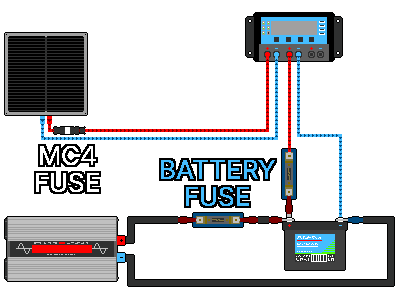

## 4. システム設計
---
### 4-1. システム電圧の決定
#### 4-1-1. システム電圧とは
&nbsp;&nbsp;&nbsp;システム電圧とは、パネル・コントローラー・バッテリー・インバーターのすべてで共通して合わせる一つの電圧定格です。一般的に12V / 24V / 48Vのいずれかに設定され、これら4つの部品の電圧定格を一致させることで、事故の発生リスクを低減できます。コントローラーはバッテリーを充電し、インバーターはバッテリーから電力を取り出して使用するため、バッテリーの電圧を基準としてシステム全体を設計するのが基本です。

&nbsp;&nbsp;&nbsp;24Vのパネルを使用する場合は、24V対応のソーラーチャージコントローラー ＋ 24Vのバッテリー（＋ ACを使用する場合は24V入力対応のインバーター）が必要です。手持ちの装備がある場合は、12Vのバッテリー2個を直列に接続して24Vのバッテリーを構成して接続することも可能です。  

| 誤った組み合わせ | 発生し得る事故・トラブル |
| --- | --- |
| 12Vパネルと24Vバッテリー（PWM）の混用 | パネルの電圧が低いため、24Vバッテリーを充電できません。 |
| 24Vコントローラーと12Vバッテリーの混用 | 電圧の不一致によりシステムが動作しないか、機器が損傷します。 |
| 12Vインバーターと24Vバッテリー의 혼용 | 入力過電圧によりインバーターが破損します。 |
| 24Vインバーターと12Vバッテリーの混用 | 電圧不足によりインバーターが起動しません。 |

#### 4-1-2. 12V・24V・48Vの比較
&nbsp;&nbsp;&nbsp;システム電圧にどの値を選定しても、コンポーネント同士の電圧さえ一致していればシステムは正常に動作します。ただし、システムの規模に応じて有利な電圧定格が異なります。同じ電力（W）を伝送する場合、電圧が高くなるほど電流が小さくなるため（P＝V×I）、より細い電線で済み、熱損失も低減します。そのため、システムが大型化する（電気使用量が多くなる）ほど、高いシステム電圧を採用する方が効率的です。

| システム電圧 | 600Wの電力を送電するときの電流 | 特徴・意味 |
| :---: | ---: | --- |
| 12V | 50A | 電流が大きいため、電線を太くする必要があり、熱損失による電力ロスが大きくなります。 |
| 24V | 25A | 12Vシステムに比べて、電力損失を半分に抑えることができます。 |
| 48V | 12.5A | 電力損失が最も小さく、12Vシステムよりもかなり細い電線を使用できます。 |

- 12V: 最もシンプルで12V用の部品や機器が豊富ですが、電流が大きくなるため大型のシステムには不向きです。
- 24V: 電流が12Vの半分に抑えられるため、電線の太さや損失を抑えられるバランスの良い選択肢です。
- 48V: 損失が最も少ないですが、12Vや24Vに比べて対応する部品が比較的高価になります。

| おおよその規模（参考） | 推奨システム電圧 |
| --- | :---: |
| 小規模（パネル発電量が数百W程度、照明や充電が中心） | 12V |
| 中規模（パネル発電量が約1.5kW程度まで） | 24V |
| 大規模（パネル発電量が1.5kW以上） | 48V |

#### 4-1-3. システム電圧の決定手順
1. 使用する家電機器の消費電力を合算し、パネルで1時間あたり何Wの電力を生産する必要があるかを計算します。
2. 計算結果をもとに、上記の「おおよその規模」の表と比較して、推奨されるシステム電圧を確認します。
3. システム電圧と同等の電圧を持つバッテリーを購入します（入手できない場合は、12Vのバッテリーを複数個直列に接続して構成します）。
4. コントローラーおよびインバーターを、バッテリー電圧と一致する製品で購入します。
5. パネルは、構築したシステムを適切に充電できる仕様の製品を購入します（PWMコントローラーでは「パネル電圧＝バッテリー電圧」の製品を、MPPTコントローラーではより柔軟に組み合わせられますがVocの限界値を確認します）。

---
### 4-2. 必要電力・パネル・バッテリー容量の計算
- すべての計算値には必ず「余裕（安全係数）」を持たせてください。不足するとシステム停止の危険がありますが、余裕があれば安全に運用できます。  

#### 4-2-1. 1日の消費電力量（Wh）の算出
&nbsp;&nbsp;&nbsp;容量の計算を始める前に、必ず必要な機器（照明・通信・冷蔵など）の優先順位を決定する必要があります。その後、太陽光発電システムから電力を供給する機器ごとに「電力（W）× 1日の使用時間（h）」を計算し、すべて合算します。  

| 機器 | 消費電力 | 使用時間 | 1日の消費電力量 |
| --- | --- | --- | --- |
| LED照明 | 10W | 5時間 | 50Wh |
| スマホ充電 | 10W | 2時間 | 20Wh |
| ノートPC | 50W | 3時間 | 150Wh |
| 10W | 40W | 6時間 | 240Wh |
| 小型冷蔵庫 | （間欠運転） | 24時間 | 約500Wh |
| 合計 | | | 約1,000Wh/日 |

- ここでは、1日に約1,000Whの電力が必要であると仮定します。

#### 4-2-2. 損失の考慮（安全マージン）
&nbsp;&nbsp;&nbsp;コントローラー、インバーター、電線、バッテリーの充放電の各過程で、電気が少しずつロス（熱損失など）として失われます。安全を見込んで、計算値を「0.75」で割ることで、適切な余裕を持たせます。  

- 1,000Wh ÷ 0.75 ≈ 1,333Wh （実際に発電・蓄電すべき総電力量）

#### 4-2-3. バッテリー容量の決定
&nbsp;&nbsp;&nbsp;何日分の電力を蓄えておくか（無日照自給日数：曇りや雨の日を何日間耐えるか）を決定します。災害対策の目的であれば2〜3日間が適当であり、この例では「2日間」として計算します。  

- 1日の消費電力量 × 自給日数 ＝ 蓄電すべき電力量
- 1,000Wh × 2日 ＝ 2,000Wh

&nbsp;&nbsp;&nbsp;さらに、バッテリーの「放電深度（DoD）」を考慮して、必要なバッテリー総容量を算出します。  

- 蓄電すべき電力量 ÷ 実質使用可能割合（DoD）＝ 必要なバッテリー容量（Wh）

| バッテリーの種類 | 計算式 | 必要容量 (Wh) | 24Vシステムでの換算 (Ah = Wh ÷ V) |
| --- | --- | --- | --- |
| リ튬(80%) | 2,000 ÷ 0.8 | 2,500Wh | 2,500 ÷ 24 ≈ 104Ah → 120Ah |
| 납산(50%) | 2,000 ÷ 0.5 | 4,000Wh | 4,000 ÷ 24 ≈ 167Ah → 200Ah |

- 同じ使用条件であるにもかかわらず、鉛蓄電池はリチウム電池に比べて約2倍の定格容量が必要になります。バッテリーを準備する際は、重量や価格も合わせて総合的に判断する必要があります。

#### 4-2-4. 太陽光パネル容量の決定
&nbsp;&nbsp;&nbsp;太陽光パネルは、日の出から日の入りまで常にフルパワーで発電できるわけではありません。「1日に最大出力に相当する強い日差しが何時間維持されるか」を示す指標を「ピーク日照時間（PSH：Peak Sun Hours）」と呼びます。これは単なる日照時間ではなく、有効な発電時間の目安であり、日本国内ではおおむね夏場で4〜5時間、冬場や曇天時で2〜3時間となります。災害対策を目的とする場合は、保守的に「約3時間」をピーク日照時間として計算する方が安全です。  

- 1日の必要発電量 ÷ ピーク日照時間 ＝ パネル容量（W）
- 1,333Wh ÷ 3時間 ≈ 約444W

&nbsp;&nbsp;&nbsp;ここに、曇りの日のリカバリーや将来の劣化を考慮し、余裕を持って大きめの容量を選定します（例：444Wが必要な場合、200Wのパネルを3枚設置して600Wとする）。パネル容量に余裕を持たせることで、晴れている数時間の間に急速にバッテリーを充電し、曇りの日を乗り切りやすくなるため、災害対策の観点ではパネル容量を多めに見積もる方が圧倒的に有利です。  

#### 4-2-5. コントローラーの電流定格の決定
&nbsp;&nbsp;&nbsp;パネルの総出力（W）÷ システム電圧（V）を計算することで、充電時に発生する最大電流値を算出できます。これに「1.25倍」の安全係数を掛け、その電流値に十分に耐えられるコントローラーを選定します。  

- パネル総出力 600W ÷ システム電圧 24V ＝ 発生電流 25A
- 発生電流 25A × 1.25 ≈ 余裕を持たせた設計電流 31A
- 40AクラスのMPPTコントローラーを選定

#### 4-2-6. 総合的な設計例のまとめ
| 項目 | 選定・決定内容 |
| --- | --- |
| システム電圧 | 24V |
| 1日の消費電力 | 約1,000Wh（損失考慮後：1,333Wh） |
| バッテリー | リン酸鉄リチウムイオン 24V・120Ah （または 鉛蓄電池 24V・200Ah） |
| 太陽光パネル | 600W （200W × 3枚） |
| コントローラー | 40A MPPT（24V対応） |
| 인버터(선택) | 負荷の合計 ＋ モーターのサージ電력을 考慮して選定、24V入力対応 |

---
### 4-3. 電線・保護装置の選定
#### 4-3-1. 電線の太さ（サイズ）の決定
&nbsp;&nbsp;&nbsp;各経路（区간）を流れる電流を算出し、その電流を十分に許容できる太さを選定します。  

上記の総合設計例をベースに計算すると以下のようになります：  
（インバーターが1,000Wの出力を出すとき、バッテリーからインバーターへ流れる電流は持続的に約50Aに達します）  

| 配선 区間 | 想定される電流 | 推奨される電線サイズ（参考） | 適合ヒューズ／遮断器（DC用） |
| --- | --- | --- | --- |
| パネル → コントローラー | 約 25A | 6mm²（10 AWG）以上 | 30A |
| コントローラー → バッテリー | 約 25〜30A | 6〜10mm² | 30〜40A |
| バッテリー → インバーター | 約 50A+（瞬間サージ 100A+） | 16mm²（6 AWG）以上 | 80A以上 |

&nbsp;&nbsp;&nbsp;上記の値は参考値です。周囲の温度が高くなる場合や、電線が長くなる場合（電圧降下）は、さらに太い電線を使用する必要があります。迷った場合は一段階太い電線を使用するのが鉄則です。特に、**バッテリー ↔ インバーター間は最も大きな電流が流れるため、システム内で最も太い電線**を使用しなければなりません。  

- 電圧降下: 電線が長く細いと、内部抵抗（R）が大きくなり、オームの法則に従って電圧が減少（V＝I×R）し、その分が熱として無駄に消費されます。電線は「短く、太く」配線するのが原則です（これも、システム電圧を高めに設定しておけば電流が小さくなるため、有利になります）。

#### 4-3-2. ヒューズ・遮断器の設置位置と容量
&nbsp;&nbsp;&nbsp;電流は電源のプラス（+）側から出て機器を経유してマイナス（−）側へと流れます。ヒューズおよび遮断器（ブレーカー）は、過電流が発生した際に回路を遮断して電線や装置を保護する安全装置です。太陽光システムでは、電源（+）側の電線を確実に保護するため、一般的にプラス（+）極の電線上に設置します。マイナス（−）側に設置してしまうと、ヒューズが切れたりブレーカーが落ちたりしても、機器の内部には依然としてプラスの電圧が印加された状態が続くため、漏電や火災などの危険なリスクが残ってしまいます。  

&nbsp;&nbsp;&nbsp;ヒューズおよび遮断器の容量は、通常の稼働電流よりも大きく、かつ電線の許容電流よりも小さい製品を選択します（例：平常時に25Aが流れ、電線が36Aまで耐えられる製品の場合 → 30Aクラスのヒューズを購入）。また、太陽光システムでは必ず「DC（直流）定格」のヒューズを使用してください。

&nbsp;&nbsp;&nbsp;次の各ポイントに、ヒューズまたはDC遮断器を配線します。
1. パネルとコントローラーの間は、パネルにできるだけ近い位置のプラス（+）線上にヒューズまたはDC遮断器を設置します。
2. コントローラーとバッテリーの間は、バッテリーにできるだけ近い位置のプラス（+）線上にヒューズまたはDC遮단기를 設置します。
3. バッテリーとインバーターの間は、バッテリーにできるだけ近い位置のプラス（+）線上にヒューズまたはDC遮断器を設置します。

  

| 設置場所 | 推奨される保護装置 |
| --- | --- |
| パネル ↔ パネル（並列接続時） | PVヒューズ |
| パネル ↔ 充電コントローラー | PVヒューズ または PV用DC遮断器 |
| 充電コントローラー ↔ バッテリー | MEGAヒューズ または Class-Tヒューズ |
| バッテリー ↔ インバーター | MEGAヒューズ または Class-Tヒューズ |
| メンテナンス用の開閉・遮断 | DC遮断器（サーキットブレーカー） |

※ MC4ヒューズは、PVヒューズの取り付け形態（コネクタ一体型）の1つです。  

| 項目 | PVヒューズ | ANLヒューズ | MEGAヒューズ | Class-Tヒューズ | DC遮断器 |
| --- | --- | --- | --- | --- | --- |
| 価格 | 安価 | 安価 | 普通 | 高価 | 普通〜高価 |
| 遮断速度 | 早い | 遅い〜普通 | 普通〜早い | 非常に早い | 遅い |
| 遮断容量 (AIC) | 低〜中 | 低い | 中程度 | 非常に高い | 製品により異なる |
| 過電流保護 | 優秀 | 可能 | 優秀 | 非常に優秀 | 可能 |
| 短絡保護 | 優秀 | 普通 | 優秀 | 非常に優秀 | 製品により異なる |
| 再利用の可否 | 不可 | 不可 | 不可 | 不可 | 可能（レバー式） |
| LiFePO4保護 | 不適合 | 可能 | 推奨 | 最適 | 単独使用は非推奨 |
| 鉛蓄電池保護 | 不適合 | 可能 | 推奨 | 推奨 | 可能 |
| 太陽光パネル保護 | 最適 | 不適合 | 不適合 | 不適合 | 可能 |
| 小型太陽光システム | 推奨 | 適合 | 適合 | オーバースペック | 適合 |
| 中型太陽光システム | 推奨 | 可能 | 推奨 | 推奨 | 可能 |
| 大型ESS（蓄電システム） | 不適合 | 非推奨 | 可能 | 最適 | 補助用 |
| 主な用途 | パネル電線の保護 | RV、キャンピングカー | オフグリッド、中型インバーター | ESS、大型インバーター、LiFePO4 | 開閉およびメンテナンス |

- リン酸鉄リチウムイオン（LiFePO4）バッテリーは、短絡（ショート）時に瞬間的に数千アンペアという爆発的な電流を放出します。一般的な低価格の家庭用や詳細不明のDC遮断器では、この莫大な電流を遮断しきれず、内部が熱で溶着（アークで溶けて一体化）してしまい、遮断に失敗して火災につながります。リチウムバッテリーを使用する場合は、**必ず遮断性能の高いClass-Tヒューズ、または高性能のMEGAヒューズを、バッテリーの直近に直列に最初に取り付けて**ください。

---
### 第4章の内容まとめ

| 項目 | 内容 |
| --- | --- |
| システム電圧 | パネル・コントローラー・バッテリー・インバーターを一つの規格（12/24/48V）に統一 |
| 基準となるコンポーネント | バッテリーが基準。コントローラーやインバーターはバッテリー電圧に整合させる |
| 24Vシステムのシナリオ | 24Vパネル → 24Vコントローラー ＋ 24Vバッテリー（＋ 24V入力インバーター） |
| 24Vのバッテリー構成法 | 12Vのバッテリー2個を直列に接続 ＝ 24V |
| 電압選定の理由 | 高電圧 ＝ 小電流（P＝V×I） ＝ 電線が細くなり、熱ロスの低減につながる |
| 容量設計の5ステップ | ①消費電力(Wh)算出 ②損失考慮(÷0.75) ③バッテリー決定(自給日数・DoD) ④パネル決定(÷日照時間) ⑤コントローラー決定(×1.25) |
| バッテリーのAh換算 | Ah ＝ Wh ÷ システム電圧 |
| ピーク日照時間 | 冬場や曇天時を基準に、約3時間として保守的に見積もるのが安全 |
| パネルの接続 | 電圧上昇 ＝ 直列（Vocの限界値に注意）、電流上昇 ＝ 並列 |
| 電線（ケーブル） | 各区間の電流値で選定し「短く、太く」。バッテリー ↔ インバーター間がシステム内で最太 |
| ヒューズ／遮断器 | 通常電流 ＜ ヒューズ容量 ＜ 電線許容電流、必ずDC定格品を使用、バッテリーのプラス（+）線の近くに配置 |