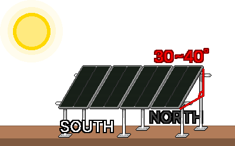

## 5. 설치와 운용
### 작업 전 안전 점검
- 전원이 차단되어 있는지 확인합니다.
- 주변의 물기·불씨를 제거합니다.
- 손이 젖었는지, 비가 내리고 있는지 확인합니다.
- +/− 극성이 맞는지 확인합니다.
- 각 구간 전선 굵기가 충분하고, DC 퓨즈 및 DC 차단기가 자리에 있는지 확인합니다.
- 모든 부품의 전압 등급이 통일되었는지 확인합니다. (예: 24V 패널 ↔ 24V 배터리)
- 멀티미터로 전압을 실제로 재어봅니다.
- 배터리 +선 가까이 퓨즈가 있는지 확인합니다.
- 컨트롤러가 패널의 전류·전압 한계를 견디는지 확인합니다.
---
### 5-1. 패널 거치
#### 5-1-1. 거치 장소
&nbsp;&nbsp;&nbsp;태양광 패널 셀은 직렬로 연결되어 있어서 일부만 그늘져도 전체 출력이 급감하므로, 가능한 앞이 트인 남쪽 방향에서 아침·정오·오후 시간대별로 그림자가 어떻게 움직이는지 확인합니다. 나무·전봇대·건물·안테나의 그림자가 지나가지 않아 하루 종일 햇빛이 드는 곳에 패널을 설치합니다.  

&nbsp;&nbsp;&nbsp;패널은 빛을 받는 순간부터 전기를 만들며, 배터리처럼 스위치로 끌 수 없습니다. 따라서 거치 작업 및 배선 중에는 불투명 천으로 패널을 덮어 발전을 막거나, 전기가 살아 있다고 가정하고 작업해야 합니다.  

#### 5-1-2. 방향
&nbsp;&nbsp;&nbsp;북반구인 대한민국에서는 패널을 남쪽(정남향)으로 향하게 합니다. 오후에 전기가 더 필요하면 약간 남서쪽으로, 아침이 중요하면 약간 남동쪽으로 미세 조정합니다.

#### 5-1-3. 각도
&nbsp;&nbsp;&nbsp;패널을 지면에서 비스듬히 세웁니다. 햇빛이 패널에 수직으로 들수록 발전 효율이 높아집니다. 패널 각도를 고정해야 할 경우, 대략 위도 각도인 30-40° 기울기로 설치합니다. 만일 패널 각도 조절이 가능한 환경일 경우, 겨울은 더 세우고(위도 +약 15°, 낮은 겨울 해를 받음) 여름은 더 눕힙니다(위도 −약 15°). (재난 대비 목적이라면 전기가 가장 부족한 계절을 기준으로 잡아야 하므로, '겨울'에 맞춰 약간 세우는 편이 안전합니다)  

  

#### 5-1-4. 고정
&nbsp;&nbsp;&nbsp;패널은 넓은 판이라 바람에 돛처럼 날리거나 부서지기 쉽습니다. 임시로 설치하는 경우에도 지면 프레임, 구조물 결박, 무게추 등을 사용하여 반드시 단단히 고정해야 합니다.  

&nbsp;&nbsp;&nbsp;패널이 뜨거워지면 출력이 낮아지므로, 패널 뒤로 공기가 통하게 띄워서 설치해야 합니다. 같은 이유로 뜨거운 표면(아스팔트·금속 지붕)에 바로 붙여 설치해서는 안됩니다.  

&nbsp;&nbsp;&nbsp;겨울철 추운 날씨에는 패널의 전압(Voc)이 사양표보다 더 높아지므로, 컨트롤러의 '최대 PV 입력 전압' 한계 수치가  패널들을 직렬 연결할 때의 전압 합산보다 최소 15% 이상 여유로워야 합니다.  

---
### 5-2. 배선·결선과 접지
#### 5-2-1. 연결 순서
&nbsp;&nbsp;&nbsp;대부분의 컨트롤러는 배터리 전압을 먼저 인식해야 정상 작동하기 떄문에, 패널을 배터리보다 먼저 연결하면 컨트롤러가 손상될 수 있습니다. 따라서 배터리는 항상 '가장 먼저' 연결하고, '가장 나중에' 분리해야 합니다. 패널을 연결/분리할 때는 패널을 불투명 천으로 덮어 둔 상태로 작업하면 더 안전합니다.

연결 순서  
1. 컨트롤러에 배터리를 연결 시킨다.  
2. 패널을 컨트롤러에 연결 시킨다.  
3. 전원이 꺼진 인버터를 배터리에 연결 시킨다.  
3. 인버터의 전원을 켠다.  

분리 순서  
1. 인버터의 전원을 끈다.  
2. 전원이 꺼진 인버터를 배터리로부터 분리 시킨다.  
3. 패널을 컨트롤러로부터 분리 시킨다.  
4. 배터리를 컨트롤러로부터 분리 시킨다.  

#### 5-2-2. 극성(+/−) 확인
&nbsp;&nbsp;&nbsp;극성을 거꾸로 연결하면 컨트롤러·배터리·인버터가 손상될 수 있습니다.

1. 연결 전 멀티미터로 +/-극을 확인합니다.
2. 보통 빨간 선은 +극이며, 검은 선은 −극입니다. 단자의 색상과 극성 표시를 함께 확인합니다.
3. 패널 커넥터(MC4 커넥터)는 암·수가 정해져 있으므로, 서로 맞물리는 커넥터 끼리 연결해야 합니다.

#### 5-2-3. 결선 상태 확인
&nbsp;&nbsp;&nbsp;느슨한 연결은 저항이 되어 열이 나고 화재로 이어집니다.

- 나사와 압착 단자(터미널)는 흔들리지 않게 단단히 조입니다.
- 굵은 전선은 압착 단자(터미널)로 마감하여 접촉을 확실히 합니다.
- 야외 연결부는 물과 습기가 들지 않도록 보호합니다.  

※ 배터리 단자를 스패너 등 금속 공구로 조일 때는 공구가 (+)단자와 (−)단자에 동시에 닿지 않도록 조심해야 합니다. 가급적 공구의 손잡이 부분을 절연 테이프로 감아 금속 노출 부위를 최소화한 뒤 작업하는 것이 안전합니다.

#### 5-2-4. 접지 확인
&nbsp;&nbsp;&nbsp;접지(接地, Ground/Earth)는 전기 회로를 땅이나 별도의 쇠붙이(접지극)에 연결하는 것을 말합니다. 접지는 기기 고장으로 금속 프레임에 전기가 흐르거나, 정전기·낙뢰가 생겼을 때 전기를 땅으로 안전하게 흘려보내 감전·손상을 줄입니다.

1. 패널 고정용 금속 프레임과 거치 구조물을 서로 연결합니다.
2. 연결된 금속 프레임을 접지선으로 잇고, 땅에 박은 접지봉에 연결합니다.

※ 접지·본딩 방식은 지역 전기 규정이 정한 부분이 있습니다. 영구·대형 설치라면 전문가의 확인을 받는 것이 안전합니다.  

---
### 5-3. 첫 가동 점검과 유지보수
#### 5-3-1. 가동 전 체크리스트
- [  ] 모든 부품의 전압 등급이 통일되었습니다. (예: 전부 24V)
- [  ] 극성(+/−)을 멀티미터로 확인하였습니다.
- [  ] 각 구간 전선 굵기가 충분하고, DC 퓨즈/차단기가 제자리에 있습니다. (배터리 +선 가까이)
- [  ] 단자가 단단히 조여져 있습니다.
- [  ] 패널이 바람에 견디게 고정되어 있습니다.

#### 5-3-2. 가동 순서
1. 5-2-1. 연결 순서대로 배터리 → 패널 → (전원이 꺼진)인버터 순으로 연결합니다.
2. 컨트롤러 화면을 확인하여 배터리 전압이 정상 범위인지 확인합니다.
3. 햇빛 아래에서 충전 전류(A)·PV 입력이 표시되는지 확인합니다.
4. 배터리 전압이 서서히 오르면서 정상 충전 되는지 확인합니다. (12V 완충 약 12.7V(충전 중이 아닐 경우), 24V 약 25.4V(충전 중이 아닐 경우))
5. 부하/인버터를 켜 보고 정상 작동 하는지 확인합니다.

#### 5-3-3. 흔히 발생하는 문제
| 증상 | 점검 사항 |
|---|---|
| 충전이 안 됨 | 퓨즈 끊김, 느슨/거꾸로 연결, 패널이 그늘짐, 컨트롤러 설정, 멀티미터로 패널 전압 측정 |
| 출력이 약함 | 그늘·먼지·잘못된 각도, 패널 과열, 패널 용량 부족, 가늘고 긴 전선(전압 강하) |
| 배터리가 금방 닳음 | 부하 과다, 배터리 용량 부족, 배터리 노후, 인버터 대기 전력, 과방전 누적 |
| 컨트롤러 오류 표시 | 설명서의 코드 확인, 전압 등급·연결 재점검 |

#### 5-3-4. 유지보수
- 패널 관리: 먼지·새똥·눈을 닦아 출력을 회복합니다. 각도 조정이 가능한 경우, 계절별 각도를 조정하여 출력을 향상시킵니다.
- 연결부 관리: 온도 변화로 단자가 느슨해질 수 있으므로 가끔 다시 조여줍니다.
- 배터리 관리: 침수형 납산 배터리는 증류수 보충과 환기를 주기적으로 수행합니다. 이외 모든 배터리는 공통적으로 단자를 청결히 유지하고, 전압 확인을 통해 노후 배터리를 교체합니다.
- 컨트롤러 관리: 충전 전류와 배터리 전압을 자주 확인합니다.

---
### 5-4. 재난 상황 운용
#### 5-4-1. 우선순위 정하기
&nbsp;&nbsp;&nbsp;재난 상황에서는 생산된 전력을 효율적으로 관리하여, 필수 설비에 장시간 공급할 수 있도록 설계해야 합니다. 각 기기가 생존에 미치는 영향을 사전에 파악하고, 배터리 잔량이 감소함에 따라 우선순위가 낮은 기기부터 순차적으로 전원을 차단합니다.  

| 우선순위 | 예시 |
| --- | --- |
| 1순위 | [생존·구호] 휴대폰, 라디오, 비상조명, 필수 의료기기 |
| 2순위 | [유지·보존] 식품·약품 냉장고, 환기 시설, 노트북 |
| 3순위 | [편의·기타] 일반 가전제품, 가습기, 정수기 등 편의 기기 |

#### 5-4-2. 전기 아껴 쓰기
- DC 기기는 인버터 없이 직접 컨트롤러(DC Load 단자) 혹은 배터리와 연결하여 전환 손실을 회피합니다.
-  AC 기기를 사용하지 않을 때는 인버터를 끄거나 분리하여 대기전력 소모를 차단합니다.
- 백열등 대신 LED 조명을 사용하는 등, 고효율 기기를 사용합니다.
- 햇빛이 가장 강한 시간(정오 전후)에 충전과 사용을 몰아서 합니다. (남는 전기는 기기 충전에 사용합니다)

#### 5-4-3. 배터리 잔량 확인
&nbsp;&nbsp;&nbsp;납산 배터리는 부하·충전을 잠시 끄고 쉰 상태에서 전압을 측정하여 잔량을 가늠할 수 있습니다.  

| 잔량 | 12V 배터리 | 24V 배터리 |
|---|---|---|
| 100% (완충) | 약 12.7V | 약 25.4V(충전 중이 아닐 경우) |
| 75% | 약 12.5V | 약 25.0V |
| 50% (납산은 여기까지 권장) | 약 12.2V | 약 24.4V |
| 25% | 약 12.0V | 약 24.0V |
| 방전 (사용 금지) | 11.9V 이하 | 23.8V 이하 |

&nbsp;&nbsp;&nbsp;리튬(LiFePO₄) 배터리는 전압이 거의 평탄하여 잔량 추정이 어려우므로, 컨트롤러 및 BMS가 보여 주는 % 표시를 확인해야 합니다. 또한 끝까지 비우는 과방전은 피해야 수명이 길어집니다.  

#### 5-4-4. 흐린 날·겨울철 대비
- 배터리 잔량이 부족하면 더 강하게 절전하고, 2·3순위 기기를 끕니다.
- 배터리 수명과 안전을 위해 과방전 상태가 되지 않도록 사용량을 조절합니다.
- 가능하면 여분 배터리나 다른 충전 수단(발전기 등)을 비상용으로 확보합니다.
- 흐린 날이 길어질수록 '최소 생존 전력'(통신·조명 정도)만 유지합니다.

#### 5-4-5. 운용 중 안전
- 인버터 정격을 넘는 기기를 사용하지 않습니다. (모터 서지 포함)
- 배터리 환기에 유의하고, 과열·이상 냄새·부풂 시 즉시 점검합니다.
- 빗물 유입을 차단하여 태양광 설비가 물에 젖지 않도록 합니다.
- 장기 운용 시 패널 청소와 연결부 점검을 주기적으로 수행합니다.

---
### 5장 내용 정리

| 항목 | 내용 |
|---|---|
| 패널 위치 | 그늘 없는 곳, 하루 종일 햇빛 |
| 방향·각도 | 정남향, 경사 ≈ 위도(30~40°), 재난 대비는 겨울 기준으로 세움 |
| 고정 | 바람 대비 단단히, 뒤로 공기 통하게 |
| 거치 안전 | 패널은 빛받으면 항상 전기 생산 → 덮고 작업, 추락 주의 |
| 연결 순서 | 배터리 → 패널 → 인버터, 분리는 반대(배터리 마지막) |
| 극성 | 멀티미터로 +/− 확인 후 연결 |
| 결선 | 단단히 조임(헐거우면 발열), 야외는 방수 |
| 접지 | 금속 프레임 접지 필수, 영구·대형은 전문가 확인 |
| 첫 가동 | 전압 정상·햇빛에 충전 전류 흐르는지 확인 |
| 문제 해결 | 충전 안 됨=퓨즈·연결·그늘 / 약함=그늘·먼지·전압강하 |
| 유지보수 | 패널 청소, 단자 재조임, 배터리·수치 점검 |
| 재난 운용 | 필수 기기 우선, 남으면 충전, 과방전 금지 |