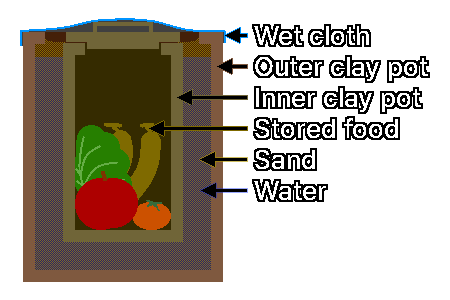

## 2. 食品の保管方法
---
### 2-1. 窒素置換保管 (Nitrogen Flushing)
&nbsp;&nbsp;&nbsp;脱酸素剤の代わりに窒素を注入し、包装内部の酸素を置換する方法です。

| 項目 | 内容 |
| :---: | :--- |
| 原理 | 不活性気体である窒素は食品の酸化を防ぎ、害虫が呼吸できる酸素を排除することで害虫の発生を抑制します。 |
| 長所 | 脱酸素剤よりも迅速かつ完全に酸素を除去します。 |
| | 再充填が可能な環境において、繰り返しの開封が必要な食糧（例：粉ミルク、コーヒー）に有利です。 |
| 適した食品 | 穀物、粉ミルク、コーヒー、ナッツ類など、酸敗に対して敏感な食品に効果的です。 |
| 注意事項 | 窒素置換包装の後に安全のため脱酸素剤を併用することは可能ですが、窒素置換が完全であれば脱酸素剤を重複して使用する必要はありません。 |

---
### 2-2. 石灰（生石灰）防湿貯蔵
&nbsp;&nbsp;&nbsp;密閉容器の内部に生石灰（酸化カルシウム、CaO）を配置し、湿気を吸収する方法です。

| 項目 | 内容 |
| :---: | :--- |
| 原理 | 生石灰が周囲の水分を吸収して水酸化カルシウム（Ca(OH)2）に変化しながら、容器内部の湿度を極限まで低下させます。 |
| 適した食品 | 米、豆、乾燥野菜など、湿気に弱い食品のカビや微生物の繁殖予防に効果的です。 |
| 注意事項 | 生石灰は水と反応する際に発熱するため、取り扱いに注意が必要です。 |
| | 過度の乾燥は穀物のひび割れや脂肪の酸化を加速させるため、少量使用の原則を遵守し、長期使用時は周期的な交換が必要です。 |
| | 食品と直接接触させてはならず、必ず別個の通気性のある袋や容器に入れ、密閉された食品容器の最下部に配置しなければなりません。 |

---
### 2-3. 階層包装 (Layered Packaging)
&nbsp;&nbsp;&nbsp;齧歯類（ネズミなど）や害虫の侵入から食糧を保護するための3段階の包装戦略です。

| 包装 | 用途 | 内容 |
| :---: | :--- |
| 内部包装 | 酸素・湿気遮断 | マイラーバッグと脱酸素剤を使用し、食品自体の品質を保存します。 |
| 中間包装 | 物理的防護 | 金属缶、厚手のプラスチック容器など、堅牢な容器にマイラーバッグを入れることで、物理的な衝撃や齧歯類の歯から保護します。 |
| 外部包装 | 位置隠蔽および臭気遮断 | 食糧を保管する場所を隠蔽し、齧歯類の嗅覚を刺激しないよう臭気を遮断する措置を講じます。 |

---
### 2-4. 地下貯蔵
&nbsp;&nbsp;&nbsp;地中深くは年間を通じて安定した温度（約4～10°C）と高い湿度（85～95%）を維持するため、根菜類や球根類を新鮮に保管することができます。

| 貯蔵原則 | 内容 |
| :---: | :--- |
| 分離貯蔵 | ジャガイモ、サツマイモ、タマネギなどはそれぞれ異なるガスを放出するため、必ず分離して貯蔵する必要があります。特に、タマネギはジャガイモの発芽を促すエチレンガスを放出するため、一緒に保管してはなりません。 |
| 通風管理 | 新鮮な空気が流入し、停滞した空気が排出されるよう、通風の方向を管理することが重要です。 |
| 作物管理 | 高湿環境ではカビや細菌が増殖しやすいため、表面が損傷した作物は直ちに除去しなければなりません。 |
| 温度管理 | サツマイモは10°C以下の涼しい地下に保管すると冷害により腐敗するため、ジャガイモと一緒に保管する際は温度管理に注意が必要です。（サツマイモの保管最適温度：12～15°C） |

---
### 2-5. ポット・イン・ポット (Pot in Pot)
  
&nbsp;&nbsp;&nbsp;ポット・イン・ポットは、気化熱を利用して食品の保管温度を下げる伝統的な食品保管方法です。

| 項目 | 内容 |
| :---: | :--- |
| 原理 | 二つの壺の間の砂と、その上を覆っている布の中の水分が蒸発する際に気化熱を奪い、内部温度を低下させます。 |
| 材料 | 大きな壺、小さな壺、砂、水、布 |
| 保管 | 水が十分に蒸発するよう、通風の良好な場所に保管します。 |
| 活用 | 野菜、果物、乳製品（短期の暫定保管）などを保管し、貯蔵寿命を延長するために使用されます。 |
| 注意事項 | 湿度が低く大気が乾燥した地域でのみ機能します。 |
| | 韓国の夏のように湿度が80%を超える災害状況では、水が蒸発しないため、かえってカビが発生する原因となります。 |
| | 高温多湿な環境においては、**5-4. 塩蔵（塩漬け）**または**5-5. 乳酸発酵**の項目を参照してください。 |

| 製作手順 | 製作方法 |
| :---: | :--- |
| 1 | 大きな壺の底に砂を5cmの厚さで敷き詰めます。 |
| 2 | 小さな壺を大きな壺の中央に配置します。 |
| 3 | 小さな壺と大きな壺の間の隙間を砂で満たします。 |
| 4 | 大きな壺と小さな壺の間に水を注ぎ、砂を湿らせます。 |
| 5 | 小さな壺に食品を入れ、蓋を閉めます。 |
| 6 | 大きな壺の口を覆える大きさの布を被せ、布の上から水をスプレーします。 |

---
### 2-6. カンギナ (Kangina)
  
&nbsp;&nbsp;&nbsp;カンギナは、アフガニスタン北部地域でブドウを新鮮に保管するために使用されてきた伝統的な泥土貯蔵技術で、「宝物」という意味を持っています。

| 項目 | 内容 |
| :---: | :--- |
| 原理 | 泥の障壁が外部の空気、湿気、微生物からブドウを保護し、鮮度を維持します。 |
| 材料 | 傷のないブドウ（皮が厚い品種を中心に房ごと収穫）、泥と藁を混ぜて天日干しにした丸い粘土容器2個、紙、泥 |
| 保管 | 直射日光の当たらない涼しい日陰や、地下室、または土中に埋めて保管します。 |
| 注意事項 | アフガニスタンの乾燥気候と粘土の特性に最適化された技術です。 |
| | 通常の泥と藁で不完全に製造した場合、内部の湿度調節に失敗し、ブドウが腐敗する確率が高くなります。 |
| | 高温多湿な環境においては、**5-4. 塩蔵（塩漬け）**または**5-5. 乳酸発酵**の項目を参照してください。 |

| 製作手順 | 製作方法 |
| :---: | :--- |
| 1 | 丸い粘土容器の中に、紙で包んだブドウを入れます。 |
| 2 | ブドウが入った粘土容器の上に別の粘土容器を逆さにして被せ、ブドウを覆います。 |
| 3 | 二つの粘土容器の隙間を泥で塞ぎ、密閉します。 |