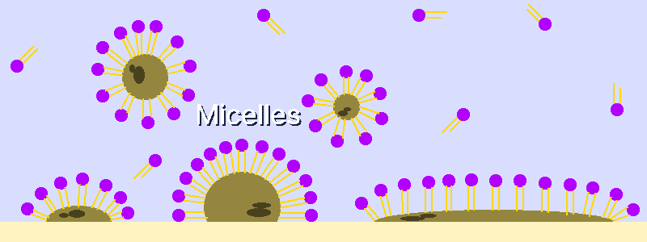

# 石鹸
---
## 1. 原理
### 1-1. 石鹸の作用原理
&nbsp;&nbsp;&nbsp;石鹸は数千年の間、動物性脂肪や植物性油、そして灰を組み合わせて作られてきており、この工程は長い時間をかけて精製されてきました。石鹸は界面活性剤として油分を乳化させ、水によって洗い流す方式で作用します。
  
  
&nbsp;&nbsp;&nbsp;石鹸分子は水と混ざる時、自発的に球状構造であるミセル（Micelles）を形成します。親水性の頭部は水と接触し、親油性の尾部は内側へと隠れます。油汚れが存在すると、ミセルは油の滴を内部空間に閉じ込めて水から隔離し、これによって油が水に安定して分散（コロイド状態）され、洗い流されます。

---
### 1-2. 化学的理解
&nbsp;&nbsp;&nbsp;石鹸は動植物性脂肪の主成分であるトリグリセリド（Triglycerides）と強塩基が反応して作られます。この反応を「けん化反応」と呼びます。  

&nbsp;&nbsp;&nbsp;脂肪貯蔵分子であるトリグリセリドは、グリセロール骨格と3本の脂肪酸の尾部から構成されており、これらはエステル結合で連結されています。ここに強塩基（例：水酸化ナトリウム）を添加するとエステル結合が切断され、グリセロールと脂肪酸塩（Fatty Acid Salts）が形成されますが、この脂肪酸塩こそが石鹸です。

&nbsp;&nbsp;&nbsp;石鹸の製造に使用される塩基の種類によって、最終的な石鹸の特性が決定されます。石鹸を構成する脂肪酸の鎖の長さが長いほど、石鹸は水に溶けにくく硬くなり、泡立ちが悪くなる傾向があります。水酸化ナトリウム（Sodium Hydroxide, NaOH, 苛性ソーダ）は硬くて水に溶けにくいナトリウム脂肪酸塩を形成するため固形石鹸の製造に適しており、水酸化カリウム（Potassium Hydroxide, KOH, 苛性カリ）は柔らかくて水に溶けやすいカリウム塩を形成するため液体石鹸の製造に適しています。

&nbsp;&nbsp;&nbsp;ラード（豚脂）1gを完全にけん化するのに必要な水酸化ナトリウム（NaOH）の量は約0.138gであり、ラード1kgで石鹸を作る場合、水酸化ナトリウムは理論上138g必要になります。（スーパーファット0%基準）

---
## 2. 石鹸製造の常識
### 2-1. 安全規則
&nbsp;&nbsp;&nbsp;石鹸の製造時は、ゴーグルと手袋を必ず着用しなければなりません。水酸化ナトリウムや水酸化カリウムのような強アルカリ性溶液は腐食性が強く、目に入ると深刻な損傷を引き起こす恐れがあります。  

&nbsp;&nbsp;&nbsp;万が一皮膚や目に触れた場合は、直ちに流水で15分以上洗浄し、必要に応じて医療措置を受けなければなりません。強塩基による火傷（化学熱傷）の際に酢を使用することは、中和の過程で熱が発生し、かえって症状を悪化させる可能性があるため危険です。  

&nbsp;&nbsp;&nbsp;混合の順序を厳守し、必ず水酸化ナトリウムを水のほうへ投入しなければなりません。水を水酸化ナトリウムのほうに注ぐと、危険な飛散や沸き上がりが生じる原因となります。

&nbsp;&nbsp;&nbsp;水酸化ナトリウムを水に溶解させる際、大量の熱が発生して煙が出ることがあります。この溶液は非常に高温で危険なため、子供やペットから遠く離れた場所に保管しなければなりません。

---
### 2-2. コールドプロセスとホットプロセス
&nbsp;&nbsp;&nbsp;石鹸を製造する主な方法は、コールドプロセス（Cold Process）とホットプロセス（Hot Process）の二つがあり、それぞれ長所と短所が明確です。

| 区分 | コールドプロセス | ホットプロセス |
| :---: | --- | --- |
| 温度 | 外部加熱なしで進行（反応熱を利用） | 約90°Cで進行 |
| 硬化時間 | 4〜6週間所要（反応完了および水分の蒸発） | 約1日所要（迅速） |
| 長所 | 多様な形状へのモールド成形が容易であり、多彩な添加物が使用可能 | 迅速 |
| 短所 | 硬化時間が長い | 粘度が非常に高いため基本的な形状のみ可能、熱に弱い添加物は使用不可 |
| 用途 | 固形石鹸（例：ラード石鹸、オリーブ／ココナッツオイル石鹸） | 液体石鹸（水酸化カリウム使用時） |

---
### 2-3. トレース段階と添加物の影響
&nbsp;&nbsp;&nbsp;石鹸の混合物を撹拌する際、表面に跡（痕跡）が残る時点を「トレース（Trace）」段階と呼びます。トレース段階の粘度は、石鹸のデザインや添加物の混合に影響を与えます。ラード石鹸は伝統的に添加物なしの純粋な状態で製造されることもありますが、他の石鹸製造時には添加物を活用することができます。

| トレース粘度 | 特徴 | 適した用途 |
| --- | --- | --- |
| ライトトレース (Light Trace) | 非常に緩く液体に近い | スワール（渦巻き）デザイン、液体添加物の混合 |
| ミディアムトレース (Medium Trace) | 適度にとろみがある | 固形添加物（例：種子、コーヒー粉）を分散させるのに最適 |
| ティックトレース (Thick Trace) | 粘度が非常に高く形状を維持する | テクス처（質感）デザイン、多層石鹸の製造 |

&nbsp;&nbsp;&nbsp;添加物の種類によって、石鹸の粘度や硬化時間に影響を及ぼすことがあります。シンナムアルデヒドやベンズアルデヒドのような特定の添加物は強塩基に敏感なため、水酸化ナトリウムの大部分が消費されたトレース段階以降に投入しなければ破壊されません。  
  
&nbsp;&nbsp;&nbsp;スーパーファット（Super-fatting／ディスカウント）とは、石鹸を製造する際に必要な量よりも脂肪をわずかに多く添加することを指します。これは石鹸に残留油分を残すことで、皮膚の乾燥を抑えてしっとりさせる効果があります。

---
## 3. 水酸化ナトリウムを用いた石鹸製造
&nbsp;&nbsp;&nbsp;ラード（Lard, 豚脂）を用いた石鹸製造は最も伝統的な方式であり、最小限の材料（水、ラード、水酸化ナトリウム）だけで保湿力に優れた石鹸を作ることができます。

&nbsp;&nbsp;&nbsp;ラード石鹸は通常、純白色の硬いバーの形状に完成し、非常にマイルドで保湿力に優れています。これはラードに含まれるオレイン酸（Oleic acid）、けん化反応中に自然生成されるグリセリン、そしてスーパーファット効果によって残留した脂肪の複合的な効果によるものです。  

&nbsp;&nbsp;&nbsp;伝統的なラード石鹸は、泡立ちを促す油分が含まれていないため泡立ちが弱く、クリーミーな感触が強いです。その代わり、一度石鹸になれば数年間保管することができ、一般的な石鹸のように水に触れても溶け崩れてベタつくことがなく、乾燥した状態を維持できるという長所があります。

| 材料 | 容量 | 説明 |
| :---: | ---: | :--- |
| ラード | 500g | 豚脂です。自身で精製するか、または購入することができます。 |
| 水酸化ナトリウム | 67g | 分子式NaOHの食品グレードの強塩基です。食品グレードとは純度の基準を意味し、食用可能という意味ではありません。67gは腐食のリスクを低減するため、約5%のスーパーファットを計算した値です。 |
| 蒸留水 | 130ml | 水を加熱して発生した水蒸気を冷却し、不純物やミネラルを除去した純水で、正確な量を使用しなければなりません。 |
| 精密秤 | 1個 | 材料を正確に計量することが非常に重要です。 |
| 撹拌工具 | 1個 | 手動で撹拌すると非常に時間がかかりますが、ハンドブレンダーを使用するとトレース（Trace）段階へ遥かに迅速に到達できます。 |
| 成形型 | 1個 | シリコン型やプラスチックボックスなどを使用できます。 |

| 順序 | 方法 |
| :---: | :--- |
| 1 | 蒸留水と水酸化ナトリウムを秤で正確に計量します。 |
| 2 | 水が入った容器に水酸化ナトリウムをゆっくりと投入し、完全に溶解するまで撹拌します。 |
| 3 | 水酸化ナトリウム溶液を脇に置いて冷却します。溶液の目標温度は約38°Cです。 |
| 4 | 固体状態のラ드（ラード）を液体状態になるまで融解させます。 |
| 5 | 融解したラードをミキシングボウルに注ぎ、冷却します。ラード의 目標温度は約27°Cです。 |
| | ！ 水酸化ナトリウムとラードの温度を適切に合わせることが、石鹸が適切に固まるために重要です。 |
| 6 | 温度が調整されたラードに、水酸化ナトリウム溶液をゆっくりと注意深く注ぎます。混合した直後からけん化反応が始まり、混合液が白濁していくのを確認できます。 |
| 7 | 撹拌工具を使用し、20〜30秒ずつ短く区切りながら撹拌します。ラード石鹸は他のオイル石鹸よりもトレースに到達するまでに時間を要することがあります。（手動で撹拌する場合はさらに時間を要します） |
| | ！ 混合液を撹拌する際、表面に跡が残る状態を「トレース（Trace）」と呼びます。この時点は、オイルと水酸化ナトリウムが安定して乳化し、これ以上分離しない状態を意味します。トレース段階に突入した後に過度に変調（撹拌）を続けると、粘度が高くなりすぎて成形型に注ぎにくくなる場合があります。 |
| 8 | トレース段階に到達した石鹸混合液を成形型に注ぎ入れます。（この段階でも、石鹸にはまだ水酸化ナトリウムや水酸化カリウムが残っているため危険な場合があります） |
| 9 | 成形型を毛布や厚手のタオルで包み、熱を保温します。この熱がけん化反応を促進します。 |
| 10 | 24時間経過後、成形型から石鹸を取り出し、ナイフやカッターで好みの大きさに切り分けます。 |
| | ！ ラード石鹸は非常に硬く固まるため、モールド（型）の中に長時間（例：1週間）放置すると、切り分けが極めて困難になります。 |
| 11 | 石鹸のブロックを空気の通りが良いプラスチックシートや棚の上に立て、1週間に1回以上裏返しながら硬化させます。 |
| | ！ 石鹸は切り分けた後も、使用する前に必ず硬化（Curing／熟成）の工程を経なければなりません。コールドプロセス石鹸は通常4週間から6週間ほど硬化工程を経る必要があり、この期間に残った水分が蒸発することで、石鹸がより硬く、そしてマイルドになります。 |

---
## 4. 伝統方式の石鹸製造
&nbsp;&nbsp;&nbsp;現代的な石鹸製造法が精製された水酸化ナトリウム（NaOH）を使用するのに対し、古代から中世までは自然から得た材料を組み合わせて強塩基を自家製造して使用していました。この方式では、水酸化カリウム（KOH）を主成分とする軟性石鹸が作られます。

&nbsp;&nbsp;&nbsp;水酸化カリウム石鹸は硬い固体形状ではなく、軟性石鹸、すなわち液体またはジェル状になります。また、伝統的な灰汁抽出法は精製された塩基を使用する現代の方式とは異なり、正確なアルカリ濃度を確保することが非常に困難です。生成された溶液は純粋な水酸化カリウム（KOH）ではなく、炭酸カリウムやその他の不純物が混合した形態であり、アルカリ濃度の測定が不完全なため、洗顔・入浴用よりも食器洗いおよび洗濯用として使用することが推奨されます。

---
### 4-1. 伝統方式の石鹸製造方法
| 順序 | 方法 |
| :---: | :--- |
| 1 | 貝殻や石灰石を約1000°Cで焼き、酸化カルシウム（CaO, 生石灰）を準備します。 |
| 2 | 広葉樹を燃やした灰に水を注いで浸出させ、濃い灰汁（炭酸カリウム, K₂CO₃ 水溶液）を濾し取ります。 |
| 3 | 生石灰の粉末に水を少しずつ加え、消石灰（水酸化カルシウム, Ca(OH)2）のペースト（スラリー）を作ります。 |
| 4 | 灰汁に消石灰のペーストを投入し、一緒に煮沸します。 |
| 5 | 混合溶液が沸騰すると、下層部には白色の炭酸カルシウムの沈殿が沈み、上層部には強アルカリ溶液（水酸化カリウム, KOH）が生成されます。上層部の透明な溶液だけを別途濾し取ります。 |
| 6 | 製造された水酸化カリウム溶液を融解したラードと混合した後、とろみが出るまで加熱しながら絶えず撹拌します。 |

---
### 4-2. 灰汁アルカリ強度の試験方法
&nbsp;&nbsp;&nbsp;伝統的な方法で石鹸を製造する際は、灰汁溶液の濃度を精密に計量することができなかったため、経験的な試験法が使用されていました。

#### 4-2-1. 卵試験法
&nbsp;&nbsp;&nbsp;灰汁溶液に卵を浮かべ、卵の一部が水面の上に浮かぶ度合いを見てアルカリ濃度を判断できます。卵が完全に沈む場合はアルカリが弱すぎてけん化が困難であり、半分以上浮かぶ場合はアルカリが過剰で脂肪を損傷させる可能性があったため、上部（直径2cm程度）がわずかに浮かぶ灰汁溶液が適しています。

#### 4-2-2. 羽毛試験法
&nbsp;&nbsp;&nbsp;灰汁溶液に羽毛を浸し、羽毛が溶解する度合いを観察してアルカリ濃度を判断できます。羽毛を浸した際に即座に溶解はしないものの、数秒から数十秒の間に先端がどろどろになり分解されなければなりません。羽毛に変化がない場合はアルカリが不足している状態であり、即座に溶けて消失する場合は過剰な濃度です。ゆっくりと損傷していく灰汁溶液が適しています。