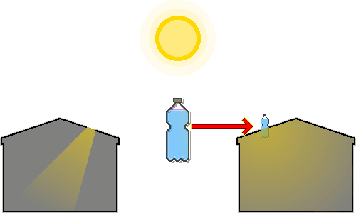

# ペットボトル電球
---
## 1. 概要
&nbsp;&nbsp;&nbsp;ペットボトル電球は、電力供給が遮断された災害状況や、電気代の負担が大きい環境において、日中に室内を照らすために考案された適正技術（アプロプリエイト・テクノロジー）です。ブラジルのアルフレド・モーゼル（Alfredo Moser）が2002年の停電事態に対応して初めて発明し、その後、フィリピンのイラック・ディアス（Illac Diaz）が「リッター・オブ・ライト（A Liter of Light）」キャンペーンを通じて世界中に普及させました。  

&nbsp;&nbsp;&nbsp;この電球は、廃プラスチックボトルと水、そして少量の漂白剤のみで製造され、約40〜60W級の白熱電球に匹敵する明るさを提供することで、暗い室内環境を改善し、灯油ランプと比較して火災のリスクが著しく低いです。

---
## 2. 材料
| 材料 | 条件 | 役割 |
| --- | --- | --- |
| 透明ペットボトル | 傷や変色のない透明な2Lプラスチックボトル | 光の集光および屈折を最大化するレンズ |
| 水 | 清潔な水 | 光を屈折・散乱させる媒体 |
| 漂白剤（塩素） | 塩素系漂白剤を水1Lあたり3ml添加 | 微生物の繁殖抑制 |
| 屋根材 | 亜鉛メッキ鋼板または類似する頑丈な屋根材 | ボトルの固定および漏水防止 |
| シリコンシーラント | 防水および密閉用のシリコン接着剤 | 漏水防止 |

&nbsp;&nbsp;&nbsp;清潔な水を入手することが困難な場合は、煮沸するかフィルタリングを行って不純物を除去してから使用しなければなりません。水が濁っていると、光の透過率が急激に低下します。  

&nbsp;&nbsp;&nbsp;ガラス瓶はプラスチックよりも耐久性が高く透明度も優れていますが、重量が重く破損時の危険性があり、屋根に設置するための固定および防水処理がより煩雑になる場合があります。

---
## 3. 原理
  

| 順序 | 動作 |
| :---: | :--- |
| 1 | 太陽光が空気を通過し、水が満たされた透明なペットボトルに入射します。 |
| 2 | 水が充填されたボトルは凸レンズと類似した働きをし、広範囲の太陽光を集めて室内方向へと集中させます。 |
| 3 | 光が空気から水へ、再び水から空気（室内）へと通過する際、媒体の密度差によって経路が折れ曲がります。 |
| 4 | 屈折現象のおかげで、光はボトルの下部に集まるようになります。 |
| 5 | ボトルの下部に集中した光は、水が持つ屈折力と漂白剤粒子の微細な散乱効果が加わり、四方へと広がっていきます。 |
| 6 | 散乱効果のおかげで、光を特定の地点だけに集中させることなく、室内全体を均一に照らす照明効果を生み出します。 |

---
## 4. 設置工程
| 段階 | 作業 | 注意事項 |
| --- | --- | --- |
| 1. 材料準備および洗浄 | 2L透明ペットボトルを洗浄し、ラベルを除去します。 | ボトルに傷があったり不透明であったりすると、光の透過率が低下します。 |
| 2. 水と漂白剤の注入 | ボトルに清潔な水を注ぎ口の端まで満たした後、水1Lあたり3ml（2L基準で約6ml）の漂白剤を加え、蓋をしっかりと閉めて密閉します。 | 内部に空気層が残るとレンズ効果が低下するため、満水にしてください。 |
| 3. 屋根の開口および準備 | 屋根材（鋼板）にペットボトルの直径よりわずかに小さい円形の穴を開けます。 | 穴が大きすぎると防水が困難になり、小さすぎるとボトルが入りません。 |
| 4. ボトルの挿入および固定 | ボトルの1/3が屋根の上に、2/3が室内に配置されるように穴に挿入して固定します。 | 重量が重いため、ボトルが揺れないように屋根の下側から支持台などで補강（補強）すると良いです。 |
| 5. 防水処理 | ボトルと屋根材の隙間に、屋根の上側と下側の両方からシリコンシーラントを厚く塗布して密閉します。 | シーラントが完全に乾燥するまで待つ必要があります。 |

---
## 5. メンテナンス
&nbsp;&nbsp;&nbsp;ペットボトル電球は、約5年ごとにボトル内部の水と漂白剤を交換し、透明度を維持しなければなりません。  

&nbsp;&nbsp;&nbsp;豪雨や強風の後は、屋根のシリコンシーラントの状態を周期的に点検し、隙間が生じていないか確認して、必要に応じて補修を行う必要があります。  

&nbsp;&nbsp;&nbsp;ボトルの屋根より上の部分がほこりや異物で覆われると、光の透過率が低下するため、周期的に拭き取らなければなりません。