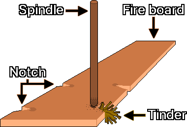
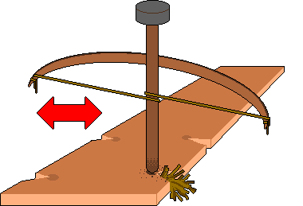
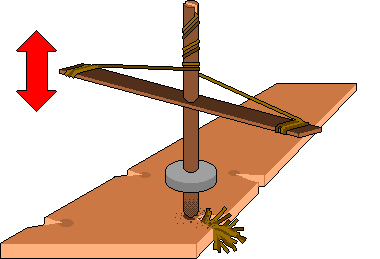
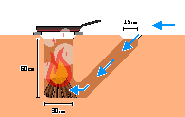

# Fire making
---
## 1. Pre-Ignition Checklist
&nbsp;&nbsp;&nbsp;Secure at least two evacuation routes to enable an immediate escape in the event of wildfire propagation or detection by hostile forces.

&nbsp;&nbsp;&nbsp;Check if the ground is damp or cold; placing an insulating barrier such as a log layout will prevent thermal dissipation into the earth and optimize fuel efficiency.  

&nbsp;&nbsp;&nbsp;Verify that heat, fuel, and oxygen are sufficient for successful ignition and sustained combustion.

| Element | Content |
| --- | --- |
| Heat | Sufficient temperature required to reach the ignition point (e.g., friction, sparks, concentrated light). |
| Fuel | Combustible matter (e.g., dry grass, fuelwood). |
| Oxygen | Ambient air necessary to sustain combustion (e.g., blowing, ventilation). |

---
## 2. Ignition Priorities
&nbsp;&nbsp;&nbsp;Igniting a fire in an emergency is a battle against time and physical stamina; therefore, it is advisable to select the most efficient method based on available tools and environmental conditions.

| Rank | Method | Success Rate | Energy Expenditure | Key Tools |
| --- | --- | --- | --- | --- |
| 1 | Direct Ignition | Extremely High | Extremely Low | Lighter, matches, torch (when tools are available) |
| 2 | Spark / Concentrated Light | Moderate | Low to Moderate | 9V battery, lens, ferrocerium rod, flint |
| 3 | Friction Ignition | Low | Extremely High | Hand drill, bow drill, pump drill (as a last resort) |

---
## 3. Ignition
### 3-1. Spark and Physical Methods
#### 3-1-1. 9V Alkaline Battery Short-Circuit Ignition
| Item | Content |
| :---: | :--- |
| Principle | An ember can be generated through electrical resistance heating (resistive heating). |
| Materials | One 9V battery, fine steel wool, tinder. |
| Method | Simultaneously contact both the positive and negative terminals of the 9V battery to the fine steel wool. |
| | The steel wool instantly overheats, glowing red and generating an ember. |
| Precautions | A 9V battery overheats rapidly when short-circuited, so disconnect it immediately after brief contact. |
| | Lithium-ion batteries (rechargeable packs) carry a very high risk of explosion and fire during a short circuit; the use of a 9V dry cell (alkaline or carbon-zinc) is highly recommended. |

#### 3-1-2. Concentrated Light Ignition Using a Lens
| Item | Content |
| :---: | :--- |
| Principle | Utilizes the principle of a convex lens to converge sunlight onto a single focal point, elevating the temperature to the ignition threshold. |
| Materials | Hyperopia-correcting convex eyeglasses or a transparent plastic bottle filled to the brim with water. |
| Method | Position the lens beneath the sun over the tinder and concentrate the light onto a single point. |

---
### 3-2. Friction Methods
&nbsp;&nbsp;&nbsp;Friction ignition operates on the principle of rapidly rubbing two pieces of wood together to generate heat, creating charred wood dust, and introducing oxygen to nurture this dust into a viable ember. Friction ignition is highly sensitive to environmental variables; thus, the success rate drops significantly in high-humidity conditions. To ensure the stable formation of charred dust, it is advantageous for the hearth/fire board and the spindle to have a similar hardness, or for the hearth to be marginally harder.

#### 3-2-1. Components
  

| Component | Role | Key Characteristics & Materials |
| :---: | :--- | :--- |
| Hearth (Fire board) | The base where friction occurs | Cut a small V-shaped notch near the edge of a soft wooden board where the spindle will rotate. This notch is where the friction-generated charred dust accumulates. |
| Spindle | The rod that rotates to generate frictional heat | Typically crafted from the same type of wood as the hearth; it must be straight and thoroughly dry. |
| Tinder | Materials that catch the ember to grow it into a flame | Use dry, highly combustible materials such as dry grass or shredded bark. |

#### 3-2-2. Causes of Friction Ignition Failure
| Failure Cause | Phenomenon | Corrective Action |
| :---: | :--- | :--- |
| Insufficient Heat | Charred dust is not generated or fails to transition into an ember. | Increase the rotation speed. |
| Excessive Oxygen | Charred dust fails to accumulate and is blown away by the wind. | Implement windbreaks, such as constructing a surrounding wall. |
| Insufficient Oxygen | An ember forms but its growth slows down or it extinguishes. | Apply appropriate ventilation or gentle blowing. |
| Excessive Fuel | The dry grass is packed too densely, suffocating the ember. | Loosen the dry grass to secure clear air pathways. |

#### 3-2-3. Friction Ignition Stages
| Step | Content |
| :---: | :--- |
| 1 | Spin the spindle slowly while applying strong downward pressure to generate frictional heat and accumulate charred dust beneath the V-shaped notch. |
| 2 | Once a sufficient amount of charred dust accumulates and smoke begins to billow, maximize the rotation speed while maintaining pressure to reach the ignition point. |
| 3 | If the charred dust sustains smoking on its own, it is deemed a successful ember formation. |
| 4 | The ember is considered stabilized if the accumulated pile of dust does not collapse when lightly fanned by hand. |

#### 3-2-4. Friction Ignition Precautions
&nbsp;&nbsp;&nbsp;Friction ignition demands tremendous physical stamina. If an ignition attempt fails, do not force the process continuously; halt operations at 10-to-15-minute intervals to rest and conserve body heat.  

&nbsp;&nbsp;&nbsp;To prevent blisters from forming on the palms during friction ignition, take hand-protection measures such as wearing gloves or wrapping a towel around the hands.

---
### 3-3. Ignition Using Friction Tools
#### 3-3-1. Hand Drill
&nbsp;&nbsp;&nbsp;This is the simplest setup, yet it demands the greatest amount of effort and physical strength.

| Step | Content |
| :---: | :--- |
| 1 | Obtain a slender, smooth branch roughly the length from your elbow to your fingertips (approx. 45–50 cm) with the thickness of an index finger (approx. 1–1.5 cm) to use as a spindle. |
| 2 | Obtain a wooden board that is slightly softer than the spindle to serve as the hearth. |
| 3 | Carve a depression into the hearth about twice the diameter of the spindle, and cut a V-shaped notch extending outward from the edge of the depression. |
| 4 | Fill the space beneath the V-shaped notch with tinder. |
| 5 | Secure the hearth firmly with your foot. |
| 6 | Position the spindle vertically between both palms, apply strong downward pressure, and rapidly rub your hands back and forth to rotate it. |
| 7 | Rotate using speed rather than brute force; when your hands slide down to the bottom of the spindle, swiftly move them back to the top and repeat the rubbing motion. |
| 8 | As charred dust accumulates within the V-shaped notch and smoke begins to emerge, do not stop spinning until an ember forms. |
| 9 | Once an ember forms, transfer it into a tinder bundle and gently blow from the side to coax it into a flame. |

#### 3-3-2. Bow Drill
  

&nbsp;&nbsp;&nbsp;A method that utilizes a bow to rotate the spindle, providing more sustained rotational force than a hand drill and yielding a higher success rate.

| Step | Content |
| :---: | :--- |
| 1 | Proceed up to Step 4 of the Hand Drill instructions. |
| 2 | Fashion a handhold (bearing block) out of a stone or hardwood with a central depression to fit over the top of the spindle. To reduce friction with the spindle, the depression can be lubricated with moisture-free lubricants such as dry leaves, charcoal dust, animal fat, tree resin, or soap shavings. |
| 3 | Procure a rigid, slightly curved branch roughly the length of an arm, and securely tie a strong cord or leather thong to both ends to construct a bow. |
| 4 | Loop the bowstring once around the spindle, and regulate the tension using your grip strength by holding the string against the bow handle with your fingers. If the string is too tight, it will slip instead of wrapping; if it is too loose, it will spin idly. It is preferable to tie the string with a small amount of slack rather than wrapping it tautly. |
| 5 | Steady and push down on the top of the spindle with the bearing block using one hand, and saw the bow horizontally back and forth with the other hand. |
| 6 | Once the spindle generates charred dust in the V-shaped notch of the hearth and sufficient smoke is produced, increase the speed to secure an ember. |
| 7 | Once an ember forms, transfer it into a tinder bundle and gently blow from the side to coax it into a flame. |

#### 3-3-3. Pump Drill
  

&nbsp;&nbsp;&nbsp;While this tool features the highest construction difficulty among friction fire-making methods, it permits highly stable operation and effectively converts vertical motion into rotational movement.

| Step | Content |
| :---: | :--- |
| 1 | Proceed up to Step 4 of the Hand Drill instructions. |
| 2 | Prepare a separate stick to serve as the crossbar handle. |
| 3 | Drill a hole precisely through the center of the crossbar handle, slide the spindle through it perpendicularly, and position it roughly 10 cm from the top of the spindle. |
| 4 | Securely tie a strong cord or leather thong to both ends of the crossbar handle. |
| 5 | Fashion a disk out of stone or clay with a central hole to create a flywheel weighing approximately 1.5 kg. |
| 6 | Slide the flywheel onto the spindle and secure it at a height of roughly 5 cm from the bottom. |
| 7 | Carve a slot into the very top tip of the spindle. |
| 8 | Insert the midpoint of the cord into the slot at the top of the spindle, knot it, and tie it securely to fix it to the spindle. |
| 9 | Spin the spindle clockwise to wind the cord downward, and tie both ends of the cord securely to each end of the crossbar handle. |
| 10 | Push the crossbar handle downward about halfway to initiate rotation. |
| 11 | When you release the downward pressure, the inertia of the flywheel will cause the cord to automatically rewind in the opposite direction, reversing the spindle's rotation. |
| 12 | Repeat this reciprocating vertical pumping motion to generate charred dust and capture an ember. |
| 13 | Once the spindle generates charred dust in the V-shaped notch of the hearth and sufficient smoke is produced, increase the speed to secure an ember. |
| 14 | Once an ember forms, transfer it into a tinder bundle and gently blow from the side to coax it into a flame. |

---
## 4. Fire Management
### 4-1. Fuel Staging
&nbsp;&nbsp;&nbsp;To successfully build and maintain a fire, fuel must be sorted by size and fed into the fire incrementally. Introducing large fuel prematurely restricts the oxygen supply and risks suffocating the flame; therefore, fuel must be added in the sequence of small → medium → large.

| Fuel | Thickness | Role |
| :---: | :---: | --- |
| Tinder | Thinner than a pencil lead | Initial fuel that receives the ember to grow it into a flame (e.g., dry grass, cattail fluff, downy lint). It should be brittle enough to crumble when twisted by hand. |
| Kindling | Pencil lead to pencil thickness | Intermediate fuel that stabilizes the flame and transfers heat so that the primary firewood can catch fire. |
| Fuelwood | Wrist thickness or wider | Primary fuel that sustains combustion over a long duration. |

---
### 4-2. Heat Preservation
#### 4-2-1. Reflector Wall
&nbsp;&nbsp;&nbsp;Installing a reflector wall made of logs, stones, or dirt behind the fire concentrates radiant heat toward the user or tent. This setup is highly effective for maintaining body temperature while sleeping and can double as a windbreak to minimize thermal loss. However, to prevent overheating and fracturing hazards of the wall, the distance between the reflector wall and the fire must be at least 30 cm.

#### 4-2-2. Ember Preservation
&nbsp;&nbsp;&nbsp;Burying glowing coals deep within ashes minimizes the oxygen supply, maintaining the coals in a low-temperature combustion state and preserving the embers for several hours. If relocation is required, wrap the embers tightly with dry bark (especially birch bark) or tinder, and transport them inside a sealed container (e.g., a metal can). It is best to let the ember stabilize for 1 minute after its creation before moving; do not seal the container completely, as the lack of microscopic ventilation will extinguish the ember due to oxygen starvation.

#### 4-2-3. Dakota Fire Hole
  

&nbsp;&nbsp;&nbsp;A method of digging a pit into the ground to build a fire; depending on soil conditions and humidity, it reduces smoke visibility to provide a conditional concealment effect and is outstanding at blocking wind.  

&nbsp;&nbsp;&nbsp;However, if airflow stagnates, there is a serious risk of carbon monoxide (CO) accumulation; thus, a clear ventilation pathway between the intake hole and the exhaust hole must be secured. Furthermore, to eliminate underground fire hazards, its use is strictly prohibited in root-heavy areas or peatlands. Exercise caution in sandy soils or landslide-prone areas, as the pit walls may collapse.

| Step | Content |
| :---: | :--- |
| 1 | Dig a large circle with a diameter of 30 cm into the ground, and a smaller circle with a diameter of 15 cm on the upwind side. The distance between the two circles must be at least 15 cm. |
| 2 | Excavate the large circle vertically to a depth of 60 cm, and dig the small circle at an angle leading down to the absolute bottom of the large vertical pit. |
| 3 | Adjust the opening where the two holes connect so that it is roughly large enough for a single hand to enter. |
| 4 | Place tinder and firewood at the bottom of the large circle and ignite the fire. |

---
## 5. Fuel Manufacturing
### 5-1. Charcoal
#### 5-1-1. Large-Scale Dome Method
| Step | Content |
| :---: | :--- |
| 1 | Gather dry wood and stack it into a dome shape. |
| 2 | Apply mud over the stack to seal it completely. |
| 3 | Fashion a small smoke exhaust vent at the top, and cut air intake holes at the bottom. |
| 4 | Ignite the wood through the top vent. |
| 5 | If cracks appear on the mud exterior during combustion, seal them immediately with fresh mud, and add more wood if necessary. |
| 6 | When the smoke color shifts from white to blue, carbonization is deemed complete; plug the bottom air intakes and the top exhaust vent with mud to cut off the oxygen supply. |
| 7 | Harvest the charcoal once all thermal energy has dissipated. |

#### 5-1-2. Small Metal Can Method
| Step | Content |
| :---: | :--- |
| 1 | Place small wood pieces or tinder inside a small metal can (e.g., a beverage can). |
| 2 | Close the lid to seal it; pierce a small hole in the lid, as total airtightness carries an explosion risk due to internal pressure build-up. |
| 3 | Place the can inside a campfire to heat it. |
| 4 | When smoke stops emerging from the hole, carbonization is deemed complete; extract the can from the campfire. |
| 5 | Harvest the charcoal once all thermal energy has dissipated. |

---
### 5-2. Rendered Fat
| Step | Instructions |
| :---: | :--- |
| 1 | Thoroughly wash the fatty tissues of beef or pork to remove impurities. |
| 2 | Chop the fat as finely as possible to maximize the surface area exposed to heat. |
| 3 | Place a minimal amount of water along with the fat in a pot and render over low heat using a double boiler method. |
| 4 | Once the fat melts into a liquid, filter out the solid residues using a fine cloth or mesh. |
| 5 | Allow the strained liquid to cool, which solidifies it into a natural, firm rendered fat. |

---
### 5-3. Beeswax Extraction
| Step | Instructions |
| :---: | :--- |
| 1 | Place the honeycomb material remaining after honey harvesting into water and heat it below 85°C. |
| 2 | Once the beeswax has melted completely, filter out the impurities through a cloth while the mixture is still hot. |
| 3 | Allow the filtered solution to cool undisturbed; because beeswax is lighter than water, it solidifies into a distinct layer on the surface. |
| 4 | Detach the solidified beeswax block, scrape away any remaining debris from the bottom layer, and repeat the refining process once more to obtain pure beeswax. |

---
### 5-4. Utilizing Environmental Resources
&nbsp;&nbsp;&nbsp;Sections where pine resin has concentrated are resistant to moisture and ignite readily thanks to their oil content.  

&nbsp;&nbsp;&nbsp;Birch bark contains oil components (betulin), making it an outstanding tinder that ignites easily even when wet.  

&nbsp;&nbsp;&nbsp;Splitting damp logs exposes the dry heartwood inside, which can be harvested for fuel.

---
## 6. Safety Regulations
### 6-1. Prohibition of Ignition in Enclosed Spaces
&nbsp;&nbsp;&nbsp;As a rule, ignition inside enclosed spaces (tents, caves, or unventilated structures) is fundamentally discouraged. Building a fire or utilizing charcoal inside an enclosed space carries an exceptionally high risk of carbon monoxide poisoning.  

&nbsp;&nbsp;&nbsp;Carbon monoxide is colorless and odorless, making it extremely difficult to detect. Early symptoms include headaches, dizziness, nausea, drowsiness, impaired judgment, and confusion, which can easily be mistaken for simple oxygen deprivation. If these symptoms manifest, extinguish the fire immediately and evacuate to a well-ventilated outdoor area.

#### 6-2. Smoke Concealment and Prevention of Position Exposure
&nbsp;&nbsp;&nbsp;Fires lit during the day can expose your position from several kilometers away due to smoke plumes. Wet wood causes a sharp increase in smoke production due to moisture evaporation; therefore, utilize charcoal, which produces minimal smoke, or dry wood split into slender pieces.  

&nbsp;&nbsp;&nbsp;White smoke primarily denotes moisture evaporation, while dense gray smoke indicates incomplete combustion; inspect the fuel condition accordingly if these occur.  

&nbsp;&nbsp;&nbsp;To prevent light exposure at night, dig a deep pit to build the fire, or thoroughly screen the surroundings to ensure no illumination escapes.

### 6-3. Wildfire Hazards
&nbsp;&nbsp;&nbsp;In wildfire-prone regions or during dry weather warnings, ignition should be prohibited as a matter of principle. If a fire must be used, completely extinguish the residual embers using water or dirt, and touch the ashes to verify that no thermal energy remains.

---
## 7. First Aid
### 7-1. First-Degree Burns
&nbsp;&nbsp;&nbsp;Immediately upon a burn occurrence, cool the affected area under cold running water (excluding ice water) for at least 20 minutes. This prevents the thermal energy from penetrating deeper into the skin tissues.  

&nbsp;&nbsp;&nbsp;When cooling large-area burns, exercise caution as the patient's body temperature can drop sharply, potentially inducing hypothermia.  

&nbsp;&nbsp;&nbsp;Folk remedies such as popping blisters or applying soybean paste (Doenjang) or Soju increase infection risks and are strictly prohibited.

#### 7-2. Chemical Burn Flushes
&nbsp;&nbsp;&nbsp;If alkaline substances (e.g., ash, lime) adhere to a burn site, remove all contaminated clothing and immediately flush the area with copious amounts of water to eliminate the chemical agents.  

&nbsp;&nbsp;&nbsp;Do not attempt to neutralize alkaline substances using acidic agents; flush exclusively with clean running water.