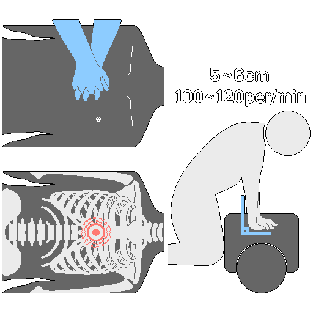
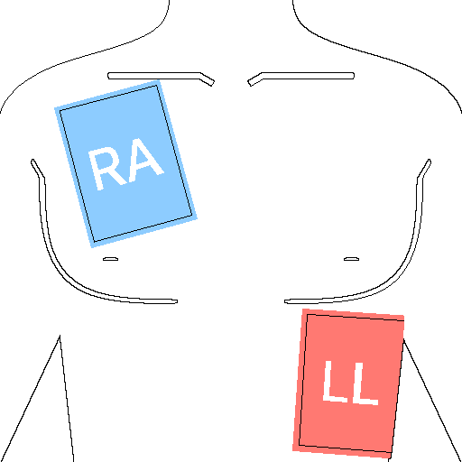
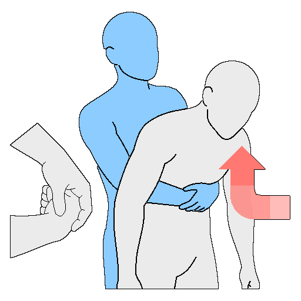

# Первая помощь
&nbsp;&nbsp;&nbsp;Данный документ предназначен исключительно для образовательных и ознакомительных целей. Он ни при каких обстоятельствах не может заменять профессиональную медицинскую помощь. В случае возникновения чрезвычайной ситуации как можно скорее обратитесь в службу спасения (112, 103 или местную службу спасения). Некоторые манипуляции (декомпрессия грудной клетки иглой, введение лекарственных препаратов и т. д.) должны выполняться только лицами, прошедшими соответствующую медицинскую подготовку.

---
## 1. Введение и базовые принципы
&nbsp;&nbsp;&nbsp;Целью данного руководства является оказание первой помощи в критических ситуациях, возникающих в условиях катастроф, военных действий и экстремальных сред, для поддержания жизни пострадавшего и предотвращения ухудшения его состояния до прибытия профессиональных медицинских работников.  

&nbsp;&nbsp;&nbsp;Первая помощь — это не окончательное лечение, а «навык, позволяющий продержаться до момента эвакуации и спасения». Даже если состояние пострадавшего стабилизировалось, он в обязательном порядке должен быть осмотрен медицинским персоналом.

---
### 1-1. Меры предосторожности перед началом оказания помощи
&nbsp;&nbsp;&nbsp;Если пострадавший находится в сознании, необходимо объяснить ему суть планируемых действий и получить согласие на их проведение. Если пострадавший без сознания или его жизни угрожает прямая опасность, помощь оказывается немедленно без предварительного согласия.

&nbsp;&nbsp;&nbsp;Если обстановка на месте происшествия представляет опасность или вы не уверены в своих действиях, приоритетом должно быть обеспечение собственной безопасности и оперативный вызов экстренных служб, а не проведение сомнительных манипуляций.

---
### 1-2. Базовые принципы
| Принцип | Содержание |
| --- | --- |
| Обеспечение безопасности | Приоритетом является безопасность самого спасателя. Оцените место происшествия на предмет наличия таких угроз, как удар током, пожар, обрушение, токсичные газы, и только после этого приближайтесь к пострадавшему. |
| Вызов служб и взаимодействие | Немедленно вызовите экстренные службы и четко распределите задачи среди окружающих. При обращении в службу спасения ясно передайте состояние пострадавшего, местоположение и уже оказанную помощь. Адресно указывайте конкретным людям задачи: «Принесите АНД», «Смените меня на компрессиях» и т. д. |
| Оценка и контроль состояния | Оцените уровень сознания, проходимость дыхательных путей, наличие дыхания и пульса, после чего приступайте к неотложным действиям. Категорически запрещено давать питье пострадавшему без сознания. Мокрую одежду необходимо снять, а пострадавшего укутать одеялом для согревания. |

---
## 2. Приоритеты при оказании помощи при травмах: Протокол M.A.R.C.H.
&nbsp;&nbsp;&nbsp;Метод оказания помощи при травмах в боевых условиях и зонах катастроф в соответствии со строгой иерархией угроз.

| Приоритет | Этап | Содержание |
| :---: | :--- | :--- |
| 1 | M - Massive Bleeding | Массивное кровотечение |
| 2 | A - Airway | Проходимость дыхательных путей |
| 3 | R - Respiration | Дыхание и повреждения грудной клетки |
| 4 | C - Circulation | Циркуляция крови и контроль шока |
| 5 | H - Head injury / Hypothermia | Травма головы / Гипотермия |

---
### 2-1. Massive Bleeding (Массивное кровотечение)
&nbsp;&nbsp;&nbsp;Массивное кровотечение представляет самую быструю угрозу для жизни, поэтому оперативная остановка крови с помощью жгута (турникета) и тампонады раны (Wound Packing) является абсолютным приоритетом.

#### 2-1-1. Жгут (Турникет)
&nbsp;&nbsp;&nbsp;Применяется при критических кровотечениях из конечностей (рук или ног), когда остановка крови методом прямого давления невозможна.

| Порядок | Порядок применения жгута (турникета) |
| :---: | :--- |
| 1 | Разместите жгут примерно на 5–7 cм выше раны, избегая суставов и двигаясь по направлению к сердцу (проксимально). (В критической ситуации наложите жгут максимально высоко на конечность прямо поверх одежды, а затем скорректируйте его положение). |
| 2 | Проденьте ленту-липучку через пряжку и с силой затяните её, надежно зафиксировав конечность. |
| 3 | Вращайте вороток (палочку для закрутки) до тех пор, пока кровотечение полностью не остановится. |
| 4 | Зафиксируйте вороток в зажимах-рожках и аккуратно уложите оставшуюся ленту. |
| 5 | В обязательном порядке запишите время наложения жгута на специальной белой ленте. |
| 6 | Если кровотечение не остановилось, наложите второй жгут непосредственно выше (ближе к сердцу) первого. |
| 7 | Категорически запрещено самостоятельно ослаблять или снимать жгут на месте происшествия. |

#### 2-1-2. Тампонада раны (Wound Packing)
&nbsp;&nbsp;&nbsp;Применяется при проникающих ранениях с кровотечением в анатомических зонах, где наложение жгута невозможно (паховая область, шея, подмышечные впадины).

| Порядок | Порядок проведения тампонады раны |
| :---: | :--- |
| 1 | Сверните конец бинта или марли в плотный небольшой шарик. |
| 2 | Протолкните этот шарик глубоко внутрь раны, добравшись до самого источника глубокого кровотечения. |
| 3 | Плотно заполняйте внутреннюю полость раны марлей, следя за тем, чтобы давление на источник не ослабевало даже в момент смены пальцев. |
| 4 | После полного заполнения раневого канала с силой прижмите рану обеими руками сверху и удерживайте давление не менее 3 минут. |
| 5 | Убедившись, что кровотечение остановлено, зафиксируйте тампонаду давящей повязкой. |

---
### 2-2. Airway (Проходимость дыхательных путей)
&nbsp;&nbsp;&nbsp;Если пострадавший находится в сознании и способен говорить, дыхательные пути считаются проходимыми. Если сознание отсутствует или имеются явные проблемы с дыханием, немедленно обеспечьте проходимость дыхательных путей.  

&nbsp;&nbsp;&nbsp;При подозрении на травму шейного отдела позвоночника используйте метод выдвижения нижней челюсти без запрокидывания головы. Если риск рвоты и асфиксии (закупорки путей) превышает риск повреждения спинного мозга, обеспечение проходимости дыхательных путей имеет приоритет над фиксацией шеи.  

&nbsp;&nbsp;&nbsp;При отсутствии сознания или при невозможности использования орофарингеального воздуховода (OPA) введите назофарингеальный (носоглоточный) воздуховод (NPA). При отсутствии назофарингеального воздуховода, а также при переломах черепа, лицевого скелета или сильном носовом кровотечении уложите пострадавшего в восстановительное положение (на бок) для предотвращения западения языка и аспирации жидких сред.

---
### 2-3. Respiration (Дыхание и повреждения грудной клетки)
&nbsp;&nbsp;&nbsp;Напряженный пневмоторакс (Tension Pneumothorax), развивающийся вследствие ранений грудной клетки (огнестрельных, ножевых), несет мгновенную угрозу жизни и требует немедленного вмешательства.

#### 2-3-1. Открытый пневмоторакс

| Порядок | Порядок действий при открытом пневмотораксе |
| :---: | :--- |
| 1 | Обнаружьте входное (и выходное) отверстие на грудной клетке. |
| 2 | Наложите окклюзионную повязку (Chest Seal) для герметизации раны и предотвращения всасывания воздуха. |
| | В приоритетном порядке используйте вентилируемые окклюзионные повязки (с клапаном). |
| | При отсутствии вентилируемой повязки наложите сплошную. В случае появления признаков напряженного пневмоторакса кратковременно отклейте один край повязки, чтобы выпустить избыточное давление воздуха. |
| | Трехстороннюю повязку (клапанную повязку, закрепленную с трех сторон) допускается применять лишь в качестве крайней временной меры, если профессиональные средства отсутствуют. |

#### 2-3-2. Контроль напряженного пневмоторакса
&nbsp;&nbsp;&nbsp;Нарастающая одышка, асимметрия движений грудной клетки при дыхании, прогрессирующее ослабление пульса и набухание шейных вен (JVD) (при отсутствии признаков гиповолемического шока) с высокой долей вероятности указывают на развитие напряженного пневмоторакса.

&nbsp;&nbsp;&nbsp;Декомпрессия грудной клетки иглой (NCD) при неправильном исполнении может нанести смертельные повреждения легким, сердцу и магистральным сосудам, поэтому данная процедура должна выполняться исключительно квалифицированным медицинским персоналом.

&nbsp;&nbsp;&nbsp;Согласно стандартам, декомпрессионная игла вводится во второе межреберье по среднеключичной линии либо в пятое межреберье по передней подмышечной линии для сброса избыточного давления из плевральной полости. Успешная декомпрессия приводит к расправлению легкого и восстановлению притока крови к сердцу.

---
### 2-4. Circulation (Циркуляция крови и контроль шока)
&nbsp;&nbsp;&nbsp;Повторно убедитесь в эффективности всех наложенных жгутов и повязок, оцените признаки шока и примите меры для поддержания адекватного кровообращения.

| Признаки шока | Проявление |
| :---: | :--- |
| Цвет кожных покровов | Бледный, серый или синюшный |
| Состояние кожи | Холодная, покрытая липким потом |
| Температура тела | Прогрессирующее снижение температуры |

| Стадии шока | Описание |
| :---: | :--- |
| Компенсированный шок | Организм пытается поддерживать кровяное давление за счет увеличения частоты сердечных сокращений (тахикардии). |
| Декомпенсированный шок | Потеря крови слишком велика, компенсаторные механизмы исчерпаны, состояние становится критическим. |

| Порядок | Порядок действий при противошоковой терапии |
| :---: | :--- |
| 1 | Уложите пострадавшего горизонтально на спину и приподнимите его ноги на 15–30 cм над уровнем земли. Однако при явных травмах таза, живота, грудной клетки или позвоночника подъем ног категорически запрещен, так как это может усилить внутреннее кровотечение. |
| 2 | Мокрую одежду необходимо немедленно снять, пострадавшего следует укутать теплыми одеялами или одеждой. |
| 3 | Если пострадавший находится без сознания, категорически запрещено давать ему питье; поверните его голову набок для предотвращения асфиксии. |
| 4 | Контролируйте пульс, давление и дыхание каждые 10 минут (при массивной кровопотере — значительно чаще). |

---
### 2-5. Head injury / Hypothermia (Травма головы / Гипотермия)
&nbsp;&nbsp;&nbsp;Расширение зрачков (анизокория), «глаза енота» (гематомы вокруг глаз), вытекание прозрачной жидкости (ликвора) из ушей или носа являются прямыми признаками тяжелой травмы головы. При их обнаружении высока вероятность сопутствующей травмы позвоночника, поэтому эвакуация должна осуществляться со строгой фиксацией головы и шеи.

&nbsp;&nbsp;&nbsp;У пострадавших с тяжелыми травмами из-за кровопотери и шока стремительно падает температура тела, что приводит к развитию коагулопатии (нарушению свертываемости крови) и усугубляет кровотечение.

| Порядок | Порядок действий при борьбе с гипотермией |
| :---: | :--- |
| 1 | Переместите пострадавшего в теплое место и снимите с него влажную одежду. |
| 2 | Полностью укутайте тело теплыми или спасательными (термоизоляционными) одеялами, обязательно наденьте на голову капюшон или шапку для предотвращения критических теплопотерь. |
| 3 | Пострадавшим с тяжелыми травмами категорически запрещено давать что-либо через рот из-за риска аспирации и подготовки к возможной операции. Прием теплого питья небольшими глотками допускается исключительно при легкой гипотермии и при полном отсутствии травм. |

---
## 3. Сердечно-легочная реанимация (СЛР)
  

&nbsp;&nbsp;&nbsp;Шанс на выживание пострадавшего при остановке сердца напрямую зависит от проведения правильной СЛР в течение первых 4 минут. Если реанимация не начата в течение 10 минут, вероятность необратимых повреждений головного мозга и смерти становится критической. Совместное использование автоматического наружного дефибриллятора (АНД) повышает выживаемость более чем в два раза.

&nbsp;&nbsp;&nbsp;Частота нажатий должна составлять от 100 до 120 компрессий в минуту, оптимальное соотношение компрессий и вдохов искусственного дыхания — 30:2. Перерывы между компрессиями должны быть сведены к минимуму (не более 10 секунд). После каждого нажатия необходимо давать грудной клетке полностью расправиться (декомпрессия).

---
### 3-1. Специфика проведения СЛР по возрастным группам
| Категория | Проверка реакции | Положение рук и глубина нажатий | Действия при одном спасателе | Искусственное дыхание |
| --- | --- | --- | --- | --- |
| Взрослые | Похлопать по плечам: «Вы меня слышите?» | Две руки в замок, центр грудной клетки (нижняя половина грудины). Около 5–6 cм | Немедленный вызов экстренных служб (112, 103), затем начало СЛР | Рекомендуется, однако для лиц без подготовки проведение только компрессий также эффективно |
| Дети (от 1 года до пубертата) | Похлопать по плечам | Одна рука, центр грудной клетки. Примерно 1/3 толщины грудной клетки (около 5 cм) | Сначала 2 минуты СЛР, затем вызов службы спасения | Высокая вероятность остановки дыхательного генеза, проведение 30:2 строго обязательно |
| Младенцы (до 1 года) | Похлопать по подошвам стоп | Два пальца, центр грудной клетки. Примерно 1/3 толщины грудной клетки (около 4 cм) | Сначала 2 минуты СЛР, затем вызов службы спасения | Высокая вероятность остановки дыхательного генеза, проведение 30:2 строго обязательно |

| Порядок | Общий алгоритм проведения СЛР |
| :---: | :--- |
| 1 | Убедитесь в отсутствии угроз, обеспечьте безопасность места происшествия и подойдите к пострадавшему. |
| 2 | Проверьте наличие реакции (в соответствии с таблицей выше). |
| 3 | При отсутствии реакции адресно укажите людям вокруг на необходимость вызова помощи: |
| | «Вы, в черной куртке, срочно звоните в 112!» / «Вы, в белой рубашке, принесите дефибриллятор (АНД)!» |
| | Если вы один, переведите телефон в режим громкой связи, общайтесь с диспетчером и одновременно приступайте к манипуляциям. |
| 4 | Оцените наличие нормального дыхания по движениям грудной клетки в течение не более 10 секунд. Агональное (нерегулярное, судорожное) дыхание приравнивается к его отсутствию. |
| 5 | Если дыхание сохранено, переведите пострадавшего в восстановительное положение. Если дыхания нет, начинайте компрессии грудной клетки. |
| 6 | Непрерывно повторяйте циклы 30:2 до прибытия бригады скорой помощи или до появления явных признаков жизни у пострадавшего. |

---
### 3-2. Искусственное дыхание (ИВЛ)
| Порядок | Порядок проведения искусственного дыхания |
| :---: | :--- |
| 1 | Запрокиньте голову пострадавшего назад и приподнимите подбородок для открытия дыхательных путей. |
| 2 | Зажмите нос пострадавшего (у младенцев плотно обхватите губами рот и нос одновременно, сохраняя нейтральное положение головы) и сделайте выдох в течение 1 секунды, контролируя визуальный подъем грудной клетки. |
| 3 | В целях инфекционной безопасности строго рекомендуется использовать специальные барьерные маски или защитные пленки для ИВЛ. |

---
### 3-3. Порядок использования автоматического наружного дефибриллятора (АНД)
  

| Порядок | Порядок использования автоматического наружного дефибриллятора (АНД) |
| --- | --- |
| 1 | Сразу после доставки прибора включите его питание и строго следуйте голосовым инструкциям. При этом подготовка прибора должна идти параллельно с непрекращающейся СЛР. |
| 2 | Закрепите электроды: один — под правой ключицей, второй — на левом боку под подмышечной впадиной. У младенцев используйте двухстороннюю схему: один электрод на центр груди, второй — на спину между лопаток. По возможности используйте детские педиатрические электроды или переключатель энергии; при их отсутствии накладывайте взрослые электроды, строго следя, чтобы они не соприкасались друг с другом. |
| 3 | При звуковой команде «Не прикасаться к пациенту» полностью прекратите компрессии и отойдите от пострадавшего на время анализа ритма. |
| 4 | Перед нажатием кнопки разряда громко скомандуйте: «Все отошли!», визуально убедитесь, что никто не касается пострадавшего, и нажмите кнопку разряда. |
| 5 | Если прибор определил восстановление нормального сердечного ритма, переведите пострадавшего в восстановительное положение. Если разряд не требуется или ритм не восстановился, немедленно возобновите СЛР и следуйте дальнейшим указаниям прибора. |

---
### 3-4. Дополнительные указания
&nbsp;&nbsp;&nbsp;Спасателям необходимо меняться каждые 2 минуты, чтобы избежать падения эффективности и глубины компрессий из-за усталости.  

&nbsp;&nbsp;&nbsp;При наличии нескольких пострадавших приоритет всегда отдается тем, у кого отсутствует дыхание.  

&nbsp;&nbsp;&nbsp;В условиях глубокой гипотермии действует правило: «Пострадавший не мертв, пока он не согрет». СЛР должна продолжаться непрерывно до восстановления нормальной температуры тела.  

&nbsp;&nbsp;&nbsp;При извлечении пострадавшего из автомобиля или узкого пространства как можно скорее переместите его на твердую ровную поверхность.  

&nbsp;&nbsp;&nbsp;У пострадавших с массивными кровотечениями и тяжелыми травмами остановка критического кровотечения всегда предшествует началу проведения СЛР.

---
## 4. Оказание помощи при различных состояниях
### 4-1. Травмы и кровотечения
| Тип | Особенности | Порядок оказания помощи |
| :---: | :--- | :--- |
| Ссадина | Поверхностное повреждение кожи. Кровотечение незначительное, но высок риск инфицирования. | Промойте чистой проточной водой, дезинфицируйте и наложите защитную повязку. |
| Порез | Линейная рана. В зависимости от глубины может сопровождаться обильным кровотечением. | Наложите чистую марлевую салфетку и осуществляйте прямое давление не менее 5 минут. |
| Колотая рана | Глубокое узкое ранение. Высок риск повреждения внутренних органов, нервов и сосудов. | Категорически запрещено самостоятельно извлекать застрявшие предметы; зафиксируйте их в исходном положении и эвакуируйте пострадавшего. |
| Укус | Рана от зубов. Высок риск тяжелого бактериального инфицирования раны микрофлорой ротовой полости. | Промойте рану, наложите повязку и обязательно обратитесь в медицинское учреждение. |

| Порядок | Экстренные действия при массивном кровотечении |
| :---: | :--- |
| 1 | Максимально сильно прижмите рану руками через чистую ткань или стерильный бинт. |
| 2 | Удерживайте непрерывное прямое давление не менее 10 минут. |
| 3 | Если кровотечение продолжается, примените жгут (исключительно при ранениях конечностей). |
| 4 | Наложите жгут выше раны (на 5–7 cм по направлению к сердцу) и обязательно зафиксируйте время. |

&nbsp;&nbsp;&nbsp;При обычном (не критическом) кровотечении подъем поврежденной конечности выше уровня сердца способствует уменьшению кровопотери. Не удаляйте уже образовавшиеся сгустки крови. Не используйте гемостатические порошки или мази непосредственно на месте происшествия без необходимости, так как это затрудняет последующую хирургическую обработку раны в госпитале.

---
### 4-2. Ожоги и термические травмы
&nbsp;&nbsp;&nbsp;Категорически запрещено самостоятельно вскрывать ожоговые пузыри, срывать прилипшую к ране одежду или прикладывать лед непосредственно к обожженной поверхности. Использование народных средств (масла, соевой пасты, соевого соуса, зубной пасты, лосьонов) строго запрещено из-за критического риска инфицирования.  

&nbsp;&nbsp;&nbsp;При подозрении на развитие ожогового шока уложите пострадавшего и слегка приподнимите его ноги. Укутайте одеялом для согревания, давать воду допускается только при сохраненном сознании и при полном отсутствии тошноты или рвоты.

| Степень | Особенности | Порядок оказания помощи |
| :---: | :--- | :--- |
| 1-я степень | Повреждение эпидермиса. Покраснение, отек, выраженная боль. Пузыри отсутствуют. | Охладите под проточной холодной водой, наложите легкую повязку, следите за увлажнением. |
| 2-я степень | Повреждение дермы. Образование пузырей, заполненных жидкостью, сильная боль. | Охладите поверхность без вскрытия пузырей, наложите защитную повязку, будьте готовы к развитию болевого шока. |
| 3-я степень | Глубокое поражение подкожных тканей. Кожа обугленная или бледная, боль может отсутствовать из-за разрушения нервных окончаний. Требуется пересадка кожи. | Кратковременно охладите, немедленно накройте чистой сухой тканью, укутайте пострадавшего для тепла и срочно доставьте в госпиталь. |

| Порядок | Алгоритм действий при термических ожогах |
| :---: | :--- |
| 1 | Немедленно устраните действие термического агента, оперативно снимите с пострадавшего одежду и украшения (кольца, часы) в зоне поражения, пока не нарос отек. Прилипшую к коже ткань аккуратно обрежьте ножницами по контуру, не срывая её. |
| 2 | Охлаждайте зону ожога проточной прохладной водой (около 18–20 °C) или физраствором в течение 15–20 минут. Прикладывать лед напрямую запрещено. При обширных ожогах избегайте чрезмерного охлаждения всего тела во избежание гипотермии. |
| 3 | Накройте рану специализированной противоожоговой повязкой или чистой марлей без оказания давления на рану. |

---
### 4-3. Травмы опорно-двигательного аппарата: Протокол R.I.C.E.
| Элемент | Действие |
| :---: | :--- |
| Rest (Покой) | Обеспечьте неподвижность поврежденного участка, придайте пострадавшему удобное комфортное положение. |
| Ice (Лед) | Исключительно в целях снижения первичного отека и боли прикладывайте лед или холодные предметы через ткань примерно на 15 minutes. (Длительное непрерывное воздействие холода замедляет последующую регенерацию тканей). |
| Compression (Давление)| Зафиксируйте поврежденный участок с помощью шины или эластичного бинта. Бинтование всегда проводят по направлению от периферии к центру (от дальнего участка конечности к ближнему по направлению к сердцу). |
| Elevation (Подъем) | Приподнимите поврежденную конечность выше уровня сердца (например, уложив на подушку) для улучшения венозного оттока, снижения отечности и уменьшения болевого синдрома. |

&nbsp;&nbsp;&nbsp;При переломах категорически запрещено пытаться самостоятельно вправлять или сопоставлять отломки костей, а 또한 вправлять выступающие кости обратно в рану. При наложении шины её длина должна обязательно перекрывать как минимум два сустава (выше시 ниже места перелома). После фиксации шины проверяйте состояние кровообращения в конечности каждые 30 минут; при обнаружении признаков нарушения кровотока ослабьте повязку.

---
### 4-4. Обструкция дыхательных путей (Удушье)
  

&nbsp;&nbsp;&nbsp;Громко спросите: «Вы подавились?» Если пострадавший не может говорить и судорожно обхватывает шею руками — это полная обструкция. Если пострадавший способен кашлять, значит, дыхательные пути перекрыты частично; стимулируйте его продолжать активный кашель. У младенцев прием нажатия на живот (метод Хаймлиха) не применяется из-за критического риска повреждения внутренних органов брюшной полости.

| Порядок | Алгоритм действий для младенцев (до 1 года) |
| :---: | :--- |
| 1 | Одной рукой зафиксируйте шею и челюсть младенца, уложите его лицом вниз на свое бедро так, чтобы голова была направлена ниже уровня туловища. |
| 2 | Основанием ладони нанесите 5 интенсивных скользящих ударов по спине между лопатками. |
| 3 | Аккуратно зажмите голову и затылок младенца руками и переверните его на спину. |
| 4 | Положите два пальца на нижнюю половину грудины (чуть ниже линии сосков) и выполните 5 быстрых и резких нажатий на грудную клетку. |
| 5 | Повторяйте циклы из 5 ударов по спине и 5 нажатий на грудь до тех пор, пока инородное тело не будет удалено. |

| Порядок | Алгоритм действий для взрослых и детей (старше 1 года) |
| :---: | :--- |
| 1 | Встаньте позади пострадавшего, поместите одну свою ногу между его ногами для создания надежной опоры. |
| 2 | Снимите одну руку в кулак и прижмите его большим пальцем к животу пострадавшего на линии между пупком и мечевидным отростком. |
| 3 | Обхватите кулак ладонью другой руки и выполните резкое, сильное движение внутрь и вверх (по диагонали кверху). |
| 4 | Повторяйте эти толчки до тех пор, пока инородное тело не выйдет наружу или пока пострадавший не потеряет сознание. (При потере сознания немедленно переходите к СЛР). |

| Порядок | Действия при самопомощи (если вы один) |
| :---: | :--- |
| 1 | Попытайтесь спровоцировать сильный кашель для удаления предмета. |
| 2 | Если это не помогает, положите кулак на зону выше пупка, но ниже ребер, обхватите его другой рукой и выполните резкий толчок вверх. |
| 3 | Если это не сработало, наклонитесь вперед и навалитесь верхней частью живота на жесткий край зафиксированного предмета (спинка стула, край стола), используя вес своего тела для создания давления вверх. |

---
### 4-5. Травматическая ампутация
&nbsp;&nbsp;&nbsp;Наложите на культю стерильную марлевую повязку, осуществите сильное прямое давление для остановки кровотечения и приподнимите конечность выше уровня сердца.

| Порядок | Порядок сохранения и транспортировки ампутированного фрагмента |
| :---: | :--- |
| 1 | Аккуратно промойте фрагмент физраствором или чистой водой для удаления грубых поверхностных загрязнений. |
| 2 | Оберните фрагмент чистой тканью или марлей, смоченной в физрастворе. |
| 3 | Поместите обернутый фрагмент в чистый пластиковый пакет или герметичный контейнер и плотно закройте его. |
| 4 | Поместите этот пакет в емкость, заполненную водой со льдом. Помните, что фрагмент не должен напрямую контактировать со льдом во избежание обморожения тканей. |
| 5 | Срочно доставьте пострадавшего и фрагмент в госпиталь, способный провести реплантацию (оптимальное время — в пределах 4–6 часов). |

---
### 4-6. Электротравма (Удар током)
| Порядок | Алгоритм действий при электротравме |
| :---: | :--- |
| 1 | Отключите источник питания. Категорически запрещено прикасаться к пострадавшему до полного обесточивания сети. |
| 2 | Если отключить питание невозможно, используйте сухой деревянный предмет, резиновые перчатки или другие диэлектрики, чтобы изолировать пострадавшего от токоведущего элемента. |
| 3 | После устранения действия тока оцените состояние: при отсутствии дыхания или пульса немедленно начинайте СЛР, примените АНД при его наличии. |

---
### 4-7. Асфиксия и отравления газами (Кислородное голодание, токсичные газы)
| Порядок | Алгоритм действий при спасении из газовой среды |
| :---: | :--- |
| 1 | Спасатель должен входить в опасную зону только при наличии средств индивидуальной защиты органов дыхания (изолирующий противогаз, дыхательный аппарат). |
| 2 | Проникнув в опасную зону, немедленно обеспечьте интенсивное проветривание (откройте окна, двери). |
| 3 | Как можно быстрее эвакуируйте пострадавшего на свежий воздух. |
| 4 | При отсутствии сознания обеспечьте проходимость дыхательных путей. При остановке дыхания или пульса начинайте СЛР, по возможности обеспечьте подачу высококонцентрированного кислорода. |

---
## 5. Воздействие факторов окружающей среды и укусы животных
### 5-1. Термические поражения (Тепловые заболевания)
| Категория | Сознание | Потоотделение | Температура тела | Степень опасности |
| --- | --- | --- | --- | --- |
| Тепловые судороги | Сохранено | Обильное | Нормальная или слегка повышенная | Низкая |
| Тепловое истощение | Может быть слегка снижено | Обильное | Выше 37 °C | Средняя |
| Тепловой удар | Спутано или отсутствует | Отсутствует (или есть в начале) | 40 °C и выше | Критическая |

| Порядок | Общий алгоритм действий при тепловых поражениях |
| :---: | :--- |
| 1 | Немедленно переместите пострадавшего в прохладное место (тень, кондиционируемое помещение, подвал). |
| 2 | Смочите тело пострадавшего водой и обеспечьте активный обдув воздухом (веером, вентилятором) для стимуляции испарительного охлаждения. |
| 3 | Давать питье (воду с добавлением небольшого количества соли и сахара для восстановления водно-электролитного баланса) допускается строго при полном сохранении сознания. |

&nbsp;&nbsp;&nbsp;При тепловых судорогах прекратите любую физическую активность, обеспечьте пострадавшему полный покой. Проведите регидратацию, аккуратно потяните и разомните спазмированные мышцы. Появление головокружения и тошноты на фоне судорог указывает на высокий риск перехода состояния в тепловое истощение.  

&nbsp;&nbsp;&nbsp;При тепловом истощении уложите пострадавшего в тени и слегка приподнимите его ноги. При позыве на рвоту поверните его на бок для защиты дыхательных путей. Обтирайте тело влажными полотенцами, прикладывая их к зонам прохождения крупных сосудов (шея, подмышечные впадины, пах) для эффективного охлаждения. Поите водой небольшими порциями при сохраненном сознании.  

&nbsp;&nbsp;&nbsp;При тепловом ударе охлаждение является главным фактором спасения жизни. Одновременно с вызовом экстренных служб (112, 103) немедленно погрузите пострадавшего в прохладную воду либо укутайте мокрой тканью и активно обдувайте. Фокусируйте охлаждение на зонах шеи, подмышек и паха. Непрерывно контролируйте дыхание и пульс; при их остановке немедленно начинайте СЛР. Вводить жидкость через рот пострадавшему без сознания, а также применять жаропонижающие средства категорически запрещено.

---
### 5-2. Укусы змей
&nbsp;&nbsp;&nbsp;Яд большинства ядовитых змей (в частности, гадюковых) распространяется преимущественно через кровельную и лимфатическую системы. Главная цель первой помощи — не «извлечь» яд, а «замедлить его распространение». Любая мышечная активность ускоряет всасывание яда, поэтому необходимо полностью обездвижить пострадавшего и иммобилизировать укушенную конечность.

&nbsp;&nbsp;&nbsp;Категорически запрещено отсасывать яд ртом, делать разрезы на ране, накладывать тугие артериальные жгуты, применять электрический ток, прикладывать лед напрямую к ране, давать алкоголь, заставлять пострадавшего бежать или двигаться, прикладывать золу, табачный пепел или землю.

&nbsp;&nbsp;&nbsp;Наличие сильной боли, стремительно нарастающего отека, гематом, некроза тканей, головокружения, тошноты, помутнения зрения или одышки однозначно указывает на укус ядовитой змеи.

| Порядок | Порядок действий при укусе змеи |
| :---: | :--- |
| 1 | Немедленно отойдите от змеи на безопасное расстояние и вызовите экстренные службы. |
| 2 | Уложите пострадавшего и постарайтесь успокоить его, чтобы снизить частоту сердечных сокращений. |
| 3 | Снимите кольца, браслеты, часы и тесную одежду с укушенной конечности до начала развития массивного отека. |
| 4 | Аккуратно промойте место укусу чистой водой, не допуская растирания кожи в зоне раны. |
| 5 | Наложите умеренно давящую повязку эластичным или обычным бинтом, предварительно подложив плотный валик из марли на 5–10 cм выше места укуса (по направлению к сердцу). Повязка должна лишь замедлить лимфоток и венозный отток: под ней должен свободно проходить палец (категорически запрещено перекрывать артериальный кровоток). Зафиксируйте конечность шиной. |
| 6 | Расположите укушенную конечность на уровне сердца или чуть ниже его уровня. |
| 7 | При сохраненном сознании и отсутствии рвоты давайте пострадавшему воду небольшими порциями, поддерживайте тепло тела для профилактики шока. |
| 8 | По возможности осуществляйте транспортировку на носилках. В условиях глубокой изоляции на большом расстоянии ожидание спасателей на месте может быть безопаснее самостоятельного изнуряющего движения. |

---
### 5-3. Укусы пчел и ос
&nbsp;&nbsp;&nbsp;В большинстве случаев укус ограничивается локальной болевой реакцией, однако у некоторых людей он может спровоцировать тяжелейший системный анафилактический шок. Мониторинг общей реакции организма имеет не меньшее значение, чем извлечение жала.

&nbsp;&nbsp;&nbsp;Чтобы минимизировать риск атаки пчелиного роя, избегайте использования парфюмерии и ношения яркой одежды в местах их скопления. При нападении пчел лучшее решение — быстро убегать как можно дальше. Категорически запрещено совершать резкие агрессивные движения руками, пытаясь отогнать насекомых, или прыгать в воду, пытаясь задерживать дыхание.

| Порядок | Порядок действий при укусе пчелы |
| :---: | :--- |
| 1 | Пчелы при укусе выделяют феромоны, провоцирующие остальных на атаку, поэтому немедленно покиньте зону их скопления. |
| 2 | Поскольку мешочек с ядом на оставленном жале продолжает пульсировать и впрыскивать токсин, как можно скорее удалите жало. Сделайте это скользящим движением плоского твердого предмета (пластиковая карта, ноготь), как бы соскабливая его с поверхности кожи. |
| | Попытка извлечь жало пинцетом или пальцами приведет к сжатию мешочка с ядом, в результате чего весь оставшийся токсин будет мгновенно впрыснут в тело пострадавшего. |
| 3 | Промойте место укуса чистой водой с мылом, приложите лед, обернутый тканью, для снижения отека. |
| 4 | Избегайте расчесывания места укуса во избежание занесения вторичной инфекции. |
| 5 | При появлении малейших системных симптомов (головокружение, слабость) уложите пострадавшего и приподнимите его ноги для контроля давления. (При одышке, наоборот, слегка приподнимите верхнюю часть туловища). |

&nbsp;&nbsp;&nbsp;К признакам развивающейся анафилаксии относятся: отек губ, языка и гортани, генерализованная крапивница (сыпь по всему телу), удушье, осиплость голоса, угнетение сознания, резкое падение артериального давления, цианоз (посинение) губ, языка и кончиков пальцев.

| Порядок | Порядок действий при развитии анафилаксии |
| :---: | :--- |
| 1 | Немедленно уложите пострадавшего на спину и приподнимите его ноги для предотвращения коллапса. (При выраженных проблемах с дыханием придайте полусидячее положение). |
| 2 | Незамедлительно введите раствор адреналина с помощью автоинъектора (EpiPen и т. д.) внутримышечно в передненаружную поверхность бедра. |
| 3 | При потере сознания переведите пострадавшего в безопасное боковое положение для обеспечения проходимости дыхательных путей. |
| 4 | Непрерывно контролируйте наличие дыхания и пульса, при необходимости немедленно начинайте СЛР. |

---
## 6. Медицинская сортировка (Triage)
&nbsp;&nbsp;&nbsp;В условиях массовых катастроф медицинская сортировка призвана обеспечить максимально эффективное распределение ограниченных ресурсов для спасения как можно большего числа жизней.

### 6-1. Сортировочная система START
&nbsp;&nbsp;&nbsp;Система START (Simple Triage and Rapid Treatment) позволяет провести быструю оценку каждого пострадавшего на месте происшествия в течение менее 60 секунд и распределить их по 4 цветовым категориям.

#### 6-1-1. Первичная сортировка: Способность к передвижению
> «Все, кто может ходить, пожалуйста, идите в указанную зону!»
- Способность передвигаться самостоятельно → Зеленый (неотложная помощь не требуется), перемещение в безопасную зону.
- Неспособность передвигаться → Оценка на месте по трем параметрам: Дыхание, Циркуляция, Сознание (RPM).

#### 6-1-2. Вторичная сортировка: Оценка параметров RPM
| Параметр | Критерий оценки | Результат (Категория) |
| --- | --- | --- |
| Respiration (Дыхание) | Отсутствует даже после открытия дыхательных путей | Черный (умерший) |
| | Частота дыхательных движений более 30 в минуту | Красный (неотложный) |
| | Частота дыхательных движений 30 и менее в минуту | Переход к параметру (P) |
| Perfusion (Циркуляция) | Пульс на лучевой артерии отсутствует ИЛИ симптом «белого пятна» (CRT) более 2 секунд | Красный (неотложный) |
| | Пульс на лучевой артерии сохранен ИЛИ симптом «белого пятна» (CRT) менее 2 секунд | Переход к параметру (M) |
| Mental (Сознание) | Неспособность выполнять простые команды | Красный (неотложный) |
| | Способность выполнять простые команды | Желтый (срочный) |

### 6-2. Цветовая кодировка сортировочных талонов (Triage Tag)
| Цвет | Категория | Значение и приоритет |
| :---: | :---: | :--- |
| Красный | Неотложный (Immediate) | Наличие травм, представляющих мгновенную угрозу жизни. Требуется немедленная помощь и эвакуация в первую очередь. (Обструкция путей, шок, критическое кровотечение). |
| Желтый | Срочный (Delayed) | Серьезные повреждения, однако отсрочка оказания помощи на 1–2 часа не несет прямой угрозы для жизни. (Открытые переломы без массивного кровотечения, стабильные травмы). |
| Зеленый | Легкий / Некритичный (Minor) | Минимальные повреждения, пострадавшие способны передвигаться самостоятельно. Помощь может быть оказана через несколько часов. (Ссадины, легкие растяжения). |
| Черный | Умерший / Безнадежный (Expectant) | Пострадавшие без признаков жизни либо с травмами, несовместимыми с жизнью в условиях массовой катастрофы и критической нехватки ресурсов, когда проведение реанимации невозможно. (Остановка сердца, открытая травма мозга). |