# 1. Stoppers
&nbsp;&nbsp;&nbsp;A knot-tying method used to prevent a rope from slipping or escaping through a securing device or opening.  

---
## 1-1. Figure Eight
&nbsp;&nbsp;&nbsp;This knot is used for terminating a line or as the foundational basis for other figure-eight knots.  

1. Wrap the working end on the right around the standing part of the rope once.  
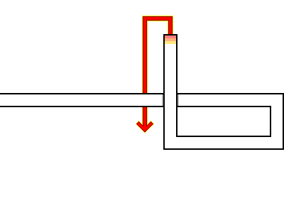  
2. Pass the working end through the loop created on the right.  
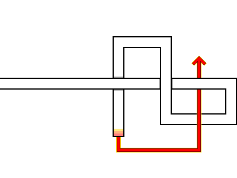  
3. Hold both ends of the rope and pull tight.  
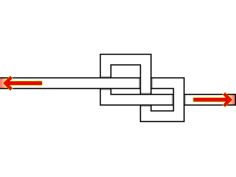  
4. The completed Figure Eight knot.  
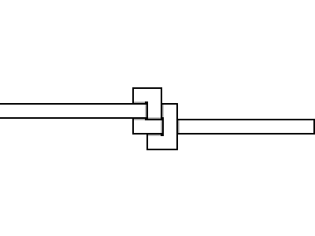  

---
## 1-2. Multiple Overhand Knot
&nbsp;&nbsp;&nbsp;This knot can be used to terminate a line, add weight for throwing, or serve decorative purposes.  

1. Wrap the working end around the standing part of the rope once.  
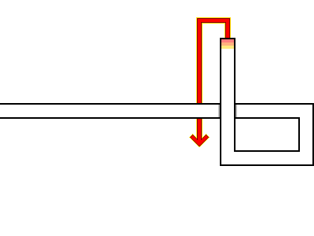  
2. Wrap the working end around the standing part of the rope a second time.  
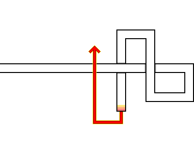  
3. Repeat the process of wrapping the working end around the standing part.  
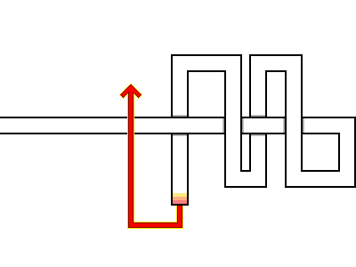  
4. Once the standing part is sufficiently bound, tuck the working end into the core of the wraps and pull it through.  
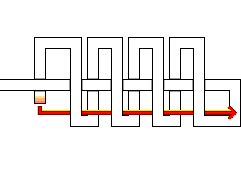  
5. The completed Multiple Overhand Knot.  
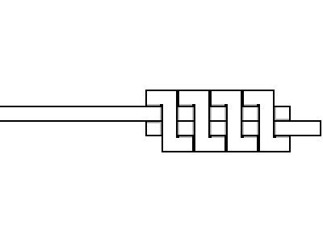  

---
## 1-3. Estar Stopper Knot
&nbsp;&nbsp;&nbsp;Developed by Evans Starzinger, this knot is highly effective for sailing, climbing, rigging, and camping where substantial loads must be sustained. However, under repeated heavy loading, it tightens excessively and becomes impossible to untie by hand, requiring the rope to be cut.

1. Form a loop on the right side, then pass the working end underneath the standing part of the rope.  
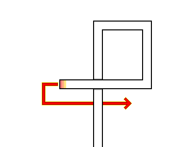  
2. Wrap the working end around the outer surface of the standing part once and pass it through the loop.  
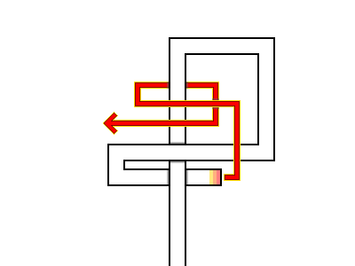  
3. Pass the working end between the two loops on the left.  
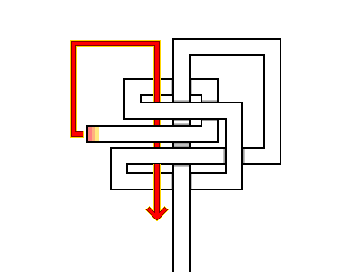  
4. Pass the working end between the two upper loops and pull firmly.  
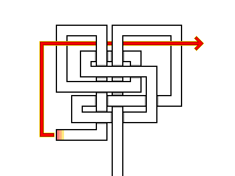  
5. The completed Estar Stopper Knot.  
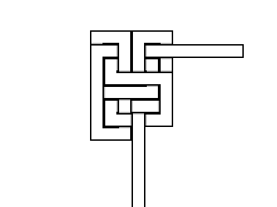  