# 2. 环状结
&nbsp;&nbsp;&nbsp;这是一种可以形成套扣或绳圈以容纳物体的绳结方法。  

---
## 2-1. 八字套结
&nbsp;&nbsp;&nbsp;该绳结相对容易打且安全可靠，但在承受沉重负荷后，可能会变得难以解开。  

1. 将绳索对折。  
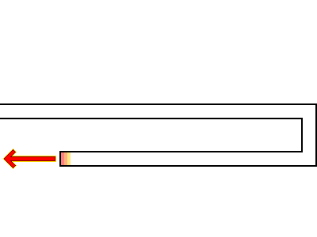  
2. 将右侧折返的绳头在主绳上绕一圈。  
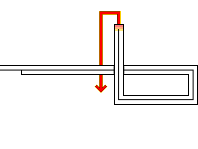  
3. 将绳头穿过右侧形成的绳环。  
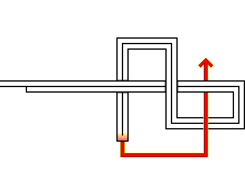  
4. 握住两端的绳索并收紧。  
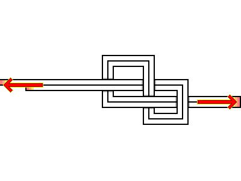  
5. 八字套结完成后的状态。  
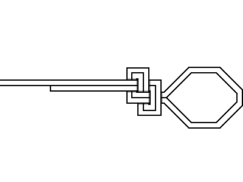  

---
## 2-2. 称人结
&nbsp;&nbsp;&nbsp;这 family 绳结是一种广泛应用于船舶作业、救援行动及各种绳索作业中的固定环状结。  

1. 在绳索中部做一个绳环，并将绳头穿过该绳环。  
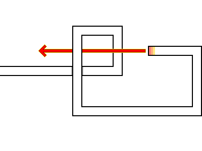  
2. 握住穿出的绳头，绕过主绳一圈后，再次穿回绳环的另一侧。  
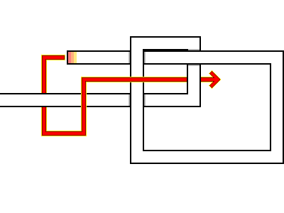  
3. 握住绳索两端并收紧。  
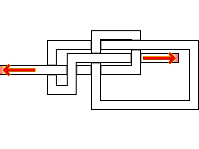  
4. 称人结完成后的状态。  
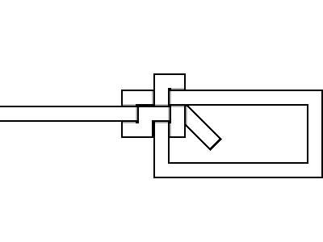  

---
## 2-3. 牧童结
&nbsp;&nbsp;&nbsp;这是牛仔用来制作捕捉牛马的套篙或活套儿时所使用的绳结方法。  

1. 在绳索左侧做一个小绳环，并将绳头穿过该绳环。  
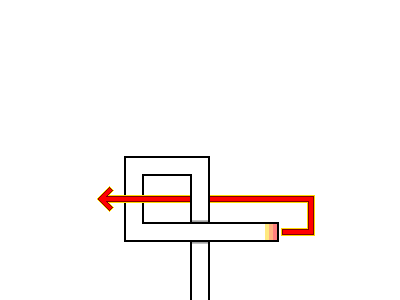  
2. 握住穿出的绳头，拉出一个大绳圈。  
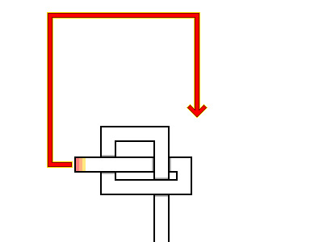  
3. 将绳头穿入左侧的小绳环中，随后握住两端的绳索并拉紧。  
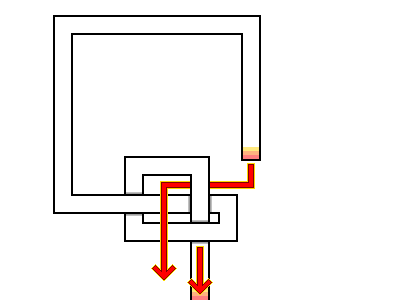  
4. 牧童结完成后的状态。  
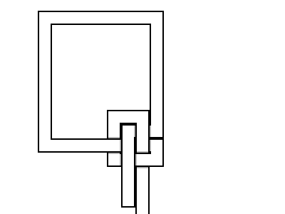  

---
## 2-4. 手铐结
&nbsp;&nbsp;&nbsp;由于该绳结本身不具备自锁机制，因此很难直接作为其名称所暗示的真实用途来使用。  

1. 在绳索左侧做一个绳环，紧接着在旁边再做一个新绳环。  
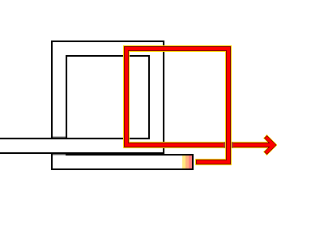  
2. 将两个绳环重叠部分的绳索分别穿过对方的绳环。  
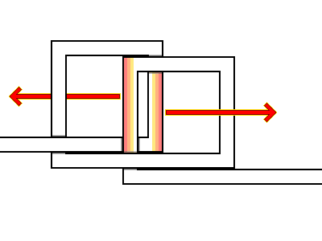  
3. 手铐结完成后的状态。  
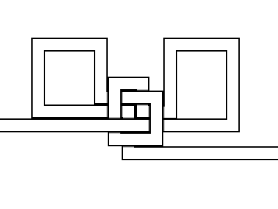  