# 3. 로프 결합 매듭
&nbsp;&nbsp;&nbsp;서로 다른 두 줄을 연결하는데 사용하는 매듭법 입니다.  

---
## 3-1. 어부 매듭
&nbsp;&nbsp;&nbsp;동일한 굵기의 두 개의 끈을 연결하는데 사용됩니다.  

1. 두 끈을 평행하게 놓는다.  
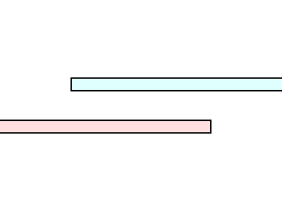  
2. 위 끈으로 아래 끈을 휘감아 묶는다.  
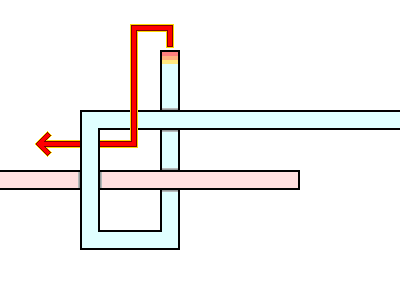  
3. 아래 끈으로 위 끈을 휘감아 묶는다.  
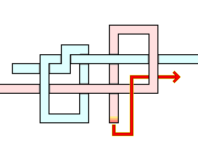  
4. 두 끈을 동시에 당겨 양쪽 매듭을 조인다.  
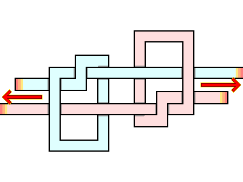  
5. 어부 매듭이 완성된 모습.  
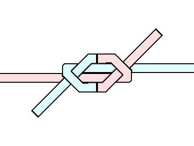  

---
## 3-2. 더블 심플 사이먼(언더)
&nbsp;&nbsp;&nbsp;심플 사이먼 변형 중 가장 안전하며, 미끄러운 합성 줄이나 서로 다른 굵기의 줄을 연결 할 수 있습니다.  

1. 위 끈으로 고리를 만들고, 아래 끈을 고리에 넣어 오른쪽으로 꺾는다.  
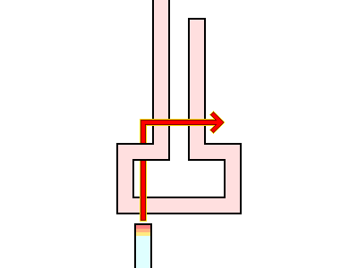  
2. 아래 끈으로 위끈을 올라가며 한 바퀴 감싼다.  
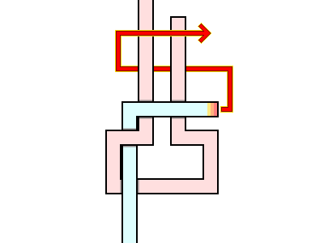  
3. 아래 끈으로 위끈을 내려가며 한 바퀴 감싸되, 오른쪽 아래 끈 고리 아래로 지나간다.  
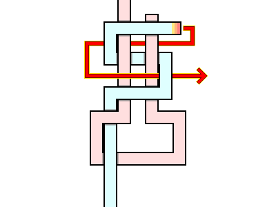  
4. 아래 끈을 위끈 고리 안에서 밖으로 빼며 잡아당긴다.  
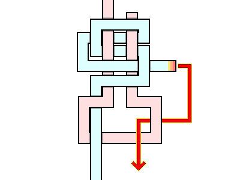  
5. 더블 심플 사이먼(언더) 매듭이 완성된 모습.  
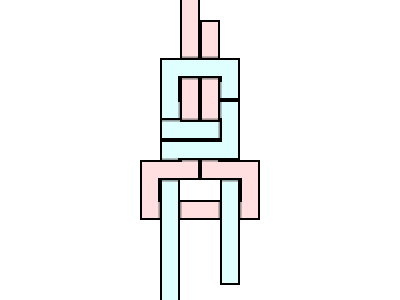  

---
## 3-3. 알베르토 매듭
&nbsp;&nbsp;&nbsp;굵기가 서로 다른 낚싯줄을 연결하는데 사용됩니다.  

1. 아래 끈으로 고리를 만들고, 위 끈을 고리에 넣어 아래 끈을 여러 번 감아 내려간다.  
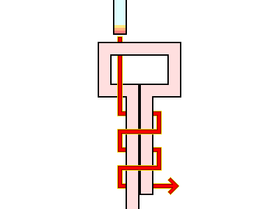  
2. 위 끈을 위로 여러 번 감아 올라가 아래 끈 고리에 넣고, 아래 끈을 잡아당긴다.  
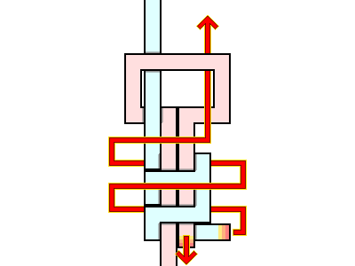  
3. 알베르토 매듭이 완성된 모습.  
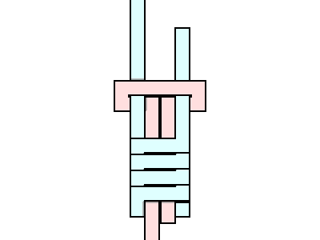  