# 4. Binding
&nbsp;&nbsp;&nbsp;A knot-tying method used to secure or bind items together.  

---
## 4-1. Square Knot
&nbsp;&nbsp;&nbsp;Used to secure a rope or cord around an object. It is not recommended for joining two lines that will bear a heavy load.  

1. Cross the two ends of the line with the left end underneath, then wrap the left end over and under the right end.  
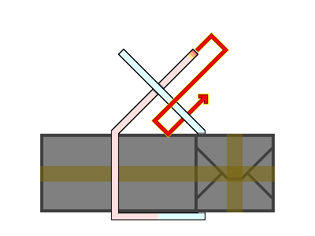  
2. Hold both ends of the line and pull to tighten.  
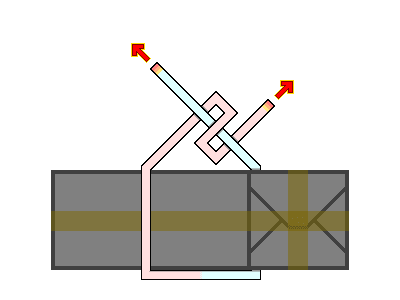  
3. Verify that the positions of the two ends have been reversed.  
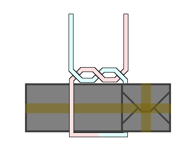  
4. Cross the ends again with the left end on top, then wrap the left end over and under the right end.  
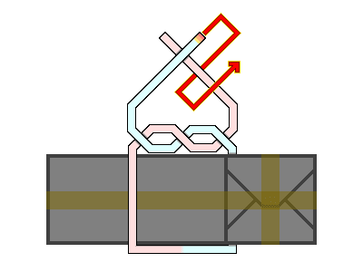  
5. Hold both ends of the line and pull to tighten.  
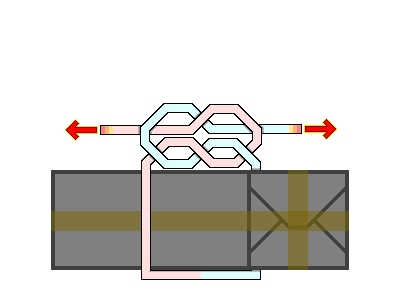  
6. The completed Square Knot.  
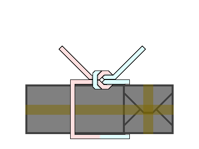  

---
## 4-2. Slipped Miller's Knot
&nbsp;&nbsp;&nbsp;Used to close the neck of a sack or secure rolled materials, featuring a quick-release mechanism for easy untying.  

1. Wrap the cord around the object to be secured.  
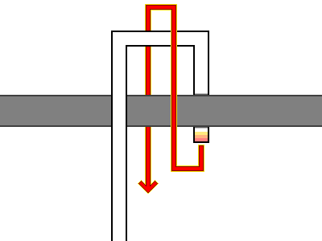  
2. Grasp the right-middle section of the working end and pull a loop out through the upper wrap.  
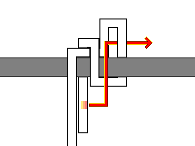  
3. The completed Slipped Miller's Knot. Pulling the working end (indicated in red) instantly releases the knot.  
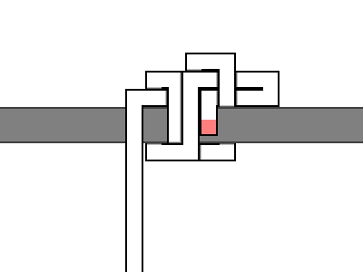  

---
## 4-3. Jar Sling Knot
&nbsp;&nbsp;&nbsp;A specialized sling knot useful for carrying jars, bottles, or other cylindrical containers.  

1. Form a loop, then wrap the line over and into the top-left section of the loop.  
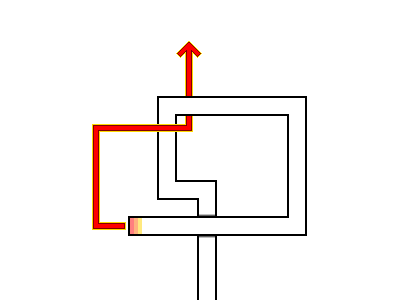  
2. Pass the wrapped line under the loop again and pull it out through the newly formed loop.  
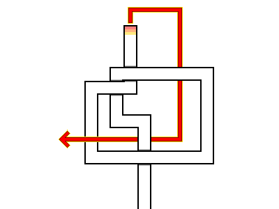  
3. Route the line behind the top loop, pass it over the existing loop, through the center loop, and then extract it below the existing loop.  
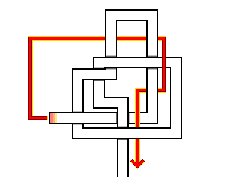  
4. The completed Jar Sling Knot. Place a bottle into the central red opening, hold the working ends, and pull the blue loops upward to secure the container within the knot.  
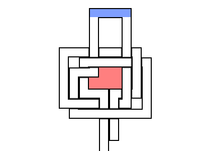  