# 5. Hitches
&nbsp;&nbsp;&nbsp;A knot-tying method used to secure a line to a post, pole, or rigid object.  

---
## 5-1. Half hitch, Two Half Hitches
&nbsp;&nbsp;&nbsp;Used for temporary securing or for binding elements together.  

1. Wrap the short working end on the right around the object, then pass it through the resulting loop.  
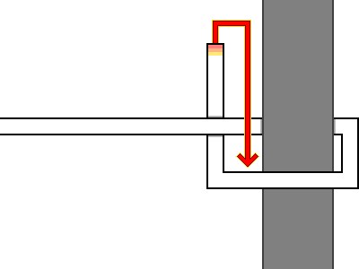  
2. Hold both sides of the line and pull to tighten.  
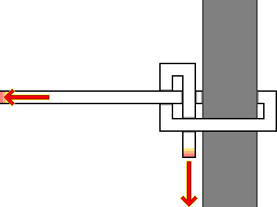  
3. The completed Half Hitch. In this state, the knot slips or unties easily, so it is rarely used on its own.  
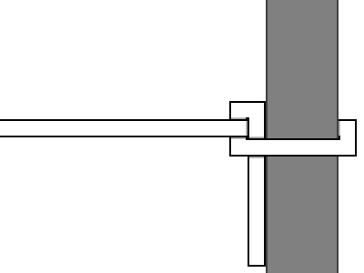  
4. From the completed Half Hitch, form another loop with the working end and pass it through.  
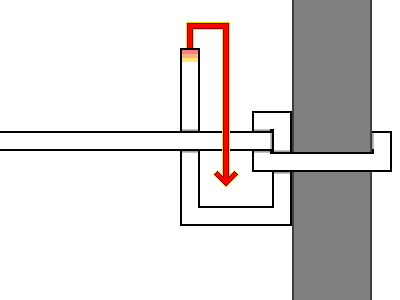  
5. Hold both sides of the line and pull to tighten.  
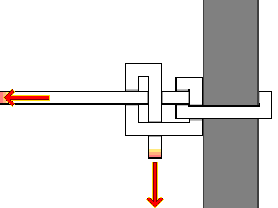  
6. The completed Two Half Hitches.  
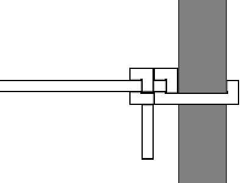  

---
## 5-2. Swing Hitch
&nbsp;&nbsp;&nbsp;A hitch used to secure a line to a horizontal pole, bar, or tree branch.  

1. Wrap the line completely around the object once to the left and once to the right.  
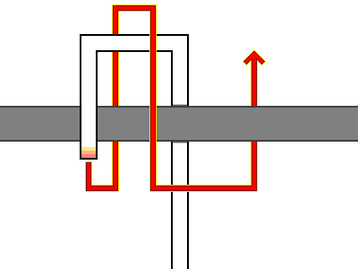  
2. Pass the working end of the cord beneath all the wrapped loops.  
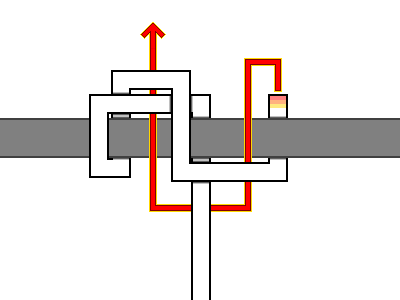  
3. The completed Swing Hitch.  
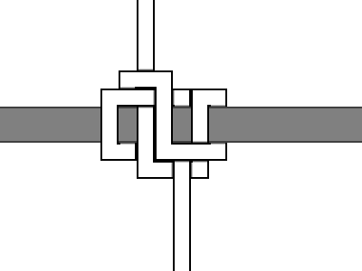  

---
## 5-3. Pile Hitch
&nbsp;&nbsp;&nbsp;A hitch used to quickly secure a rope to a dock pile or other cylindrical object. It holds fast under tension yet releases effortlessly, making it a frequent choice for mooring vessels.  

1. Wrap a bight formed by two parallel lines around the pile.  
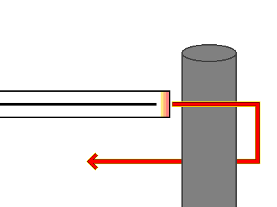  
2. Open the loop at the end of the bight and cast it over the top of the pile.  
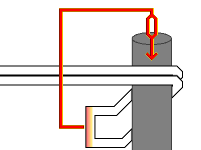  
3. The completed Pile Hitch.  
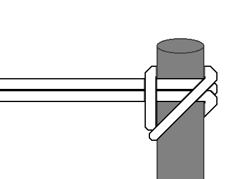  