# 6. Lashings
&nbsp;&nbsp;&nbsp;A knot-tying method used to bind multiple spars, poles, or sticks together securely.  

---
## 6-1. Round Lashing
&nbsp;&nbsp;&nbsp;A lashing technique used to join two parallel spars together to create a longer spar.  

1. Wrap the cord around the lower section of the spars once, then bring the cord over the loop to wrap in the opposite direction.  
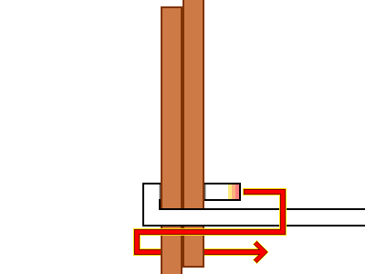  
2. Tuck the end of the cord into the newly formed loop, and wrap around both spars tightly as many times as possible moving upward.  
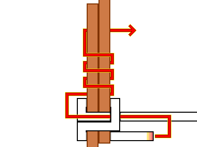  
3. To terminate, wrap around the spar one last time and tuck the end of the cord through the resulting loop.  
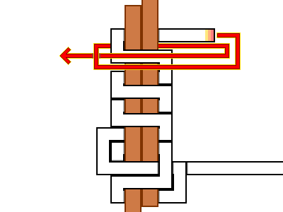  
4. The completed Round Lashing.  
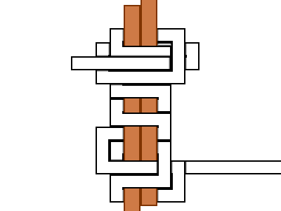  

---
## 6-2. Square Lashing
&nbsp;&nbsp;&nbsp;A lashing technique used to bind two spars at right angles to build structures. It is commonly employed to support heavy loads in applications such as scaffolding and bridging.  

1. Wrap the vertical spar twice near the joint, then tuck the end of the cord into the resulting loop.  
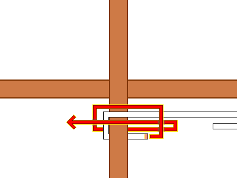  
2. Place the tucked end against the side of the horizontal spar, then route the other end over the horizontal spar and under the vertical spar.  
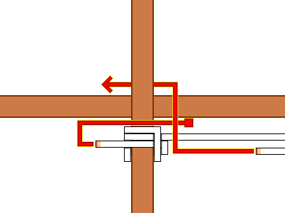  
3. Bind the spars by tracing a circular path—going over when intersecting the horizontal spar and under when intersecting the vertical spar. Secure the loose end held against the horizontal spar during this process.  
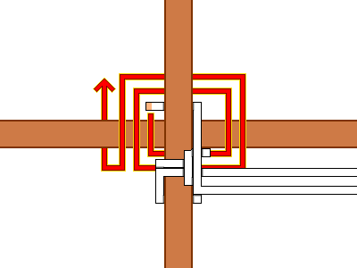  
4. Complete the binding phase by reversing the pattern—going under the horizontal spar and over the vertical spar.  
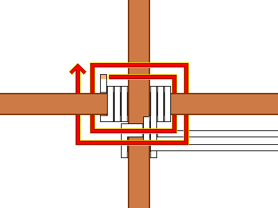  
5. Wrap around the left side of the horizontal spar twice, then tuck the cord end into the loop to form the final locking knot.  
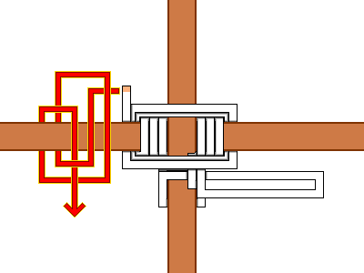  
6. The completed Square Lashing.  
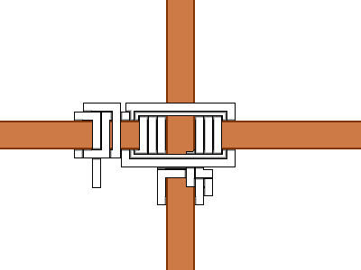  

---
## 6-3. Woodland Zip-tie Lashing
&nbsp;&nbsp;&nbsp;A lashing method used for the quick, temporary securing of two spars crossing at a right angle.  

1. Drape the line over the spar to form an 'M' shape, then fold the central section upward by half.  
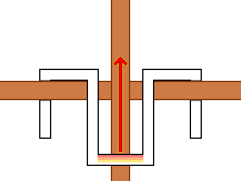  
2. Twist the central 'U'-shaped loop outward by one full turn to create a circular eyelet.  
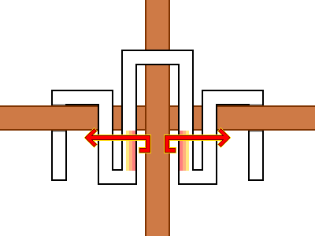  
3. Pass both working ends of the line through the circular eyelet and pull firmly to cinch.  
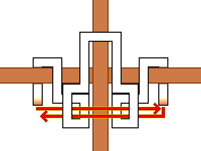  
4. The completed Woodland Zip-tie Lashing.  
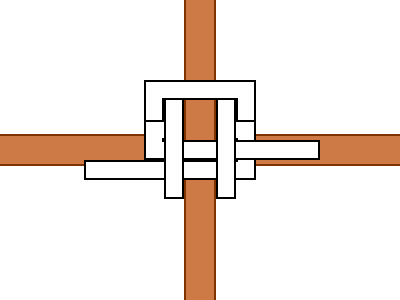  