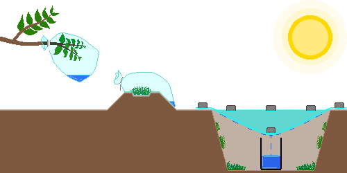

## 1. 水源确保
&nbsp;&nbsp;&nbsp;在自来水供应中断或发生污染时，应优先利用未开封的商业瓶装水、净水器储水箱、冷冻室冰块、罐头汤汁等安全有保障的水源。

---
### 1-1. 替代水源
&nbsp;&nbsp;&nbsp;在未能确保安全水源的情况下，作为最后手段，可以从以下途径获取水。以下列出的各项仅为紧急情况下获取水的可能来源，无法得知其是否达到饮用标准。即使经过适当的净水或消毒处理，由于可能无法去除化学污染物，其安全性依然无法得到保障，因此在可行的情况下，应仅将其用于洗涤、清扫等卫生目的。  

&nbsp;&nbsp;&nbsp;应避免使用含有悬浮物、有异味或颜色深暗的水。被燃料、农药、毒性化学物质或放射性物质污染的水，无法通过煮沸、过滤、消毒等方法使其变得安全，因此绝不可作为水源。在战争区域，由于爆炸、设施破坏、污水外溢等原因，水源可能会受到严重的化学 and 生物污染，因此在选择水源时须格外小心。  

| 水源 | 备注 |
| --- | --- |
| 各种雨水 | 通过集雨桶进行收集获取。若通过屋顶 and 天沟收集，可能会混入鸟类粪便、灰尘、金属成分等。 |
| 江河、湖泊 | 优先选择流速较快的地点进行收集。但若无法确认上游是否存在污染，则安全性无法得到保障。 |
| 浴缸水 | 灾难发生后立即用自来水放满的情况，其受污染可能性相对较低，但长期放置的水存在细菌滋生风险。 |
| 露水 | 在太阳升起前，利用吸水性良好的干布、毛巾等织物，从无灰尘或污染物的植物、金属板、塑料膜、帐篷、塑料布等干净表面收集露水。须避开农耕地、公路旁、工业设施附近。 |
| 热水器水箱 | 须先切断电源 and 热水供应源，随后摒弃底部沉淀物，仅利用相对澄清的水。但若无法确认系统是否与采暖循环水相连，则不建议收集。 |
| 管道残留水 | 开启家中位置最低处的自来水龙头以获取残留水。若无法确认管道是否受到污染，则切勿收集。 |
| 宠物饮水器 | 易混入宠物的唾液，细菌污染可能性极高。 |
| 加湿器水箱 | 细菌 and 霉菌滋生的风险极高。 |
| 游泳池 | 由于氯 entries 以及化学药剂污染风险高，仅可为了洗涤、清扫等卫生目的进行收集。 |
| 水床 | 极有可能含有杀藻剂 and 防腐剂。 |
| 除湿机冷凝水 | 存在因金属成分、霉菌、细菌等引发污染的可能性。 |
| 花瓶水 | 营养液 and 细菌污染的可能性高。 |
| 鱼缸水 | 极有可能含有硝酸盐 and 鱼类排泄物。 |
| 花盆托盘水 | 肥料 and 细菌污染的可能性高。 |
| 马桶水箱 | 必须且只能利用马桶后方储水箱内的水，而非如厕的便池。仅在未使用化学洁厕剂的情况下方可收集，存在因细菌、沉淀物及金属成分引发污染的可能性。 |
| 锅炉采暖水 | 可能含有防冻液、防锈剂、腐蚀抑制剂等，严禁收集。 |
| 散热器汽车水 | 可能含有防冻液、防锈剂、腐蚀抑制剂等，严禁收集。 |

---
### 1-2. 水分捕集
&nbsp;&nbsp;&nbsp;当周边缺乏替代水源时，可以利用自然蒸发、凝结现象或植物的蒸腾作用来获取少量的水。但以下方法通常难以获取大量的日常用水，虽然收集到的水通常比原水干净，但根据安装环境 and 是否存在二次污染，其安全性无法得到绝对保障，因此必须尽可能经过净水、消毒工序后再行使用。  

&nbsp;&nbsp;&nbsp;由于仅靠水分捕集方法难以确保成年人 1 人 1 天所需的全部水分，因此水分捕集应作为辅助手段而非主要集水手段，在条件允许的情况下，应同时安装多个以增加获取量。  

  

| 方法 | 内容 |
| --- | --- |
| 蒸腾袋 | 选择无毒、叶片茂盛的健康树枝，套上透明塑料袋并进行严格密封。由于阳光照射引发植物的蒸腾作用，塑料袋内部会凝结水滴。虽然取决于气象条件 and 植物状态，但一天约可获取 50mL 的水。 |
| 植物袋 | 将无毒的青草、树叶等相对安全的植物原料装入透明塑料袋中并密封，随后暴露在阳光下。由于植物表面的污染物可能会混入凝结水中，操作时须格外注意；一天约可获取 50mL 的水。 |
| 太阳能蒸馏 | 利用塑料膜 values 和承水容器，通过蒸发、冷凝土壤或植物中的水分来获取水的方法。坑洞的表面积越大，集水面积越广；内部包含的富含水分物质越多，蒸发量越大。在良好的环境条件下，一天约可获取 250mL 的水，但若土壤含水量低或气温较低，获取量可能会明显少于该数值。塑料膜若密封不严会导致效率下降，若在同一位置反复使用，由于土壤内部水分减少，产量可能会逐渐降低。 |