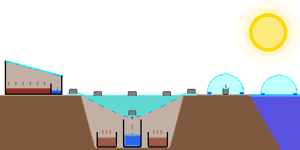
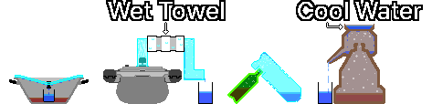

## 2. 净水
&nbsp;&nbsp;&nbsp;对水进行净水的最佳方法是不依赖单一手段，而是将去除大颗粒杂质到消灭病原体等多种技术进行多阶段的有效结合。

| 步骤 | 内容 |
| --- | --- |
| 1. 沉淀 | 若为泥浆水，先将其装入容器中静置，等待大颗粒杂质沉降至底部。随后将上层相对澄清的水缓缓倒出。 |
| 2. 过滤 | 利用布、咖啡滤纸、或者由碎石、沙子、木炭等构成的简易过滤器去除悬浮物和大颗粒污染物。 |
| 3. 杀菌 | 利用煮沸、净水药片、氯消毒等手段杀灭或灭活细菌、病毒、原虫等病原微生物。 |
| 4. 蒸馏(可选) | 在未怀疑受到化学物质污染的情况下，通过蒸馏进一步去除病原菌、盐分及多数污染物。（挥发性有机化合物/VOCs 等部分低沸点化学物质无法被去除） |

&nbsp;&nbsp;&nbsp;虽然通常净水性能的评估顺序为：蒸馏 > 煮沸 > 过滤，但蒸馏并不能去除所有的污染物。蒸馏对去除微生物、盐分、绝大多数重金属及无机污染物非常有效，但挥发性有机化合物（VOCs）、部分农药、燃料成分等低沸点化学物质会与之共同气化并混入冷凝水中。因此，怀疑受到化学物质污染或污染源不明的水，即使在蒸馏后也无法确保其绝对安全性。  

---
### 2-1. 沉淀
&nbsp;&nbsp;&nbsp;利用重力使水中的非溶解颗粒物沉降至底部，从而获得澄清水的净水方法。这对于去除大颗粒颗粒物非常有用，尤其是在煮沸多泥的泥浆水之前。沉淀的操作极其简单，只需将水装入容器中静置数小时，待颗粒物沉降至底部后，将上层相对澄清的水缓缓倒出即可。由于单靠沉淀无法去除病原菌，因此后续必须经过更深层次的净水步骤。  

---
### 2-2. 过滤
#### 2-2-1. 简易过滤器
&nbsp;&nbsp;&nbsp;简易过滤器可以通过将布、咖啡滤纸、碎石、沙子、木炭等周边易于获取的材料分层层层堆叠来制作。简易过滤器虽然能够去除沉淀物 and 杂质，但无法去除有害的细菌或寄生虫，因此后续必须经过更深层次的净水步骤。

| 材料 | 作用 | 投入量 |
| :---: | --- | :---: |
| 碎石 | 位于最上层，用于滤除最大体积的异物杂质。 | 5cm 以上 |
| 沙子 | 位于中间层，用于过滤比碎石更细小的颗粒物。 | 5cm 以上 |
| 木炭 | 有助于减缓异物味 and 部分有机物，改善口感。普通木炭与活性炭不同，其吸附力较低，仅具有有限的去异味和有机物减少效果，无法去除病原菌。 | 5cm 以上 |
| 沙子 | 用于固定木炭，并进行追加过滤。 | 5cm 以上 |
| 布 | 铺设在最底层，用于阻隔微小颗粒物。 | 3层以上 |

#### 2-2-2. 便携式过滤器 (LifeStraw 等)
&nbsp;&nbsp;&nbsp;推荐使用绝对孔径在 0.2µm 以下的过滤器，或者通过 NSF P248 或 NSF P231 认证的便携式过滤器、陶瓷过滤器、中空纤维膜（Hollow Fiber Membrane）过滤器。但必须注意，便携式过滤器同样无法去除重金属或挥发性有机化合物（VOCs）等化学污染物。

| 认证 | 内容 |
| :---: | --- |
| NSF P231 | 微生物净水器（滤除细菌·病毒·原虫） |
| NSF P248 | 军事行动用微生物净水器（包含高浊度环境测试） |
|  NSF 53  | 减少健康危害物质（根据具体认证项目有所不同，如铅、砷、PFAS等） |
|  NSF 58  | 反渗透（RO）净水系统（减少重金属、盐类、杂质） |
|  NSF 401 | 减少新兴污染物（如药物残留、杀虫剂、除草剂等） |

---
### 2-3. 杀菌
#### 2-3-1. 净水药剂
&nbsp;&nbsp;&nbsp;净水药片（Tablets）或净水滴剂（Drops）是利用化学物质杀灭水中细菌、病毒、其他病原菌的药剂。操作时必须严格遵守产品说明书上标明的剂量 parameters and 等待时间。  

#### 2-3-2. 氯系 bleach
&nbsp;&nbsp;&nbsp;在普通氯系 bleach（消毒液、次氯酸钠）中，无香、无色（非 Color-safe 型）、未添加洗涤剂/香料/表面活性剂的产品可以用于饮用水精制。但由于氯对隐孢子虫（Cryptosporidium）及部分原虫胞囊的灭活效果有限，因此浑浊的水必须先进行过滤、然后再行消毒；若高度怀疑存在隐孢子虫等原虫污染，应优先考虑使用煮沸法或蒸馏法。  

&nbsp;&nbsp;&nbsp;向高温水中添加氯系 bleach 可能会导致消毒效果下降；若水质浑浊、带有颜色或水温极低，则必须将投放量翻倍，因此应尽可能使用处于室温状态下的水。  

&nbsp;&nbsp;&nbsp;以下是 [CDC（美国疾病控制与预防中心）](https://www.cdc.gov/water-emergency/about/index.html) 提供的标准用法。添加氯系 bleach 之后，须将其充分搅拌均匀，随后静置等待 30 分钟以上。如果水温极低（如 5°C 以下），消毒作用会变慢，将等待时间延长至 60 分钟以上会更为安全。  

| 消毒剂 | 浓度 | 每 1L 水投入量 |
| --- | --- | --- |
| 次氯酸钠 | 5-9% | 2滴（约 0.1mL） |
| 次氯酸钠 | 1% | 10滴（约 0.5mL） |

#### 2-3-3. 碘酊 (碘酒)
&nbsp;&nbsp;&nbsp;饮用水消毒基准中所称的“碘酊”，是指将碘 and 碘化钾（或碘化钠）溶解于水和乙醇（酒精）中制成的 Tincture of Iodine，与通常以水为溶剂、浓度为 5% 或 10% 的“卢戈氏碘液”并非同一种产品。  

&nbsp;&nbsp;&nbsp;医药箱或急救包中常见的碘酊可以用于饮用水的急救消毒。但与氯一样，碘对隐孢子虫（Cryptosporidium）及部分原虫胞囊的灭活效果同样有限，因此浑浊的水必须先进行过滤、然后再行消毒；若高度怀疑存在隐孢子虫等原虫污染，应优先考虑使用煮沸法或蒸馏法。  

&nbsp;&nbsp;&nbsp;由于碘酊杀菌法是紧急情况下短期使用的消毒方法，因此不适合孕妇、甲状腺疾病患者饮用，健康成年人也不得长期连续饮用此类消毒水。  

&nbsp;&nbsp;&nbsp;以下是 [EPA（美国环境保护署）](https://www.epa.gov/ground-water-and-drinking-water/emergency-disinfection-drinking-water) 提供的利用碘酊进行紧急消毒的指南。该指南以 2% 浓度的碘酊（Tincture of Iodine）为基准，不适用于 5% 或 10% 浓度的卢戈氏碘液。如果水质浑浊，应优先进行过滤，若条件不允许则须将添加量翻倍。添加碘酊之后，须将其充分搅拌均匀，随后静置等待 30 分钟以上。如果水温极低（如 5°C 以下），消毒作用会变慢，将等待时间延长至 60 分钟以上会更为安全。  

| 消毒剂 | 浓度 | 每 1L 水投入量 |
| --- | --- | --- |
| 碘酊 | 2% | 5滴（约 0.25mL） |

#### 2-3-4. 煮沸
&nbsp;&nbsp;&nbsp;在紧急情况下，煮沸是最为可靠的杀菌方法。在通常情况下，只需保持水呈剧烈沸腾状态 1 分钟以上即可；但在海拔 2,000 m 以上区域须持续沸腾 3 分钟，在 4,000 m 以上的极限环境下则至少须持续沸腾 5 分钟以上。  

#### 2-3-5. 紫外线消毒 (SODIS)
&nbsp;&nbsp;&nbsp;这是一种利用太阳光中的紫外线杀灭微生物的方式。将水装入透明、无刮痕的瓶子中，将瓶身横倒放置在阳光下暴晒 6 小时（晴天）或 2 天（阴天）。由于长时间暴露在强紫外线 values and 高热下可能会导致容器释放化学物质，因此尽可能使用玻璃瓶；若使用 PET 塑料瓶，则不宜长期反复使用。  

&nbsp;&nbsp;&nbsp;在能确保充足日光照射量的情况下，该方法对减少绝大多数细菌 and 病毒非常有效，但在浊度较高的水中效果会急剧下降，因此后续操作前务必先进行沉淀及过滤处理。  

---
## 2-4. 蒸馏
&nbsp;&nbsp;&nbsp;蒸馏是指通过收集烧开受污染水时产生的蒸汽来制造饮用水的方法。这种方法能够分离污染物、盐分、矿物质等，因此也被用于将泥浆水或海水（盐水）转化为淡水。然而，挥发性有机化合物（VOCs）、部分农药、燃料成分等低沸点化学物质会与之共同气化并混入冷凝水中。因此，怀疑受到化学物质污染或污染源不明的水，即使在蒸馏后也无法确保其绝对安全性。  

#### 2-4-1. 利用太阳能的蒸馏法
&nbsp;&nbsp;&nbsp;利用太阳热量使水蒸发，并通过收集蒸发出的蒸汽来获取干净水的方法。若将盛装受污染水的容器放置在黑色底面上，可以加快蒸发速度。  

  

| 方法 | 内容 |
| --- | --- |
| 单斜面型 | 在宽大的水槽中倒入污水，将透明板（玻璃·亚克力·塑料膜）倾斜安置。在倾斜面的末端放置空容器以收集冷凝水。 |
| 挖地方式 | 在地面挖一个坑，正中央放置一个空干净容器，在空容器周围放置盛装污水的容器。用塑料膜覆盖坑洞，并在空容器正上方的塑料膜上压一块石头固定。利用太阳热量蒸发出的蒸汽冷凝后流入空容器中。但是，若塑料膜未能完全密封，或者空容器本身受到了污染，则须格外注意。 |
| 水锥 (Water Cone) | 剪下大型塑料瓶的上半部分，将剪切面朝内翻折 2~3 cm 以形成集水槽；或者在透明雨伞等锥状物体的内部制作承水槽。随后将其漂浮在海水上，或覆盖在盛装污水的微小容器上方，以此收集冷凝在内部集水槽中的水。 |

#### 2-4-2. 利用煮沸的蒸馏法
&nbsp;&nbsp;&nbsp;利用火将水烧开，并通过收集蒸发出的蒸汽来获取干净水的方法。通常情况下，利用 PET 塑料瓶进行蒸馏由于在高温下存在变形及释放化学物质的危险，因此必须且只能使用耐热玻璃或耐热金属（如不锈钢等）容器。  

  

| 方法 | 内容 |
| --- | --- |
| 倒盖方式 | 灵活利用带有中央手柄的圆形锅盖以及锅内的杯子。将空杯子放置在锅中央，注入高度低于杯子高度的污水。将锅盖倒扣在锅上进行加热，蒸汽会汇聚到锅盖中央并滴落到杯子内部。 |
| 高压锅法 | 在高压锅的排气阀门处连接耐热软管（管道），并将其通过冷水进行冷却的方法。在高压锅内注入污水并加热，将冒出的蒸汽通过软管排出。若让软管中段穿过装有冰块或冷水的容器，蒸汽会迅速冷凝成水。 |
| 双瓶对接法 | 在耐热玻璃或耐热金属瓶 A 中装入污水，在耐热塑料或可打孔的耐热金属瓶 B 的底部钻孔，随后将瓶 B 底部与瓶 A 的瓶口紧密结合。将瓶 B 的瓶口朝下倒置，随后对瓶 A 进行加热煮沸以实施蒸馏。 |
| 烧酒壶式 (传统蒸馏器) | 这是一种传统的蒸馏器具，下层装载污水，中层设有类似于倒置水壶形态的冷凝室，上层则注入冷却水。受热的蒸汽向上飘升，遇到冰冷的上层底部后发生冷凝，转化为干净的水并顺着导管流出。 |